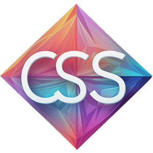

### Icon Generation  Documentation

**Tips:**
The icons listed below were generated using `Midjourney`. Post-generation, they were edited with Adobe `Photoshop` for
enhancements such as color adjustments, angle modifications, and resizing, among other alterations.

| Icon                                                                                          | Prompt and Parameters                                                                                                                                                                                                                                                                                                                                                                                                       | Icon Generated By |
|-----------------------------------------------------------------------------------------------|-----------------------------------------------------------------------------------------------------------------------------------------------------------------------------------------------------------------------------------------------------------------------------------------------------------------------------------------------------------------------------------------------------------------------------|-------------------|
|                      | four leaf clover, Icon, Adobe-esque, logo, background white, minimalistic, modern, branding, graphic design, vibrant, contemporary, clean design, geometric, symmetric, simplicity, innovation, utility, functionality, creativity, inspiration, professional --quality 0.5 --stylize 250 --v 5.2                                                                                                                           | Midjourney        |
|              | Pen, Icon Creator, Adobe-esque, logo, minimalistic, modern, branding, graphic design, iconography, user interface, vibrant, contemporary, clean design, geometric, symmetric, simplicity, innovation, utility, functionality, creativity, inspiration, professional --quality 0.5 --stylize 250 --v 5.2                                                                                                                     | Midjourney        |
|                 | bubble, Icon, sleek, stylesheet tool, Adobe-esque, logo, background white, minimalistic, modern, branding, design tool, graphic design, iconography, user interface, vibrant, contemporary, sleek lines, clean design, geometric, symmetric, simplicity, innovation, utility, functionality, style editor, palette, visual tool, creativity, inspiration, angular, professional --quality 0.5 --stylize 250 --v 5.2         | Midjourney        |
|                 | CSS, square, sleek, stylesheet tool, Adobe-esque, logo, background white, minimalistic, modern, branding, design tool, graphic design, iconography, user interface, vibrant, contemporary, sleek lines, clean design, geometric, symmetric, simplicity, innovation, utility, functionality, style editor, palette, visual tool, creativity, inspiration, angular, professional --v 5.2                                      | Midjourney        |
|                     | wrenches, Icon, Adobe-esque, logo, minimalistic, modern, branding, graphic design, vibrant, contemporary, clean design, geometric, symmetric, simplicity, innovation, utility, functionality, creativity, inspiration, professional --quality 0.5 --stylize 250 --v 5.2                                                                                                                                                     | Midjourney        |
|         | Beautiful icon for Convert Arrow , shape,circle, rectangle, design,ux/ui, ux,ui --quality 0.5 --stylize 250 --v 5.2                                                                                                                                                                                                                                                                                                         | Midjourney        |
|       | Pencil, Icon, square, sleek, stylesheet tool, Adobe-esque, logo, background white, minimalistic, modern, branding, design tool, graphic design, iconography, user interface, vibrant, contemporary, sleek lines, clean design, geometric, symmetric, simplicity, innovation, utility, functionality, style editor, palette, visual tool, creativity, inspiration, angular, professional --quality 0.5 --stylize 250 --v 5.2 | Midjourney        |
|          | Icon, sleek, flat design, Adobe logo style, logo, flat, background white, minimalistic, modern, branding, design tool, graphic design, iconography, user interface, vibrant, contemporary, sleek lines, clean design, geometric, symmetric, simplicity, innovation, utility, functionality, style editor, palette, visual tool, creativity, inspiration, angular, professional --quality 0.5 --stylize 250 --v 5.2          | Midjourney        |
|        | Beautiful icon for Convert Arrow ,ruler, tick marks, design,ux/ui, ux,ui --quality 0.5 --stylize 250 --v 5.2                                                                                                                                                                                                                                                                                                                | Midjourney        |
|             | flat vector design of the word 'API' ::1.5 , logo, minimalistic graphic, inspired by Rob Janoff's style, Simple --no realistic photo detail shading --quality 0.5 --stylize 250 --v 5.2                                                                                                                                                                                                                                     | Midjourney        |
|      | the word "CSS", logo, simple --v 5.2                                                                                                                                                                                                                                                                                                                                                                                        | Midjourney        |
|          | flat vector design of the word 'fxml' , minimalistic graphic, inspired by Rob Janoff's style, --no realistic photo detail shading --stylize 350 --v 5.2                                                                                                                                                                                                                                                                     | Midjourney        |
|            | flat vector design of the word 'xml' , minimalistic graphic, inspired by Rob Janoff's style, --no realistic photo detail shading --v 5.2                                                                                                                                                                                                                                                                                    | Midjourney        |
|     | Beautiful icon for book ,documentation, design,ux/ui, ux,ui --v 5.2                                                                                                                                                                                                                                                                                                                                                         | Midjourney        |
|       | the word "CSS", logo, simple --v 5.2                                                                                                                                                                                                                                                                                                                                                                                        | Midjourney        |
|  | flat vector design of the word 'DOC', logo, minimalistic graphic, inspired by Rob Janoff's style, Simple --no realistic photo detail shading --v 5.2                                                                                                                                                                                                                                                                        | Midjourney        |
|   | flat vector design of the word 'DOC', logo, minimalistic graphic, inspired by Rob Janoff's style, Simple --no realistic photo detail shading --v 5.2                                                                                                                                                                                                                                                                        | Midjourney        |
