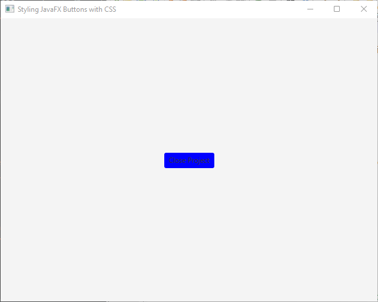
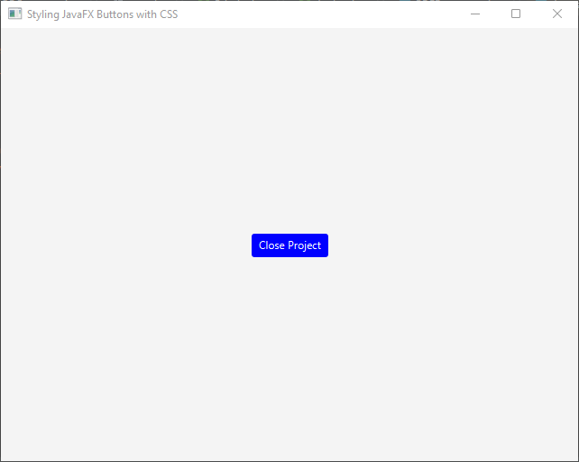
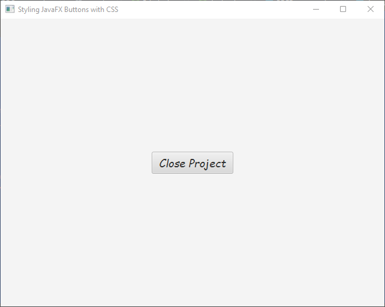
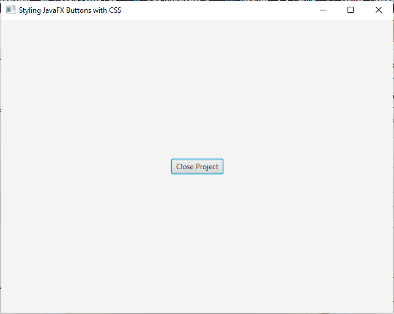
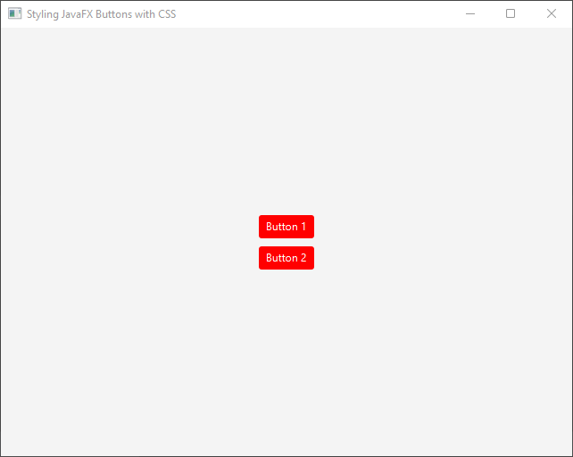
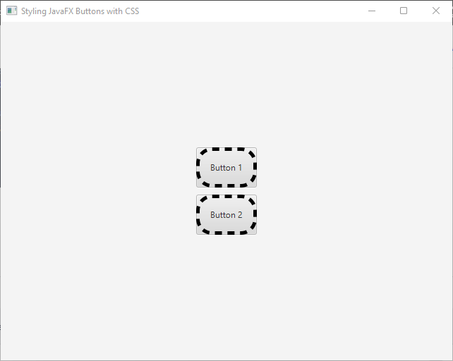
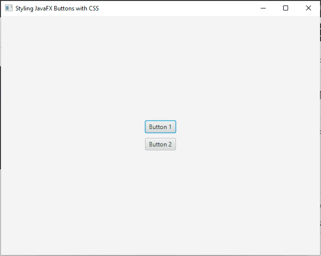

JavaFX is a versatile framework for building user interfaces in Java applications. When it comes to designing visually appealing applications, customizing the style of UI components is crucial. This article focuses on styling JavaFX buttons using CSS (Cascading Style Sheets) to create personalized and consistent button designs.


## Why Use CSS for Styling?

CSS offers a flexible and powerful way to separate the style from the code, making it easier to maintain and update the appearance of JavaFX buttons. By utilizing CSS, you can achieve a consistent look and feel across your application and customize the buttons to match your design preferences.

## Styling JavaFX Buttons

JavaFX provides a flexible way to style buttons using CSS (Cascading Style Sheets). You can customize various aspects of a button’s appearance, such as its background color, text color, font, and size.

## Inline Styles

Inline styles involve setting the style directly on the button’s style property. You can use CSS property-value pairs to modify various aspects of the button’s appearance. For example:

### Setting Background and Text Colors

To change the background color of a button, you can use the -fx-background-color property in CSS. For example, to set the background color to blue, you can write:

```java
import javafx.application.Application;
import javafx.scene.Scene;
import javafx.scene.control.Button;
import javafx.scene.layout.BorderPane;
import javafx.stage.Stage;

public class Main extends Application {

    private final BorderPane parent = new BorderPane();

    @Override
    public void init() throws Exception {
        super.init();
        this.buildUI();
    }

    private void buildUI() {
        Button button = new Button("Close Project");

        // Sets the button background color to blue
        button.setStyle("-fx-background-color: blue;");
        
        this.parent.setCenter(button);
    }

    @Override
    public void start(Stage stage) throws Exception {
        this.setupStage(stage);
    }

    private void setupStage(Stage stage) {
        Scene scene = new Scene(this.parent, 640.0, 480.0);

        // Sets the stage title
        stage.setTitle("Styling JavaFX Buttons with CSS");

        // Sets the stage scene
        stage.setScene(scene);

        // Centers stage on screen
        stage.centerOnScreen();

        // Show stage on screen
        stage.show();
    }
}
```



Similarly, you can change the text color using the -fx-text-fill property:

```java
import javafx.application.Application;
import javafx.scene.Scene;
import javafx.scene.control.Button;
import javafx.scene.layout.BorderPane;
import javafx.stage.Stage;

public class Main extends Application {

    private final BorderPane parent = new BorderPane();

    @Override
    public void init() throws Exception {
        super.init();
        this.buildUI();
    }

    private void buildUI() {
        Button button = new Button("Close Project");

        // Sets the button background color to blue
        // And the text color to white
        button.setStyle(
                "-fx-background-color: blue;" +
                "-fx-text-fill: white;");

        this.parent.setCenter(button);
    }

    @Override
    public void start(Stage stage) throws Exception {
        this.setupStage(stage);
    }

    private void setupStage(Stage stage) {
        Scene scene = new Scene(this.parent, 640.0, 480.0);

        // Sets the stage title
        stage.setTitle("Styling JavaFX Buttons with CSS");

        // Sets the stage scene
        stage.setScene(scene);

        // Centers stage on screen
        stage.centerOnScreen();

        // Show stage on screen
        stage.show();
    }
}
```



### Modifying Font and Size

To modify the font, size and style of the button’s text, you can use the -fx-font-family, -fx-font-size and -fx-font-style properties. For instance:

```java
import javafx.application.Application;
import javafx.scene.Scene;
import javafx.scene.control.Button;
import javafx.scene.layout.BorderPane;
import javafx.stage.Stage;

public class Main extends Application {

    private final BorderPane parent = new BorderPane();

    @Override
    public void init() throws Exception {
        super.init();
        this.buildUI();
    }

    private void buildUI() {
        Button button = new Button("Close Project");

        // Sets the button text font family to 'Comic Sans MS'
        // The size to 18px
        // And the font style to 'italic'
        button.setStyle(
                "-fx-font-family: 'Comic Sans MS'; " +
                "-fx-font-size: 18px;" +
                "-fx-font-style: italic;");

        this.parent.setCenter(button);
    }

    @Override
    public void start(Stage stage) throws Exception {
        this.setupStage(stage);
    }

    private void setupStage(Stage stage) {
        Scene scene = new Scene(this.parent, 640.0, 480.0);

        // Sets the stage title
        stage.setTitle("Styling JavaFX Buttons with CSS");

        // Sets the stage scene
        stage.setScene(scene);

        // Centers stage on screen
        stage.centerOnScreen();

        // Show stage on screen
        stage.show();
    }
}
```



### Adding Hover Effects

You can add hover effects to buttons by modifying their styles when the mouse cursor hovers over them. For example:

```java
import javafx.application.Application;
import javafx.scene.Scene;
import javafx.scene.control.Button;
import javafx.scene.layout.BorderPane;
import javafx.stage.Stage;

public class Main extends Application {

    private final BorderPane parent = new BorderPane();

    @Override
    public void init() throws Exception {
        super.init();
        this.buildUI();
    }

    private void buildUI() {
        Button button = new Button("Close Project");
        
        // Changes the button background color to lightblue on mouseover
        button.setOnMouseEntered(event -> button.setStyle("-fx-background-color: lightblue;"));
        
        // Removes the style on mouse exit
        button.setOnMouseExited(event -> button.setStyle(""));
        
        this.parent.setCenter(button);
            }

    @Override
    public void start(Stage stage) throws Exception {
        this.setupStage(stage);
    }

    private void setupStage(Stage stage) {
        Scene scene = new Scene(this.parent, 640.0, 480.0);

        // Sets the stage title
        stage.setTitle("Styling JavaFX Buttons with CSS");

        // Sets the stage scene
        stage.setScene(scene);

        // Centers stage on screen
        stage.centerOnScreen();

        // Show stage on screen
        stage.show();
    }
}
```



## External Style Sheets

External style sheets offer a more organized and maintainable way to style JavaFX buttons. You can create a separate CSS file and link it to your JavaFX application.

1. Create a new file with a .css extension, e.g., “styles.css”.
2. Place the CSS file in your project’s resources folder or any other appropriate location.

In your JavaFX application, link the stylesheet to the scene by adding the following line of code:

```java
scene.getStylesheets().add("path/to/styles.css");
```

## Selecting Buttons

To apply styles to specific buttons, you can assign a unique ID or a CSS class to each button. The ID or class serves as a selector in CSS, allowing you to target and modify specific buttons.

```java
import javafx.application.Application;
import javafx.scene.Scene;
import javafx.scene.control.Button;
import javafx.scene.layout.BorderPane;
import javafx.stage.Stage;

public class Main extends Application {

    private final BorderPane parent = new BorderPane();

    @Override
    public void init() throws Exception {
        super.init();
        this.buildUI();
    }

    private void buildUI() {
        Button button = new Button("Close Project");
        
        // Assign a unique ID
        button.setId("my-button");
        
        this.parent.setCenter(button);
    }

    @Override
    public void start(Stage stage) throws Exception {
        this.setupStage(stage);
    }

    private void setupStage(Stage stage) {
        Scene scene = new Scene(this.parent, 640.0, 480.0);

        scene.getStylesheets().add("styles.css");

        // Sets the stage title
        stage.setTitle("Styling JavaFX Buttons with CSS");

        // Sets the stage scene
        stage.setScene(scene);

        // Centers stage on screen
        stage.centerOnScreen();

        // Show stage on screen
        stage.show();
    }
}

In your CSS file, you can target the button using its ID:

```css
#my-button {
    /* Styles for the button */
}
```

Alternatively, you can assign a CSS class to multiple buttons and style them collectively:

```java
import javafx.application.Application;
import javafx.geometry.Pos;
import javafx.scene.Scene;
import javafx.scene.control.Button;
import javafx.scene.layout.BorderPane;
import javafx.scene.layout.VBox;
import javafx.stage.Stage;

public class Main extends Application {

    private final BorderPane parent = new BorderPane();

    @Override
    public void init() throws Exception {
        super.init();
        this.buildUI();
    }

    private void buildUI() {
        Button button1 = new Button("Button 1");
        Button button2 = new Button("Button 2");

        // Assign CSS classes
        button1.getStyleClass().add("my-button");
        button2.getStyleClass().add("my-button");

        // Creates a vertical container with 10px spacing between nodes
        VBox buttonContainer = new VBox(10);
        buttonContainer.setAlignment(Pos.CENTER);

        // Adds buttons to the container
        buttonContainer.getChildren().addAll(button1, button2);

        // Adds the button container to the parent container
        this.parent.setCenter(buttonContainer);
    }

    @Override
    public void start(Stage stage) throws Exception {
        this.setupStage(stage);
    }

    private void setupStage(Stage stage) {
        Scene scene = new Scene(this.parent, 640.0, 480.0);

        scene.getStylesheets().add("styles.css");

        // Sets the stage title
        stage.setTitle("Styling JavaFX Buttons with CSS");

        // Sets the stage scene
        stage.setScene(scene);

        // Centers stage on screen
        stage.centerOnScreen();

        // Show stage on screen
        stage.show();
    }
}
```

In CSS, target the buttons using the CSS class:

```css
.my-button {
    /* Styles for the buttons */
}
```

## Applying Styles

Once you have selected the buttons, you can apply various styles to modify their appearance. Here are a few commonly used CSS properties for button styling:

* Background color: -fx-background-color
* Text color: -fx-text-fill
* Font family: -fx-font-family
* Font size: -fx-font-size
* Padding: -fx-padding
* Border: -fx-border-color, -fx-border-width, -fx-border-radius

For example, to change the background color and text color of a button, you can use the following CSS code:

```css
.my-button {
    -fx-background-color: #ff0000; /* Red background */
    -fx-text-fill: #ffffff; /* White text color */
}
```



To change the padding and border of a button, you can use the following CSS code:

```css
.my-button {
    /* Sets the padding (inner spacing) to 15px */
    -fx-padding: 15px;

    /* Sets the border color to black */
    -fx-border-color: black;

    /* Sets the border width to 15px */
    -fx-border-width: 5px;

    /* Sets the border style to dashed */
    -fx-border-style: dashed;

    /* Sets the border radius to 20px */
    -fx-border-radius: 20px;
}
```



### Pseudo-classes and Effects

JavaFX buttons support pseudo-classes and effects, which allow you to apply styles based on different states or events. Some commonly used pseudo-classes include :hover, :focused, :pressed, and :disabled. These pseudo-classes can enhance the interactivity and visual feedback of buttons.

For instance, to change the background color of a button when it is hovered over, you can use the :hover pseudo-class:

```css
.my-button:hover {
	/* Orange background on hover */
    -fx-background-color: #ff9900; 
}
```



## Conclusion

CSS styling provides an effective way to customize the appearance of JavaFX buttons, allowing you to create visually appealing and interactive user interfaces. Whether you choose to apply inline styles or use external style sheets, CSS empowers you to control various aspects of button design, such as background color, text color, and hover effects. By leveraging CSS pseudo-classes and states, you can enhance user feedback and interactivity.