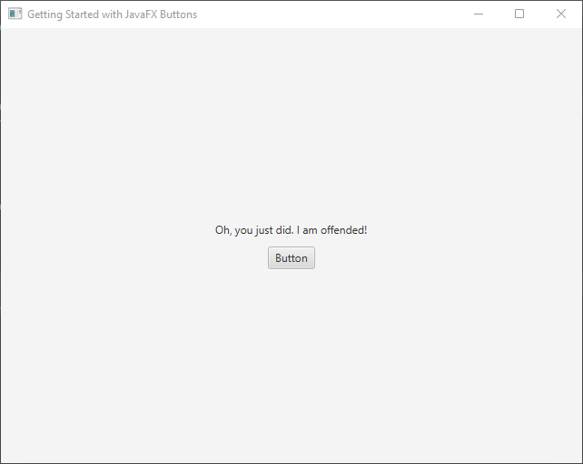

Buttons are a fundamental component of any graphical user interface, allowing users to interact with your application. In JavaFX, creating and handling buttons is straightforward. 


## Basic Button Usage

The code snippet below demonstrates how to use buttons and handle click events in JavaFX, empowering you to create interactive and responsive applications.

```java
import javafx.application.Application;
import javafx.event.ActionEvent;
import javafx.geometry.Pos;
import javafx.scene.Scene;
import javafx.scene.control.Button;
import javafx.scene.control.Label;
import javafx.scene.layout.*;
import javafx.stage.Stage;

public class Main extends Application {

    private Scene scene;
    private Label label;

    @Override
    public void start(Stage stage) throws Exception {
        // set the scene for the stage
        stage.setScene(this.scene);
        stage.setTitle("Getting Started with JavaFX Buttons");
        stage.centerOnScreen();
        stage.show();
    }

    @Override
    public void init() throws Exception {
        super.init();
        buildUI();
    }

    private void buildUI() {
        // create the main content pane
        VBox mainContent = new VBox(10);
        mainContent.setAlignment(Pos.CENTER);

        // create button
        Button button = new Button("Button");
        this.label = new Label("I dare you to click on the button!");

        // setting a button handler
        button.setOnAction(this::buttonHandler);

        // add label and button to the main content pane
        mainContent.getChildren().addAll(this.label, button);

        // Create the layout manager using BorderPane
        BorderPane layoutManager = new BorderPane(mainContent);

        // create the scene with specified dimensions
        this.scene = new Scene(layoutManager, 640, 480);
    }

    // button handler
    private void buttonHandler(ActionEvent actionEvent) {
        this.label.setText("Oh, you just did. I am offended!");
    }
}
```

When executed, the above program creates a simple UI with a button and a label, as depicted in the images below. When the button is clicked, the label’s text is updated:




## Handling Button Events

Buttons emit events when they are clicked, allowing you to execute specific actions in response to user interaction. Event handling in JavaFX follows the observer pattern, where you register an event handler to listen for button clicks. Here’s how you can handle button events:

### Using Lambda Expressions

Java 8 introduced lambda expressions, which provide a concise way to define event handlers. With lambda expressions, you can attach an event handler to a button’s setOnAction method. Here’s an example:

```java
import javafx.application.Application;
import javafx.application.Platform;
import javafx.scene.Scene;
import javafx.scene.control.Button;
import javafx.scene.layout.BorderPane;
import javafx.stage.Stage;

public class Main extends Application {

    private final BorderPane parent = new BorderPane();

    @Override
    public void init() throws Exception {
        super.init();
        this.buildUI();
    }

    private void buildUI() {
        Button button = new Button("Exit");

        button.setOnAction(event -> {
            // Call Platform.exit() to close the JavaFX application
            Platform.exit();
        });

        this.parent.setCenter(button);
    }

    @Override
    public void start(Stage stage) throws Exception {
        this.setupStage(stage);
    }

    private void setupStage(Stage stage) {
        Scene scene = new Scene(this.parent, 640.0, 480.0);

        // Sets the stage title
        stage.setTitle("Handling JavaFX Button Events");

        // Sets the stage scene
        stage.setScene(scene);

        // Centers stage on screen
        stage.centerOnScreen();

        // Show stage on screen
        stage.show();
    }
}
```

In the above code, a lambda expression is used to define the event handler. Inside the lambda expression, you can write the code that should be executed when the button is clicked. In this case, the Platform.exit() method is called to close the JavaFX application.

Lambda expressions simplify event handling by eliminating the need to create a separate class for each event handler. They offer a more streamlined and readable approach to handling button events.

### Implementing EventHandler Interface

Another way to handle button events is by implementing the EventHandler<ActionEvent> interface. This approach involves creating a class that implements the interface and overriding the handle method. Here’s an example:

```java
import javafx.application.Platform;
import javafx.event.ActionEvent;
import javafx.event.EventHandler;

public class ButtonHandler implements EventHandler<ActionEvent> {

    @Override
    public void handle(ActionEvent event) {
        // Call Platform.exit() to close the JavaFX application
        Platform.exit();
    }
}
```

To attach the event handler to a button, you can create an instance of the handler class and use the setOnAction method:

```java
import javafx.application.Application;
import javafx.scene.Scene;
import javafx.scene.control.Button;
import javafx.scene.layout.BorderPane;
import javafx.stage.Stage;

public class Main extends Application {

    private final BorderPane parent = new BorderPane();

    @Override
    public void init() throws Exception {
        super.init();
        this.buildUI();
    }

    private void buildUI() {
        Button button = new Button("Exit");

        // Sets the button handler when clicked
        button.setOnAction(new ButtonHandler());

        this.parent.setCenter(button);
    }

    @Override
    public void start(Stage stage) throws Exception {
        this.setupStage(stage);
    }

    private void setupStage(Stage stage) {
        Scene scene = new Scene(this.parent, 640.0, 480.0);

        // Sets the stage title
        stage.setTitle("Handling JavaFX Button Events");

        // Sets the stage scene
        stage.setScene(scene);

        // Centers stage on screen
        stage.centerOnScreen();

        // Show stage on screen
        stage.show();
    }
}
```

By implementing the EventHandler interface, you have more control and flexibility over the event handling process. This approach is useful when you have complex event handling logic that requires multiple methods or external dependencies.

### Using Anonymous Inner Classes

JavaFX also allows you to handle button events using anonymous inner classes. This approach lets you define the event handler directly at the point of attachment. Here’s an example:

```java
import javafx.application.Application;
import javafx.application.Platform;
import javafx.event.ActionEvent;
import javafx.event.EventHandler;
import javafx.scene.Scene;
import javafx.scene.control.Button;
import javafx.scene.layout.BorderPane;
import javafx.stage.Stage;

public class Main extends Application {

    private final BorderPane parent = new BorderPane();

    @Override
    public void init() throws Exception {
        super.init();
        this.buildUI();
    }

    private void buildUI() {
        Button button = new Button("Exit");

        button.setOnAction(new EventHandler<ActionEvent>() {
            @Override
            public void handle(ActionEvent event) {
                // Call Platform.exit() to close the JavaFX application
                Platform.exit();
            }
        });

        this.parent.setCenter(button);
    }

    @Override
    public void start(Stage stage) throws Exception {
        this.setupStage(stage);
    }

    private void setupStage(Stage stage) {
        Scene scene = new Scene(this.parent, 640.0, 480.0);

        // Sets the stage title
        stage.setTitle("Handling JavaFX Button Events");

        // Sets the stage scene
        stage.setScene(scene);

        // Centers stage on screen
        stage.centerOnScreen();

        // Show stage on screen
        stage.show();
    }
}
```

In this code example, an anonymous inner class is created and defined inline with the setOnAction method. The handle method is overridden within the class, allowing you to specify the actions to be performed when the button is clicked.

This approach is useful when you need to create a one-time event handler without the need for a separate class or when the event handling logic is relatively simple.

### Using Method References

Method references provide a concise and readable way to attach event handlers to JavaFX buttons. By referencing existing methods, developers can streamline their code and improve readability. In this section, we will explore how to use method references for event handling in JavaFX.

To attach an event handler using a method reference, the referenced method must have a compatible signature with the event type. Let’s consider an example:

```java
import javafx.application.Application;
import javafx.application.Platform;
import javafx.event.ActionEvent;
import javafx.scene.Scene;
import javafx.scene.control.Button;
import javafx.scene.layout.BorderPane;
import javafx.stage.Stage;

public class Main extends Application {

    private final BorderPane parent = new BorderPane();

    @Override
    public void init() throws Exception {
        super.init();
        this.buildUI();
    }

    private void buildUI() {
        Button button = new Button("Exit");

        button.setOnAction(this::onExit);

        this.parent.setCenter(button);
    }

    private void onExit(ActionEvent actionEvent) {
        // Call Platform.exit() to close the JavaFX application
        Platform.exit();
    }

    @Override
    public void start(Stage stage) throws Exception {
        this.setupStage(stage);
    }

    private void setupStage(Stage stage) {
        Scene scene = new Scene(this.parent, 640.0, 480.0);

        // Sets the stage title
        stage.setTitle("Handling JavaFX Button Events");

        // Sets the stage scene
        stage.setScene(scene);

        // Centers stage on screen
        stage.centerOnScreen();

        // Show stage on screen
        stage.show();
    }
}
```

In this code example, onExit is a method defined within the same class. It should have a parameter that matches the event type, such as ActionEvent in this case. The this::onExit syntax references the method without invoking it.

Next, let’s define the method that will be referenced as the event handler:

```java
private void onExit(ActionEvent actionEvent) {
    // Call Platform.exit() to close the JavaFX application
    Platform.exit();
}
```

In this example, onExit takes an ActionEvent parameter and performs the desired actions when the button is clicked. The method can access instance variables and other methods within the class, allowing for encapsulated event handling logic.

Using method references offers several benefits:

* Conciseness: Method references provide a shorter and more readable syntax compared to lambda expressions, improving code readability and understandability.
* Reusability: By referencing existing methods, you can reuse code and avoid duplicating functionality across event handlers. This promotes code reusability and reduces redundancy.
* Encapsulation: Method references allow you to encapsulate event handling logic within dedicated methods, promoting code organization and maintainability.

By leveraging method references, developers can enhance the efficiency and readability of their event handling code in JavaFX. Whether attaching event handlers to buttons or other UI elements, method references offer a clean and concise approach that improves code maintainability and reduces duplication.

### Using FXML and Controller Classes

If you are using FXML to define your user interface, you can handle button events by specifying the event handler method in your controller class. Here’s how you can do it:

In your FXML file:

```xml
<?xml version="1.0" encoding="UTF-8"?>

<?import javafx.scene.control.*?>
<?import javafx.scene.layout.*?>

<BorderPane xmlns="http://javafx.com/javafx"
xmlns:fx="http://javafx.com/fxml"
fx:controller="MainController"
prefHeight="480.0" prefWidth="640.0">
    <center>
        <Button text="Exit" onAction="#onExit" />
    </center>
</BorderPane>
```

In your controller class:

```java
import javafx.application.Platform;
import javafx.event.ActionEvent;
import javafx.fxml.FXML;

public class MainController {

    @FXML
    private void onExit(ActionEvent event) {
        // Call Platform.exit() to close the JavaFX application
        Platform.exit();
    }
}
```

In this approach, you define the button in your FXML file and associate it with a method in the controller class using the onAction attribute. The method in the controller class should have the same name as specified in the onAction attribute and take an ActionEvent parameter.

## Accessing the Event Source

When handling button events, it is often necessary to access the button itself or other related elements. JavaFX provides the getSource method within the event object, allowing you to retrieve the source of the event. Here’s an example:

```java
import javafx.application.Application;
import javafx.event.ActionEvent;
import javafx.geometry.Pos;
import javafx.scene.Scene;
import javafx.scene.control.Button;
import javafx.scene.layout.BorderPane;
import javafx.scene.layout.VBox;
import javafx.stage.Stage;

import java.io.IOException;

public class Main extends Application {

    private final BorderPane parent = new BorderPane();

    @Override
    public void init() throws Exception {
        super.init();
        this.buildUI();
    }

    private void buildUI() {
        Button button1 = new Button("New");
        Button button2 = new Button("Open");
        Button button3 = new Button("Export");
        Button button4 = new Button("Print");
        Button button5 = new Button("Exit");

        button1.setOnAction(this::onExit);
        button2.setOnAction(this::onExit);
        button3.setOnAction(this::onExit);
        button4.setOnAction(this::onExit);
        button5.setOnAction(this::onExit);

        VBox buttonContainer = new VBox(10, button1, button2, button3, button4, button5);
        buttonContainer.setAlignment(Pos.CENTER);

        this.parent.setCenter(buttonContainer);
    }

    private void onExit(ActionEvent actionEvent) {
        Button sourceButton = (Button) actionEvent.getSource();

        // Prints the text of clicked button
        System.out.println("Button clicked: " + sourceButton.getText());
    }

    @Override
    public void start(Stage stage) throws Exception {
        this.setupStage(stage);
    }

    private void setupStage(Stage stage) throws IOException {
        Scene scene = new Scene(this.parent, 640.0, 480.0);

        // Sets the stage title
        stage.setTitle("Handling JavaFX Button Events");

        // Sets the stage scene
        stage.setScene(scene);

        // Centers stage on screen
        stage.centerOnScreen();

        // Show stage on screen
        stage.show();
    }
}
```

Inside the onExit() method, the getSource method is used to retrieve the button that triggered the event. This information can be used to differentiate between multiple buttons or perform specific actions based on the button clicked.

## Conclusion

Handling button events is an essential aspect of JavaFX development, as it enables you to create interactive applications. By using lambda expressions, implementing the EventHandler interface, or utilizing anonymous inner classes, you have multiple options for handling button events based on your specific requirements. Whether you prefer a concise and streamlined approach or a more structured and extensible solution, JavaFX provides the tools to create dynamic and responsive applications. Remember to check the JavaFX Button Documentation for more.