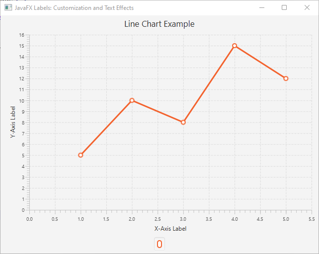
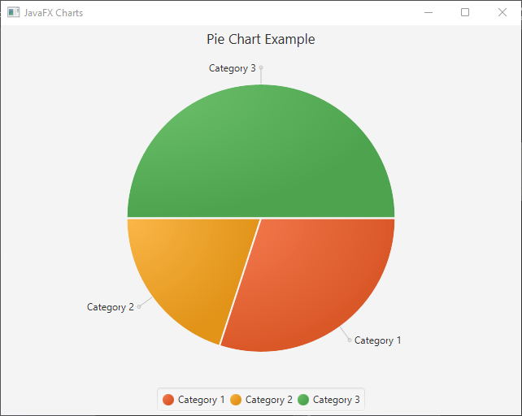
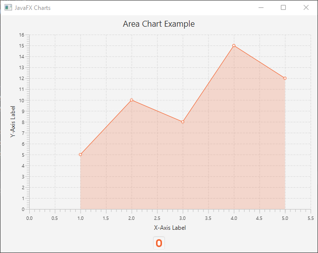
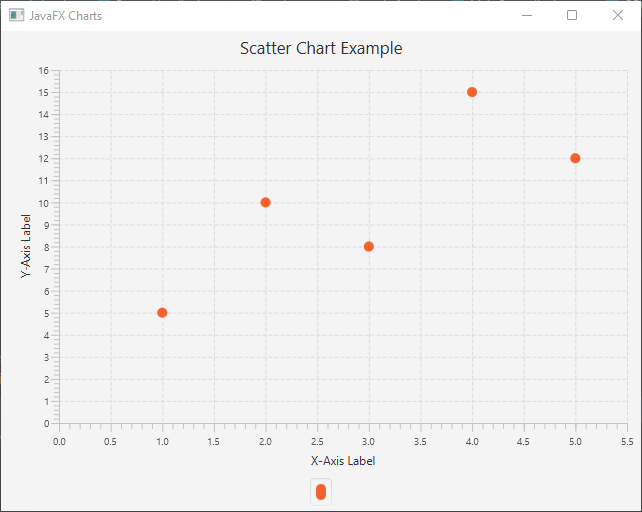
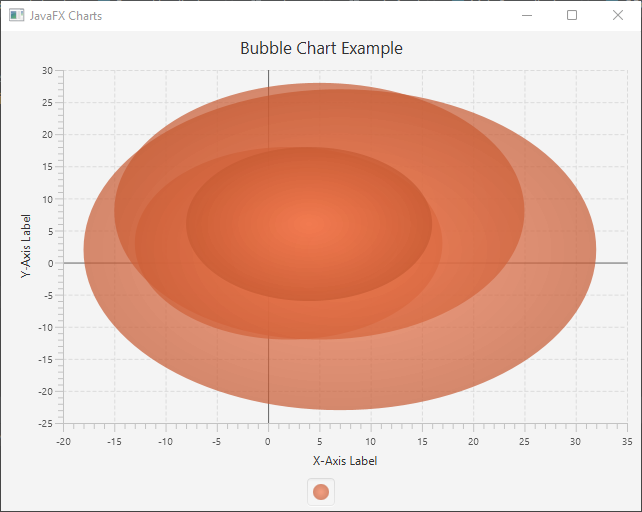
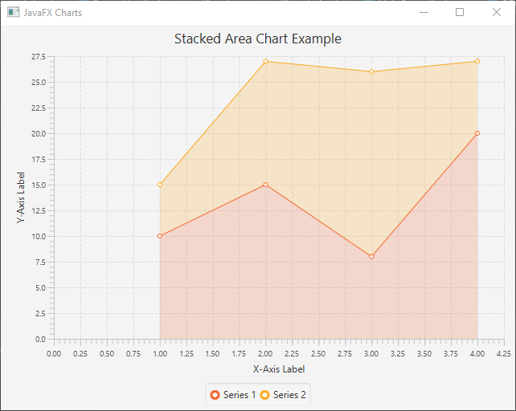
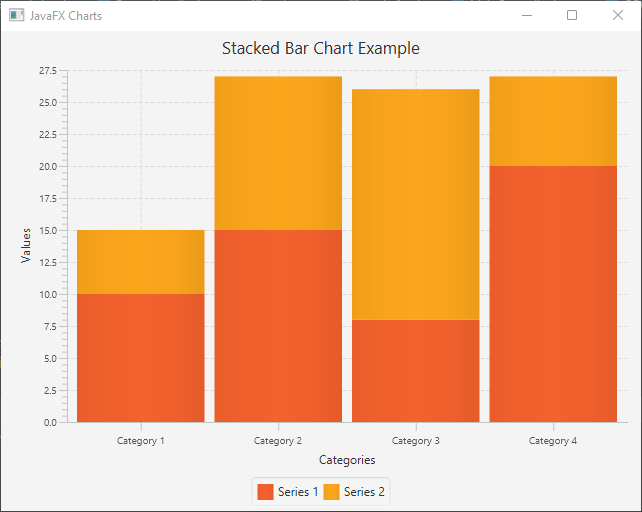

One of the essential components of data visualization in JavaFX is charts. Charts allow you to present data in a visually appealing and understandable manner, making it easier for users to grasp complex information quickly. In this article, we’ll explore different types of JavaFX charts and provide full code examples to create each of them.

## Line Chart

The line chart is ideal for visualizing trends and patterns over a continuous period.

```java
import javafx.application.Application;
import javafx.scene.Scene;
import javafx.scene.chart.LineChart;
import javafx.scene.chart.NumberAxis;
import javafx.scene.chart.XYChart;
import javafx.scene.layout.*;
import javafx.stage.Stage;

public class Main extends Application {

    private final StackPane parent = new StackPane();

    @Override
    public void start(Stage stage) throws Exception {
        this.setupStage(stage);
    }

    @Override
    public void init() throws Exception {
        super.init();
        this.buildUI();
    }

    private void buildUI() {
        // Sample data
        XYChart.Series<Number, Number> series = new XYChart.Series<>();

        series.getData().add(new XYChart.Data<>(1, 5));
        series.getData().add(new XYChart.Data<>(2, 10));
        series.getData().add(new XYChart.Data<>(3, 8));
        series.getData().add(new XYChart.Data<>(4, 15));
        series.getData().add(new XYChart.Data<>(5, 12));

        // Define the axes
        NumberAxis xAxis = new NumberAxis();
        NumberAxis yAxis = new NumberAxis();

        // Create the line chart
        LineChart<Number, Number> lineChart = new LineChart<>(xAxis, yAxis);

        lineChart.getData().add(series);

        // Set the chart title and axis labels
        lineChart.setTitle("Line Chart Example");

        xAxis.setLabel("X-Axis Label");
        yAxis.setLabel("Y-Axis Label");

        this.parent.getChildren().addAll(lineChart);
    }

    private void setupStage(Stage stage) {
        Scene scene = new Scene(this.parent, 640.0, 480.0);
        stage.setTitle("JavaFX Charts");
        stage.setScene(scene);
        stage.centerOnScreen();
        stage.show();
    }
}
```



## Bar Chart

Bar charts are suitable for comparing categorical data.

```java
import javafx.application.Application;
import javafx.scene.Scene;
import javafx.scene.chart.*;
import javafx.scene.layout.*;
import javafx.stage.Stage;

public class Main extends Application {

    private final StackPane parent = new StackPane();

    @Override
    public void start(Stage stage) throws Exception {
        this.setupStage(stage);
    }

    @Override
    public void init() throws Exception {
        super.init();
        this.buildUI();
    }

    private void buildUI() {
        // Sample data
        XYChart.Series<String, Number> series = new XYChart.Series<>();
        series.getData().add(new XYChart.Data<>("Category 1", 10));
        series.getData().add(new XYChart.Data<>("Category 2", 5));
        series.getData().add(new XYChart.Data<>("Category 3", 12));
        series.getData().add(new XYChart.Data<>("Category 4", 8));
        series.getData().add(new XYChart.Data<>("Category 5", 15));

        // Define the axes
        CategoryAxis xAxis = new CategoryAxis();
        NumberAxis yAxis = new NumberAxis();

        // Create the bar chart
        BarChart<String, Number> barChart = new BarChart<>(xAxis, yAxis);
        barChart.getData().add(series);

        // Set the chart title and axis labels
        barChart.setTitle("Bar Chart Example");
        xAxis.setLabel("Categories");
        yAxis.setLabel("Values");

        this.parent.getChildren().addAll(barChart);
    }

    private void setupStage(Stage stage) {
        Scene scene = new Scene(this.parent, 640.0, 480.0);
        stage.setTitle("JavaFX Charts");
        stage.setScene(scene);
        stage.centerOnScreen();
        stage.show();
    }
}
```


## Pie Chart

Pie charts are excellent for displaying the proportional distribution of data.

```java
import javafx.application.Application;
import javafx.scene.Scene;
import javafx.scene.chart.*;
import javafx.scene.layout.*;
import javafx.stage.Stage;

public class Main extends Application {

    private final StackPane parent = new StackPane();

    @Override
    public void start(Stage stage) throws Exception {
        this.setupStage(stage);
    }

    @Override
    public void init() throws Exception {
        super.init();
        this.buildUI();
    }

    private void buildUI() {
        // Sample data
        PieChart.Data slice1 = new PieChart.Data("Category 1", 30);
        PieChart.Data slice2 = new PieChart.Data("Category 2", 20);
        PieChart.Data slice3 = new PieChart.Data("Category 3", 50);

        // Create the pie chart
        PieChart pieChart = new PieChart();
        pieChart.getData().addAll(slice1, slice2, slice3);

        // Set the chart title
        pieChart.setTitle("Pie Chart Example");

        this.parent.getChildren().addAll(pieChart);
    }

    private void setupStage(Stage stage) {
        Scene scene = new Scene(this.parent, 640.0, 480.0);
        stage.setTitle("JavaFX Charts");
        stage.setScene(scene);
        stage.centerOnScreen();
        stage.show();
    }
}
```



## Area Chart

Area charts are useful for displaying the cumulative totals over time.

```java
import javafx.application.Application;
import javafx.scene.Scene;
import javafx.scene.chart.*;
import javafx.scene.layout.*;
import javafx.stage.Stage;

public class Main extends Application {

    private final StackPane parent = new StackPane();

    @Override
    public void start(Stage stage) throws Exception {
        this.setupStage(stage);
    }

    @Override
    public void init() throws Exception {
        super.init();
        this.buildUI();
    }

    private void buildUI() {
        // Sample data
        XYChart.Series<Number, Number> series = new XYChart.Series<>();
        series.getData().add(new XYChart.Data<>(1, 5));
        series.getData().add(new XYChart.Data<>(2, 10));
        series.getData().add(new XYChart.Data<>(3, 8));
        series.getData().add(new XYChart.Data<>(4, 15));
        series.getData().add(new XYChart.Data<>(5, 12));

        // Define the axes
        NumberAxis xAxis = new NumberAxis();
        NumberAxis yAxis = new NumberAxis();

        // Create the area chart
        AreaChart<Number, Number> areaChart = new AreaChart<>(xAxis, yAxis);
        areaChart.getData().add(series);

        // Set the chart title and axis labels
        areaChart.setTitle("Area Chart Example");
        xAxis.setLabel("X-Axis Label");
        yAxis.setLabel("Y-Axis Label");

        this.parent.getChildren().addAll(areaChart);
    }

    private void setupStage(Stage stage) {
        Scene scene = new Scene(this.parent, 640.0, 480.0);
        stage.setTitle("JavaFX Charts");
        stage.setScene(scene);
        stage.centerOnScreen();
        stage.show();
    }
}
```



## Scatter Chart

Scatter charts are ideal for visualizing individual data points.

```java
import javafx.application.Application;
import javafx.scene.Scene;
import javafx.scene.chart.*;
import javafx.scene.layout.*;
import javafx.stage.Stage;

public class Main extends Application {

    private final StackPane parent = new StackPane();

    @Override
    public void start(Stage stage) throws Exception {
        this.setupStage(stage);
    }

    @Override
    public void init() throws Exception {
        super.init();
        this.buildUI();
    }

    private void buildUI() {
        // Sample data
        XYChart.Series<Number, Number> series = new XYChart.Series<>();
        series.getData().add(new XYChart.Data<>(1, 5));
        series.getData().add(new XYChart.Data<>(2, 10));
        series.getData().add(new XYChart.Data<>(3, 8));
        series.getData().add(new XYChart.Data<>(4, 15));
        series.getData().add(new XYChart.Data<>(5, 12));

        // Define the axes
        NumberAxis xAxis = new NumberAxis();
        NumberAxis yAxis = new NumberAxis();

        // Create the scatter chart
        ScatterChart<Number, Number> scatterChart = new ScatterChart<>(xAxis, yAxis);
        scatterChart.getData().add(series);

        // Set the chart title and axis labels
        scatterChart.setTitle("Scatter Chart Example");

        xAxis.setLabel("X-Axis Label");
        yAxis.setLabel("Y-Axis Label");

        this.parent.getChildren().addAll(scatterChart);
    }

    private void setupStage(Stage stage) {
        Scene scene = new Scene(this.parent, 640.0, 480.0);
        stage.setTitle("JavaFX Charts");
        stage.setScene(scene);
        stage.centerOnScreen();
        stage.show();
    }
}
```



## Bubble Chart

A Bubble Chart is a variation of a Scatter Chart, where data points are represented as bubbles with varying sizes. Each bubble has three values: X-axis value, Y-axis value, and a numeric value that determines the size of the bubble. The size of the bubble is proportional to the numeric value, allowing for the visualization of three dimensions of data.

```java
import javafx.application.Application;
import javafx.scene.Scene;
import javafx.scene.chart.*;
import javafx.scene.layout.*;
import javafx.stage.Stage;

public class Main extends Application {

    private final StackPane parent = new StackPane();

    @Override
    public void start(Stage stage) throws Exception {
        this.setupStage(stage);
    }

    @Override
    public void init() throws Exception {
        super.init();
        this.buildUI();
    }

    private void buildUI() {
        // Sample data
        XYChart.Series<Number, Number> series = new XYChart.Series<>();
        series.getData().add(new XYChart.Data<>(3, 5, 10));
        series.getData().add(new XYChart.Data<>(5, 8, 20));
        series.getData().add(new XYChart.Data<>(2, 3, 15));
        series.getData().add(new XYChart.Data<>(7, 2, 25));
        series.getData().add(new XYChart.Data<>(4, 6, 12));

        // Define the axes
        NumberAxis xAxis = new NumberAxis();
        NumberAxis yAxis = new NumberAxis();

        // Create the bubble chart
        BubbleChart<Number, Number> bubbleChart = new BubbleChart<>(xAxis, yAxis);
        bubbleChart.getData().add(series);

        // Set the chart title and axis labels
        bubbleChart.setTitle("Bubble Chart Example");
        xAxis.setLabel("X-Axis Label");
        yAxis.setLabel("Y-Axis Label");

        this.parent.getChildren().addAll(bubbleChart);
    }

    private void setupStage(Stage stage) {
        Scene scene = new Scene(this.parent, 640.0, 480.0);
        stage.setTitle("JavaFX Charts");
        stage.setScene(scene);
        stage.centerOnScreen();
        stage.show();
    }
}
```



## Stacked Area Chart

Creating a Stacked Area Chart in JavaFX is a great way to visualize the cumulative contribution of multiple data series over time. Each data series is represented as an area, and the areas are stacked on top of each other to show the combined value at each data point.

```java
import javafx.application.Application;
import javafx.scene.Scene;
import javafx.scene.chart.*;
import javafx.scene.layout.*;
import javafx.stage.Stage;

public class Main extends Application {

    private final StackPane parent = new StackPane();

    @Override
    public void start(Stage stage) throws Exception {
        this.setupStage(stage);
    }

    @Override
    public void init() throws Exception {
        super.init();
        this.buildUI();
    }

    private void buildUI() {
        // Sample data series
        XYChart.Series<Number, Number> series1 = new XYChart.Series<>();
        series1.setName("Series 1");

        series1.getData().add(new XYChart.Data<>(1, 10));
        series1.getData().add(new XYChart.Data<>(2, 15));
        series1.getData().add(new XYChart.Data<>(3, 8));
        series1.getData().add(new XYChart.Data<>(4, 20));

        XYChart.Series<Number, Number> series2 = new XYChart.Series<>();
        series2.setName("Series 2");

        series2.getData().add(new XYChart.Data<>(1, 5));
        series2.getData().add(new XYChart.Data<>(2, 12));
        series2.getData().add(new XYChart.Data<>(3, 18));
        series2.getData().add(new XYChart.Data<>(4, 7));

        // Define the axes
        NumberAxis xAxis = new NumberAxis();
        NumberAxis yAxis = new NumberAxis();

        // Create the stacked area chart
        StackedAreaChart<Number, Number> stackedAreaChart = new StackedAreaChart<>(xAxis, yAxis);
        stackedAreaChart.getData().addAll(series1, series2);
        
        // Set the chart title and axis labels
        stackedAreaChart.setTitle("Stacked Area Chart Example");
        xAxis.setLabel("X-Axis Label");
        yAxis.setLabel("Y-Axis Label");

        this.parent.getChildren().addAll(stackedAreaChart);
    }

    private void setupStage(Stage stage) {
        Scene scene = new Scene(this.parent, 640.0, 480.0);
        stage.setTitle("JavaFX Charts");
        stage.setScene(scene);
        stage.centerOnScreen();
        stage.show();
    }
}
```



## Stacked Bar Chart

Creating a Stacked Bar Chart in JavaFX is an effective way to display the cumulative composition of multiple data series. Each data series is represented as a bar, and the bars are stacked on top of each other to show the combined value at each category.

```java
import javafx.application.Application;
import javafx.scene.Scene;
import javafx.scene.chart.*;
import javafx.scene.layout.*;
import javafx.stage.Stage;

public class Main extends Application {

    private final StackPane parent = new StackPane();

    @Override
    public void start(Stage stage) throws Exception {
        this.setupStage(stage);
    }

    @Override
    public void init() throws Exception {
        super.init();
        this.buildUI();
    }

    private void buildUI() {
        // Sample data series
        XYChart.Series<String, Number> series1 = new XYChart.Series<>();
        series1.setName("Series 1");

        series1.getData().add(new XYChart.Data<>("Category 1", 10));
        series1.getData().add(new XYChart.Data<>("Category 2", 15));
        series1.getData().add(new XYChart.Data<>("Category 3", 8));
        series1.getData().add(new XYChart.Data<>("Category 4", 20));

        XYChart.Series<String, Number> series2 = new XYChart.Series<>();
        series2.setName("Series 2");

        series2.getData().add(new XYChart.Data<>("Category 1", 5));
        series2.getData().add(new XYChart.Data<>("Category 2", 12));
        series2.getData().add(new XYChart.Data<>("Category 3", 18));
        series2.getData().add(new XYChart.Data<>("Category 4", 7));

        // Define the axes
        CategoryAxis xAxis = new CategoryAxis();
        NumberAxis yAxis = new NumberAxis();

        // Create the stacked bar chart
        StackedBarChart<String, Number> stackedBarChart = new StackedBarChart<>(xAxis, yAxis);
        stackedBarChart.getData().addAll(series1, series2);

        // Set the chart title and axis labels
        stackedBarChart.setTitle("Stacked Bar Chart Example");
        xAxis.setLabel("Categories");
        yAxis.setLabel("Values");

        this.parent.getChildren().addAll(stackedBarChart);
    }

    private void setupStage(Stage stage) {
        Scene scene = new Scene(this.parent, 640.0, 480.0);
        stage.setTitle("JavaFX Charts");
        stage.setScene(scene);
        stage.centerOnScreen();
        stage.show();
    }
}
```



## Conclusion

JavaFX provides a wide range of chart types to visualize your data effectively. We explored various types of JavaFX charts, including Line Chart, Bar Chart, Pie Chart, Area Chart, Scatter Chart, Bubble Chart, Stacked Area Chart and Stacked Bar Chart. Feel free to use these code examples as a starting point to create stunning data visualizations for your Java applications.

Remember that the key to impactful data visualization lies in selecting the most suitable chart type for your data and making the charts visually appealing and easy to understand for your users.