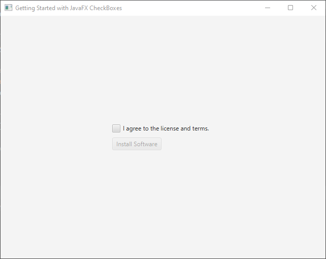
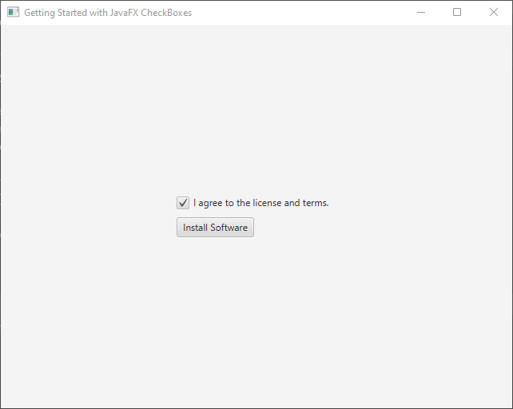
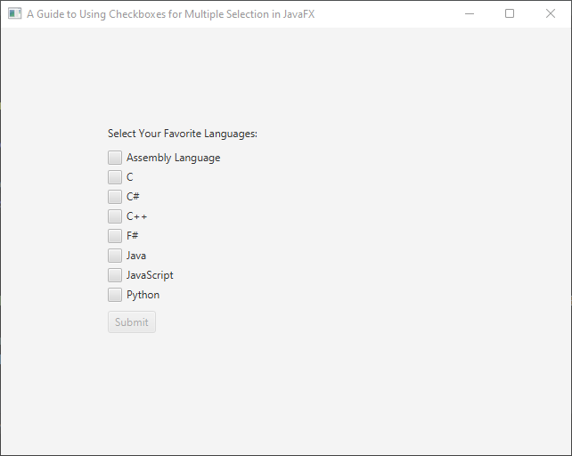
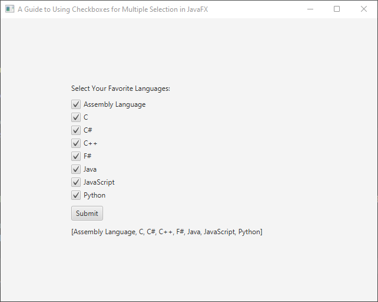

Checkboxes are a common UI element used to offer users selectable or deselectable options. One prevalent scenario where checkboxes are used is during software installation when users must agree to the terms of service and license before proceeding, just as one example. This guide explores the usage of checkboxes in JavaFX.

## Basic Checkbox Usage

The code shown below shows a straightforward example that demonstrates the use of checkboxes in JavaFX:

```java
import javafx.application.Application;
import javafx.geometry.Pos;
import javafx.scene.Scene;
import javafx.scene.control.Button;
import javafx.scene.control.CheckBox;
import javafx.scene.layout.*;
import javafx.stage.Stage;

public class Main extends Application {

    private Scene scene;

    @Override
    public void init() throws Exception {
        super.init();
        buildUI();
    }

    private void buildUI() {
        // create the main content pane
        VBox mainContent = new VBox(10);
        mainContent.setAlignment(Pos.CENTER);

        // create button
        Button button = new Button("Install Software");

        // disable button
        button.setDisable(true);

        CheckBox checkBox = new CheckBox("I agree to the license and terms.");

        // set check box change listener
        checkBox.selectedProperty().addListener((observableValue, prevState, currentState) -> button.setDisable(!currentState));

        // create button container, and add check box and button
        VBox buttonContainer = new VBox(10, checkBox, button);
        buttonContainer.setMaxWidth(200.0);

        // add button container to the main content pane
        mainContent.getChildren().addAll(buttonContainer);

        // Create the layout manager using BorderPane
        BorderPane layoutManager = new BorderPane(mainContent);

        // create the scene with specified dimensions
        this.scene = new Scene(layoutManager, 640.0, 480.0);
    }

    @Override
    public void start(Stage stage) throws Exception {
        stage.setScene(this.scene);
        stage.setTitle("Getting Started with JavaFX CheckBoxes");
        stage.centerOnScreen();
        stage.show();
    }
}
```

When executed, the program above creates a simple user interface with a checkbox and a button, as shown in the images below. When the checkbox is checked, the button’s disabled state changes from true to false, and vice versa.




I hope you found this code informative and helpful in enhancing your JavaFX application. If you like this and would like to see more like it, make sure to subscribe to stay updated with my latest code snippets. 😊

## Multi-selection Functionality

The code example below demonstrates how to create a user interface with checkboxes to select your favorite programming languages. In this code example, a Builder-pattern is used, to assign a `ChangeListener` to each checkbox. With this approach, the `selectedLanguages` is continuously update with a list of all the selected languages. 

```java
import javafx.application.Application;
import javafx.beans.property.BooleanProperty;
import javafx.beans.value.ChangeListener;
import javafx.beans.value.ObservableValue;
import javafx.event.ActionEvent;
import javafx.geometry.Pos;
import javafx.scene.Scene;
import javafx.scene.control.*;
import javafx.scene.layout.*;
import javafx.stage.Stage;
import javafx.util.Builder;

import java.util.Arrays;
import java.util.Set;
import java.util.TreeSet;
import java.util.function.Function;

public class Main extends Application {

    private Scene scene;
    Set<String> selectedLanguages;
    private static final String[] languages = {
            "Assembly Language",
            "C",
            "C#",
            "C++",
            "F#",
            "Java",
            "JavaScript",
            "Python"
    };
    private Button button;
    private Label label;

    @Override
    public void init() throws Exception {
        super.init();
        buildUI();
    }

    private void buildUI() {
        // create the main content pane
        VBox mainContent = new VBox(10);
        mainContent.setAlignment(Pos.CENTER);

        // create a set to store selected languages
        this.selectedLanguages = new TreeSet<>();

        // create the submit button
        this.button = new Button("Submit");
        this.button.setDisable(true);
        this.button.setOnAction(this::buttonSubmitHandler);

        // create the label
        this.label = new Label();

        // hide label
        this.label.setVisible(false);

        // creates a language mapper, each to a checkbox
        // and attach listener
        Function<String, CheckBox> mapper = language -> {
            return (new CheckBoxBuilder(language, this::languageChangeListener)).build();
        };

        // create language checkboxes
        CheckBox[] languageCheckboxes = Arrays.stream(languages)
                                              .map(mapper)
                                              .toArray(CheckBox[]::new);

        // create the language container and add all checkboxes
        VBox languageContainer = new VBox(
                // add 10px spacing between nodes
                10,
                new Label("Select Your Favorite Languages:"),
                // add language checkboxes to a different VBox container,
                // with a 5px spacing
                new VBox(5, languageCheckboxes),
                this.button,
                this.label
        );

        languageContainer.setMaxWidth(400.0);

        // add the language container to the main content pane
        mainContent.getChildren().addAll(languageContainer);

        // create the layout manager using BorderPane
        BorderPane layoutManager = new BorderPane(mainContent);

        // create the scene with specified dimensions
        this.scene = new Scene(layoutManager, 640.0, 480.0);
    }

    private void buttonSubmitHandler(ActionEvent actionEvent) {
        this.label.setText(selectedLanguages.toString());

        // hide or show label, depending on selected languages
        this.label.setVisible(!selectedLanguages.isEmpty());
    }

    private void languageChangeListener(ObservableValue<? extends Boolean> observableValue, Boolean prevState, Boolean currentState) {
        // get the property's underlying bean
        Object bean = ((BooleanProperty) observableValue).getBean();

        // cast the bean to a checkbox
        CheckBox language = (CheckBox) bean;

        if(currentState) {
            // add the selected language to the set
            this.selectedLanguages.add(language.getText());
        } else {
            // remove the deselected language from the set
            this.selectedLanguages.remove(language.getText());
        }

        // enable or disable the button based on selected languages
        this.button.setDisable(selectedLanguages.isEmpty());
    }

    @Override
    public void start(Stage stage) throws Exception {
        stage.setScene(this.scene);
        stage.setTitle("A Guide to Using Checkboxes for Multiple Selection in JavaFX");
        stage.centerOnScreen();
        stage.show();
    }

    private static class CheckBoxBuilder implements Builder<CheckBox> {
        private final CheckBox checkBox;

        public CheckBoxBuilder(String label, ChangeListener<? super Boolean> changeListener) {
            this.checkBox = new CheckBox(label);
            this.checkBox.selectedProperty().addListener(changeListener);
        }

        @Override
        public CheckBox build() {
            return this.checkBox;
        }
    }
}
```

When the above program is executed, it generates the UI shown in the images below. Initially, the submit button is in a disabled state, and it becomes enabled only when at least one language is selected by the user. The submit button displays the selected languages in the label below when it is clicked, as illustrated in the second image:



