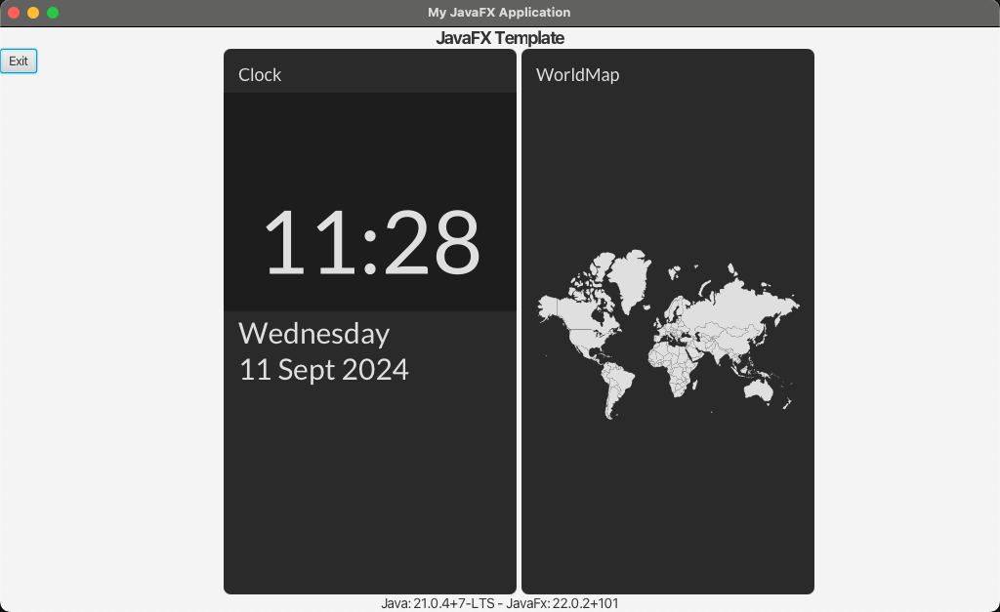
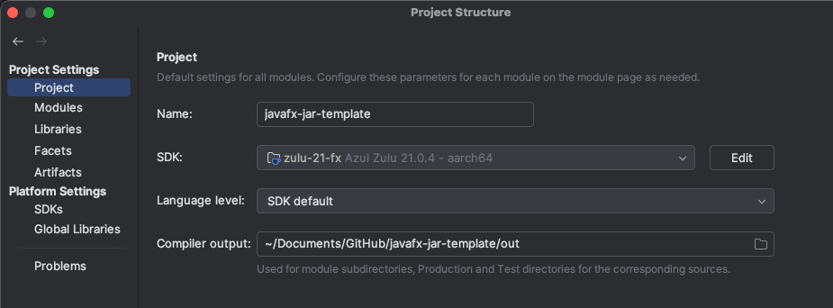
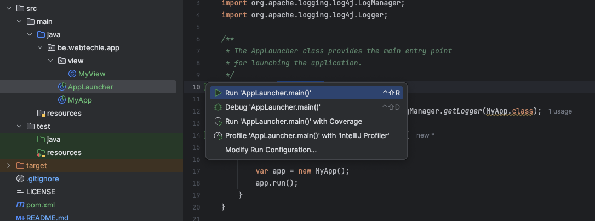

You can use the [GitHub project `javafx-jar-template`](https://github.com/FDelporte/javafx-jar-template) as a starting point for a JavaFX application, that gets build as a FAT JAR (a JAR with all dependencies). It contains a small JavaFX demo application with the TilesFX dependency and the necessary plugins in the `pom.xml` file.


You can use Visual Studio Code or any other IDE for this project, the video and descriptions below are created with IntelliJ IDEA.



## Install JDK and Maven

Make sure you have the requirement tools installed on your machine.

### Install Java JDK with JavaFX

This template requires Java 21 or newer. You can use any JDK and install the [JavaFX runtime separately from the Gluon website](https://gluonhq.com/products/javafx/). But the easiest way is to install a JDK which has JavaFX included:

* Use for instance Azul Zulu with JavaFX included.
* Check installation instructions on the Azul Documentation website:
    * [Windows](https://docs.azul.com/core/install/windows)
    * [macOS](https://docs.azul.com/core/install/macos)
    * [Linux](https://docs.azul.com/core/install/debian)
* Or use [SDKMAN](https://sdkman.io/) on Linux or macOS to easily install a JDK or switch to another one:
```bash
# Install SDKMAN 
$ curl -s "https://get.sdkman.io" | bash
$ source "$HOME/.sdkman/bin/sdkman-init.sh"

# Install the Zulu JDK 21 with JavaFX 
# Answer Y to set as default
$ sdk install java 21.0.4.fx-zulu
```

### Install Maven

If you didn't install Maven before:

* Follow the instructions on [the website of the Apache Maven Project](https://maven.apache.org/install.html).
* Or use [SDKMAN](https://sdkman.io/) on Linux or macOS:
```bash
$ sdk install maven
```

### Check Java and Maven Version

```bash
$ java -version
openjdk version "21.0.4" 2024-07-16 LTS
OpenJDK Runtime Environment Zulu21.36+17-CA (build 21.0.4+7-LTS)
OpenJDK 64-Bit Server VM Zulu21.36+17-CA (build 21.0.4+7-LTS, mixed mode, sharing)

$ mvn -version
Apache Maven 3.9.6 (bc0240f3c744dd6b6ec2920b3cd08dcc295161ae)
Maven home: /Users/frank/.sdkman/candidates/maven/current
Java version: 21.0.4, vendor: Azul Systems, Inc., runtime: /Users/frank/.sdkman/candidates/java/21.0.4.fx-zulu/zulu-21.jdk/Contents/Home
Default locale: en_US, platform encoding: UTF-8
OS name: "mac os x", version: "14.6.1", arch: "aarch64", family: "mac"
```

## Run in IntelliJ IDEA

You can find the [sources on GitHub: github.com/FDelporte/javafx-jar-template](https://github.com/FDelporte/javafx-jar-template).

1. Check out the sources, directly in your IDE or with `git clone https://github.com/FDelporte/javafx-jar-template.git`
1. Open in IntelliJ IDEA as a new Maven project
1. Configure a JDK with JavaFX in "Project Structure > SDK"
   
1. Go to the file `src/main/java/be/webtechie/app/AppLauncher.java`
1. Click on the green button "Run AppLauncher.main()"
   

## Build as executable JAR with all dependencies

1. Fill-in the name you want to use for your jar-file in `pom.xml` > build > finalName.
1. Make sure the `mainClass` is correct in `pom.xml` > build > plugin > maven-assembly-plugin.
1. Run the Maven `package` command `$ mvn package`.
1. You can now find the jar with all dependencies packages in `/target/{YOUR_FINALNAME}.jar`.
1. Run it with `java -jar target/{YOUR_FINALNAME}.jar`.

## Conclusion

This template can help you to get started quickly with a new JavaFX project.

