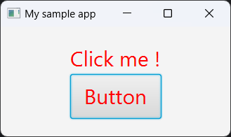

## QuarkusFX

QuarkusFX is a [Quarkus](https://quarkus.io/) extension that allows you to use JavaFX in your Quarkus application.
It allows component injection in FX Controllers as well as other CDI features like events management.

A comprehensive documentation can be found in the [quarkiverse dedicated page](https://docs.quarkiverse.io/quarkus-fx/dev/index.html).

The source code is available on [Github](https://github.com/quarkiverse/quarkus-fx), as well as some useful [samples](https://github.com/quarkiverse/quarkus-fx/tree/main/samples).

This guide helps you to make use of this extension in your Quarkus application.

### Bootstrap your QuarkusFX application

The [Start Coding](https://code.quarkus.io/) page from the Quarkus website allows you to generate a starting project.

You can select the extensions that you wish to include.
Type "fx" in the search bar to find the _quarkus-fx_ extension.


Select any other extensions that you wish to use, like a REST client, an ORM for a given database, ... and click "Generate your application" to download the project archive.

### Add QuarkusFX to an existing Quarkus project

If you already have an existing Quarkus project, you can add the QuarkusFX extension by adding the following dependency by replacing `{version}` with the version you wish to use.

Maven
```xml
<dependency>
    <groupId>io.quarkiverse.fx</groupId>
    <artifactId>quarkus-fx</artifactId>
    <version>{version}</version>
</dependency>
```

Gradle
```groovy
dependencies {
  implementation 'io.quarkiverse.fx:quarkus-fx:{version}'
}
```

### Starting the JavaFX application

There is no need to create a main class and extend `javafx.application.Application` : the extension takes care of the plumbing for you.

The primary `Stage` instance can be retrieved by subscribing to the CDI event `FxPostStartupEvent`.

```java
void onStartup(@Observes FxPostStartupEvent event) {
  Stage stage = event.getPrimaryStage();
}
```

### Loading FXML

Injecting the `FXMLLoader` allows to load `.fxml` files.

Here is some sample code to set up a basic application.

_FXML_
```xml
<?xml version="1.0" encoding="UTF-8"?>

<?import javafx.scene.control.Button?>
<?import javafx.scene.control.Label?>
<?import javafx.scene.layout.VBox?>

<VBox alignment="CENTER"
      xmlns="http://javafx.com/javafx/21"
      xmlns:fx="http://javafx.com/fxml/1"
      fx:controller="org.acme.SampleController">

    <Label text="Click me !" fx:id="label"/>
    <Button mnemonicParsing="false" onAction="#onButtonClick" text="Button"/>
</VBox>
```

_Controller_
```java
@Singleton
public class SampleController {

    @FXML
    Label label;
  
    @FXML
    private void onButtonClick() {
        this.label.setText("Clicked !");
    }
}

```

_Starter code_
```java
public class SampleApp {

    @Inject
    FXMLLoader fxmlLoader;

    void onStartup(@Observes final FxPostStartupEvent event) throws IOException {

        // Load FXML
        InputStream fxml = this.getClass().getResourceAsStream("/Sample.fxml");
        Parent parent = this.fxmlLoader.load(fxml);

        // Setup stage
        Stage stage = event.getPrimaryStage();
        Scene scene = new Scene(parent, 250, 125);
        stage.setScene(scene);
        stage.setTitle("My sample app");
        stage.show();
    }
}
```

When the quarkus application is launched, the stage is displayed.


### Supercharge your FX controllers with dependency injection !

Let's say we have this simple service that we want to use in our FX controller :

```java
@ApplicationScoped
public class MessageService {
  
    public String getMessageOfTheDay() {
        return "Lorem Ipsum";
    }
}
```

We can simply inject it in our controller and call it upon click action :

```java
@Singleton
public class SampleController {

    @Inject
    MessageService messageService;

    @FXML
    Label label;

    @FXML
    private void onButtonClick() {
        String message = this.messageService.getMessageOfTheDay();
        this.label.setText(message);
    }
}
```

### The `@RunOnFxThread` interceptor

`@RunOnFxThread` is an interceptor that ensures a method is called within the JavaFX Application Thread.

Let's make our service asynchronous by returning a `CompletableFuture` with a 2 seconds delay.

```java
@ApplicationScoped
public class MessageService {

    public CompletableFuture<String> getMessageOfTheDay() {
        return CompletableFuture.supplyAsync(
            () -> "Async Lorem Ipsum",
            CompletableFuture.delayedExecutor(2, TimeUnit.SECONDS)
        );
    }
}
```

We can adapt our controller code to use the new service :

```java
@Singleton
public class SampleController {

    @Inject
    MessageService messageService;

    @FXML
    Label label;

    @FXML
    private void onButtonClick() {
        this.messageService.getMessageOfTheDay()
                .thenAccept(message -> Platform.runLater(() -> this.label.setText(message)));
    }
}
```

This can be simplified further using the `@RunOnFxThread` annotation :

```java
@Singleton
public class SampleController {

    @Inject
    MessageService messageService;

    @FXML
    Label label;

    @FXML
    private void onButtonClick() {
        this.messageService.getMessageOfTheDay().thenAccept(this::processMessage);
    }

    @RunOnFxThread
    void processMessage(String message) {
        this.label.setText(message);
    }
}
```

### Conventional views

The `@FxView` annotation allows to define conventional views.
Based on naming conventions, it simplifies FXML loading (as well as style and internationalization resources).

We can mark our controller with `@FxView` to indicate it is a conventional view.
Therefore, the extension will take care of loading the `.fxml` and the associated resources.
If the controller is named `FooController`, it will look for resources `Foo.fxml`, `Foo.css` and resource bundle with name `Foo`.

```java
@FxView
@Singleton
public class SampleController {
    // ...
}
```

We can then adapt for `SampleApp` starter :

```java
public class SampleApp {

    @Inject
    FxViewRepository viewRepository;

    void onStartup(@Observes final FxPostStartupEvent event) {

        // Retrieve view
        Parent parent = this.viewRepository.getViewData("Sample").getRootNode();

        // Setup stage
        Stage stage = event.getPrimaryStage();
        Scene scene = new Scene(parent, 250, 125);
        stage.setScene(scene);
        stage.setTitle("My sample app");
        stage.show();
    }
}
```

### Live CSS reload

Dev integrates a live CSS reload feature, allowing the developer to modify stylesheet files with live effect on the running application.

Let's add some styling to our component by creating a `Sample.css` file :

```css
Label, Button {
    -fx-font-size: 2em;
    -fx-text-fill: blue;
}
```

After launch the application in dev mode :


Let's change some style while the application is running :

```css
Label, Button {
    -fx-font-size: 2em;
    -fx-text-fill: red;
}
```

The style is automatically applied :

