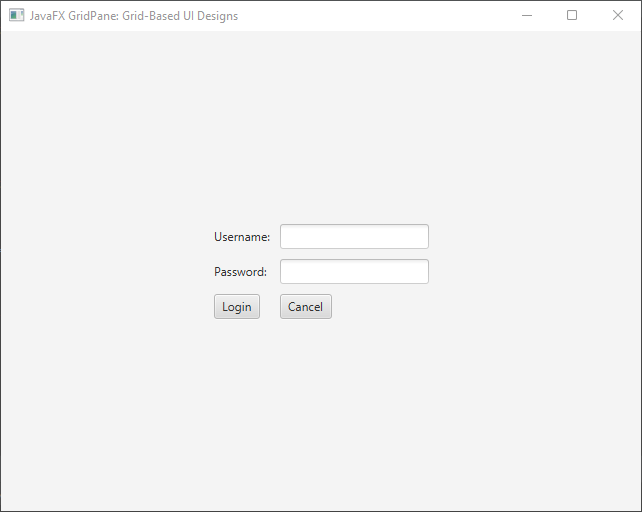
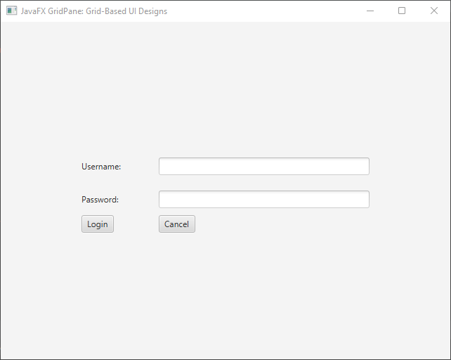
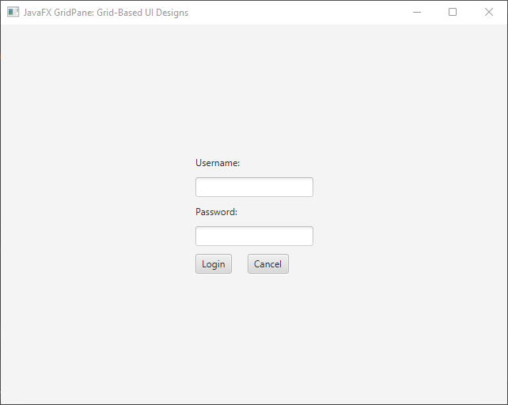
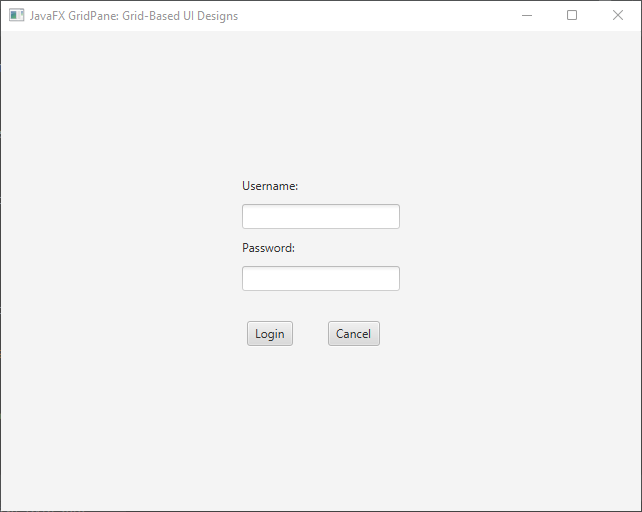
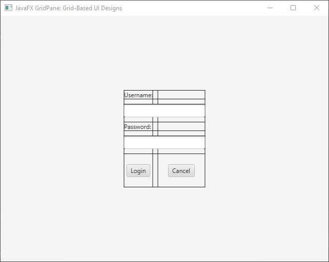
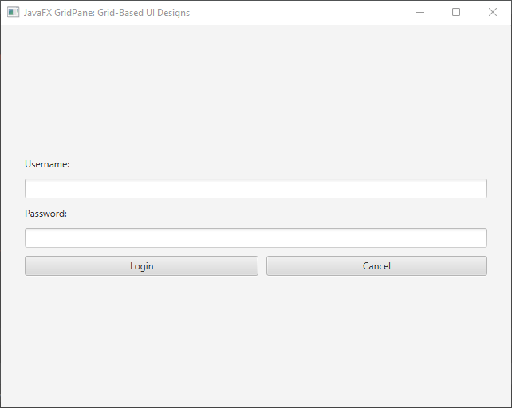

In the world of user interface (UI) design, organizing and aligning elements on the screen is crucial to creating visually appealing and user-friendly applications. JavaFX, a rich set of graphics and media libraries for building desktop and mobile applications, offers a versatile layout manager called GridPane. JavaFX GridPane enables developers to create sophisticated grid-based UI designs, arranging components in rows and columns to create structured and organized layouts.

In this section, we will explore the fundamentals of JavaFX GridPane and provide you with comprehensive code examples to help you get started with grid-based UI designs.

# Understanding the GridPane

JavaFX GridPane is a layout manager that allows you to create layouts by dividing the scene into a grid of rows and columns. Each cell in the grid can contain UI components like buttons, labels, text fields, and more. This grid-based approach makes it easy to align and organize elements in a structured manner, accommodating various design requirements.

Key features of GridPane:

* **Flexible Layout**: GridPane offers a flexible way to manage the layout of UI components. You can specify how many rows and columns the grid should have, and each cell can contain a single UI component or be left empty.
* **Alignment Control**: You can align elements within individual cells both vertically and horizontally. This gives you fine-grained control over the positioning of components.
* **Spanning Cells**: Components can span across multiple rows and columns, allowing you to create complex designs with merged cells.
* **Responsive Design**: GridPane supports responsive design by allowing components to grow or shrink based on the available space.
* **Resizable Rows and Columns**: You can define rows and columns to be resizable, ensuring that the layout adjusts smoothly when the window size changes.
* **Nesting**: GridPane instances can be nested inside each other, enabling you to create more intricate layouts by combining grids.

## Creating a Simple GridPane

Let’s start by creating a simple GridPane with a few UI elements. In this example, we’ll create a basic login form with labels, text fields, and buttons.

```java
import javafx.application.Application;
import javafx.geometry.Pos;
import javafx.scene.Scene;
import javafx.scene.control.*;
import javafx.scene.layout.*;
import javafx.stage.Stage;

public class Main extends Application {

    private final GridPane parent = new GridPane();

    @Override
    public void start(Stage stage) throws Exception {
        this.setupStage(stage);
    }

    @Override
    public void init() throws Exception {
        super.init();
        this.buildUI();
    }

    private void buildUI() {

        // Horizontal gap between columns
        this.parent.setHgap(10);

        // Vertical gap between rows
        this.parent.setVgap(10);

        // Center the GridPane
        this.parent.setAlignment(Pos.CENTER);

        Label usernameLabel = new Label("Username:");
        TextField usernameField = new TextField();

        Label passwordLabel = new Label("Password:");
        PasswordField passwordField = new PasswordField();

        Button loginButton = new Button("Login");
        Button cancelButton = new Button("Cancel");

        // Adding components to the grid
        this.parent.add(usernameLabel, 0, 0);
        this.parent.add(usernameField, 1, 0);

        this.parent.add(passwordLabel, 0, 1);
        this.parent.add(passwordField, 1, 1);

        this.parent.add(loginButton, 0, 2);
        this.parent.add(cancelButton, 1, 2);
    }

    private void setupStage(Stage stage) {
        Scene scene = new Scene(this.parent, 640, 480);
        stage.setTitle("JavaFX GridPane: Grid-Based UI Designs");
        stage.setScene(scene);
        stage.centerOnScreen();
        stage.show();
    }
}
```

In this example, we create a simple login form with labels, text fields, and buttons arranged using the GridPane. The add() method is used to place components at specific grid coordinates (row and column indices).



## Advanced GridPane Features

GridPane provides advanced features that allow for more complex layouts. You can control the column and row constraints, span cells, and manage alignment within the grid.

### Column and Row Constraints

You can control the sizing behavior of columns and rows in the GridPane using ColumnConstraints and RowConstraints. These constraints allow you to specify the preferred, minimum, and maximum sizes, along with the resizing behavior.

```java
import javafx.application.Application;
import javafx.geometry.Pos;
import javafx.scene.Scene;
import javafx.scene.control.*;
import javafx.scene.layout.*;
import javafx.stage.Stage;

public class Main extends Application {

    private final GridPane parent = new GridPane();

    @Override
    public void start(Stage stage) throws Exception {
        this.setupStage(stage);
    }

    @Override
    public void init() throws Exception {
        super.init();
        this.buildUI();
    }

    private void buildUI() {

        // Horizontal gap between columns
        this.parent.setHgap(10);

        // Vertical gap between rows
        this.parent.setVgap(10);

        // Center the GridPane
        this.parent.setAlignment(Pos.CENTER);

        Label usernameLabel = new Label("Username:");
        TextField usernameField = new TextField();

        Label passwordLabel = new Label("Password:");
        PasswordField passwordField = new PasswordField();

        Button loginButton = new Button("Login");
        Button cancelButton = new Button("Cancel");

        // Adding components to the grid
        this.parent.add(usernameLabel, 0, 0);
        this.parent.add(usernameField, 1, 0);

        this.parent.add(passwordLabel, 0, 1);
        this.parent.add(passwordField, 1, 1);

        this.parent.add(loginButton, 0, 2);
        this.parent.add(cancelButton, 1, 2);

        ColumnConstraints col1 = new ColumnConstraints(100); // Preferred width

        // Min, pref, max width
        ColumnConstraints col2 = new ColumnConstraints(200, 300, Double.MAX_VALUE);
        this.parent.getColumnConstraints().addAll(col1, col2);

        // Preferred height
        RowConstraints row1 = new RowConstraints(50);
        this.parent.getRowConstraints().add(row1);
    }

    private void setupStage(Stage stage) {
        Scene scene = new Scene(this.parent, 640, 480);
        stage.setTitle("JavaFX GridPane: Grid-Based UI Designs");
        stage.setScene(scene);
        stage.centerOnScreen();
        stage.show();
    }
}
```



### Spanning Rows and Columns

One of the strengths of GridPane is the ability to make UI components span multiple rows or columns. This is useful when you want a single component to take up more space within the layout.

```java
import javafx.application.Application;
import javafx.geometry.Pos;
import javafx.scene.Scene;
import javafx.scene.control.*;
import javafx.scene.layout.*;
import javafx.stage.Stage;

public class Main extends Application {

    private final GridPane parent = new GridPane();

    @Override
    public void start(Stage stage) throws Exception {
        this.setupStage(stage);
    }

    @Override
    public void init() throws Exception {
        super.init();
        this.buildUI();
    }

    private void buildUI() {

        // Horizontal gap between columns
        this.parent.setHgap(10);

        // Vertical gap between rows
        this.parent.setVgap(10);

        // Center the GridPane
        this.parent.setAlignment(Pos.CENTER);

        Label usernameLabel = new Label("Username:");
        TextField usernameField = new TextField();

        Label passwordLabel = new Label("Password:");
        PasswordField passwordField = new PasswordField();

        Button loginButton = new Button("Login");
        Button cancelButton = new Button("Cancel");

        // Adding components to the grid
        this.parent.add(usernameLabel, 0, 0);
        this.parent.add(usernameField, 0, 1);

        this.parent.add(passwordLabel, 0, 2);
        this.parent.add(passwordField, 0, 3);

        this.parent.add(loginButton, 0, 4);
        this.parent.add(cancelButton, 1, 4);

        // Spanning 2 Columns
        GridPane.setColumnSpan(usernameField, 2);

        // Spanning 2 Columns
        GridPane.setColumnSpan(passwordField, 2);
    }

    private void setupStage(Stage stage) {
        Scene scene = new Scene(this.parent, 640, 480);
        stage.setTitle("JavaFX GridPane: Grid-Based UI Designs");
        stage.setScene(scene);
        stage.centerOnScreen();
        stage.show();
    }
}
```

In this snippet, we have shifted the user name and password fields to the next row. Both fields now span two columns, starting from positions (0, 1) and (0, 3) respectively.



### Alignment and Margins

You can control the alignment of UI components within their grid cell using setAlignment method:

```java
import javafx.application.Application;
import javafx.geometry.HPos;
import javafx.geometry.Pos;
import javafx.geometry.VPos;
import javafx.scene.Scene;
import javafx.scene.control.*;
import javafx.scene.layout.*;
import javafx.stage.Stage;

public class Main extends Application {

    private final GridPane parent = new GridPane();

    @Override
    public void start(Stage stage) throws Exception {
        this.setupStage(stage);
    }

    @Override
    public void init() throws Exception {
        super.init();
        this.buildUI();
    }

    private void buildUI() {

        // Horizontal gap between columns
        this.parent.setHgap(10);

        // Vertical gap between rows
        this.parent.setVgap(10);

        // Center the GridPane
        this.parent.setAlignment(Pos.CENTER);

        Label usernameLabel = new Label("Username:");
        TextField usernameField = new TextField();

        Label passwordLabel = new Label("Password:");
        PasswordField passwordField = new PasswordField();

        Button loginButton = new Button("Login");
        Button cancelButton = new Button("Cancel");

        // Adding components to the grid
        this.parent.add(usernameLabel, 0, 0);
        this.parent.add(usernameField, 0, 1);

        this.parent.add(passwordLabel, 0, 2);
        this.parent.add(passwordField, 0, 3);

        this.parent.add(loginButton, 0, 4);
        this.parent.add(cancelButton, 1, 4);

        // Spanning 2 Columns
        GridPane.setColumnSpan(usernameField, 2);

        // Spanning 2 Columns
        GridPane.setColumnSpan(passwordField, 2);
        
        // Horizontal alignment
        GridPane.setHalignment(loginButton, HPos.CENTER);
        
        // Vertical alignment
        GridPane.setValignment(cancelButton, VPos.BOTTOM);
    }

    private void setupStage(Stage stage) {
        Scene scene = new Scene(this.parent, 640, 480);
        stage.setTitle("JavaFX GridPane: Grid-Based UI Designs");
        stage.setScene(scene);
        stage.centerOnScreen();
        stage.show();
    }
}
```


Additionally, you can set margins around individual cells using setMargin method:

```java
import javafx.application.Application;
import javafx.geometry.HPos;
import javafx.geometry.Insets;
import javafx.geometry.Pos;
import javafx.geometry.VPos;
import javafx.scene.Scene;
import javafx.scene.control.*;
import javafx.scene.layout.*;
import javafx.stage.Stage;

public class Main extends Application {

    private final GridPane parent = new GridPane();

    @Override
    public void start(Stage stage) throws Exception {
        this.setupStage(stage);
    }

    @Override
    public void init() throws Exception {
        super.init();
        this.buildUI();
    }

    private void buildUI() {

        // Horizontal gap between columns
        this.parent.setHgap(10);

        // Vertical gap between rows
        this.parent.setVgap(10);

        // Center the GridPane
        this.parent.setAlignment(Pos.CENTER);

        Label usernameLabel = new Label("Username:");
        TextField usernameField = new TextField();

        Label passwordLabel = new Label("Password:");
        PasswordField passwordField = new PasswordField();

        Button loginButton = new Button("Login");
        Button cancelButton = new Button("Cancel");

        // Adding components to the grid
        this.parent.add(usernameLabel, 0, 0);
        this.parent.add(usernameField, 0, 1);

        this.parent.add(passwordLabel, 0, 2);
        this.parent.add(passwordField, 0, 3);

        this.parent.add(loginButton, 0, 4);
        this.parent.add(cancelButton, 1, 4);

        // Spanning 2 Columns
        GridPane.setColumnSpan(usernameField, 2);

        // Spanning 2 Columns
        GridPane.setColumnSpan(passwordField, 2);

        // Horizontal alignment
        GridPane.setHalignment(loginButton, HPos.CENTER);

        // Vertical alignment
        GridPane.setValignment(cancelButton, VPos.BOTTOM);

        // Setting margins
        GridPane.setMargin(cancelButton, new Insets(20));
    }

    private void setupStage(Stage stage) {
        Scene scene = new Scene(this.parent, 640, 480);
        stage.setTitle("JavaFX GridPane: Grid-Based UI Designs");
        stage.setScene(scene);
        stage.centerOnScreen();
        stage.show();
    }
}
```



## The GridPane Layout and Grid Lines

Grid lines in the GridPane layout serve as visual aids that depict the boundaries of each cell, facilitating precise alignment and positioning of UI elements. These grid lines provide a tangible reference for developers to ensure optimal arrangement and aesthetics.

### Benefits of Grid Lines

The grid lines displayed by the GridPane layout serve as a powerful visual aid during the design phase. They enable developers to:

* **Achieve Alignment**: Grid lines ensure that UI elements are aligned uniformly, resulting in a polished and professional appearance.
* **Maintain Consistency**: With grid lines, it’s easier to maintain consistent spacing between elements, contributing to a cohesive user interface.
* **Precise Positioning**: Grid lines help developers accurately position elements within cells, eliminating the guesswork associated with manual alignment.
* **Debugging**: During the development process, grid lines can be helpful for debugging layout issues by identifying misaligned or overlapping elements.

```java
import javafx.application.Application;
import javafx.geometry.HPos;
import javafx.geometry.Insets;
import javafx.geometry.Pos;
import javafx.geometry.VPos;
import javafx.scene.Scene;
import javafx.scene.control.*;
import javafx.scene.layout.*;
import javafx.stage.Stage;

public class Main extends Application {

    private final GridPane parent = new GridPane();

    @Override
    public void start(Stage stage) throws Exception {
        this.setupStage(stage);
    }

    @Override
    public void init() throws Exception {
        super.init();
        this.buildUI();
    }

    private void buildUI() {

        // Horizontal gap between columns
        this.parent.setHgap(10);

        // Vertical gap between rows
        this.parent.setVgap(10);

        // Center the GridPane
        this.parent.setAlignment(Pos.CENTER);

        // Display grid lines
        this.parent.setGridLinesVisible(true);

        Label usernameLabel = new Label("Username:");
        TextField usernameField = new TextField();

        Label passwordLabel = new Label("Password:");
        PasswordField passwordField = new PasswordField();

        Button loginButton = new Button("Login");
        Button cancelButton = new Button("Cancel");

        // Adding components to the grid
        this.parent.add(usernameLabel, 0, 0);
        this.parent.add(usernameField, 0, 1);

        this.parent.add(passwordLabel, 0, 2);
        this.parent.add(passwordField, 0, 3);

        this.parent.add(loginButton, 0, 4);
        this.parent.add(cancelButton, 1, 4);

        // Spanning 2 Columns
        GridPane.setColumnSpan(usernameField, 2);

        // Spanning 2 Columns
        GridPane.setColumnSpan(passwordField, 2);

        // Horizontal alignment
        GridPane.setHalignment(loginButton, HPos.CENTER);

        // Vertical alignment
        GridPane.setValignment(cancelButton, VPos.BOTTOM);

        // Setting margins
        GridPane.setMargin(cancelButton, new Insets(20));
    }

    private void setupStage(Stage stage) {
        Scene scene = new Scene(this.parent, 640, 480);
        stage.setTitle("JavaFX GridPane: Grid-Based UI Designs");
        stage.setScene(scene);
        stage.centerOnScreen();
        stage.show();
    }
}
```

We set the grid lines to be visible using the setGridLinesVisible method. This allows us to see the grid lines between cells. The grid lines help visualize the alignment of the nodes within their respective cells.



## Grow Priority

In complex layouts, accommodating dynamic content sizes can be challenging. This is where the “grow priority” of the GridPane layout comes into play. The grow priority determines how extra space is distributed among cells when the grid’s size increases. This feature is particularly useful when the content within cells expands, ensuring that the layout adapts fluidly to changing conditions.

```java
import javafx.application.Application;
import javafx.geometry.Insets;
import javafx.geometry.Pos;
import javafx.scene.Scene;
import javafx.scene.control.*;
import javafx.scene.layout.*;
import javafx.scene.layout.Priority;
import javafx.stage.Stage;

public class Main extends Application {

    private final GridPane parent = new GridPane();

    @Override
    public void start(Stage stage) throws Exception {
        this.setupStage(stage);
    }

    @Override
    public void init() throws Exception {
        super.init();
        this.buildUI();
    }

    private void buildUI() {

        // Horizontal gap between columns
        this.parent.setHgap(10);

        // Vertical gap between rows
        this.parent.setVgap(10);

        // Set padding
        this.parent.setPadding(new Insets(30));

        // Center the GridPane
        this.parent.setAlignment(Pos.CENTER);

        Label usernameLabel = new Label("Username:");
        TextField usernameField = new TextField();

        Label passwordLabel = new Label("Password:");
        PasswordField passwordField = new PasswordField();

        Button loginButton = new Button("Login");
        Button cancelButton = new Button("Cancel");

        // Adding components to the grid
        this.parent.add(usernameLabel, 0, 0);
        this.parent.add(usernameField, 0, 1);

        this.parent.add(passwordLabel, 0, 2);
        this.parent.add(passwordField, 0, 3);

        this.parent.add(loginButton, 0, 4);
        this.parent.add(cancelButton, 1, 4);

        // Spanning 2 Columns
        GridPane.setColumnSpan(usernameField, 2);

        // Spanning 2 Columns
        GridPane.setColumnSpan(passwordField, 2);

        // Set Button sizes
        loginButton.setMaxWidth(Double.MAX_VALUE);
        cancelButton.setMaxWidth(Double.MAX_VALUE);

        // Set grow priority for buttons
        GridPane.setHgrow(loginButton, Priority.ALWAYS);
        GridPane.setHgrow(cancelButton, Priority.ALWAYS);
    }

    private void setupStage(Stage stage) {
        Scene scene = new Scene(this.parent, 640, 480);
        stage.setTitle("JavaFX GridPane: Grid-Based UI Designs");
        stage.setScene(scene);
        stage.centerOnScreen();
        stage.show();
    }
}
```

We have two buttons within the grid, login and cancel buttons. By setting the horizontal grow priority of both buttons to ALWAYS, we ensure that they will expand horizontally to occupy any extra space available. This prevents the content from getting cut off or overlapping in the case of a smaller window.



## Conclusion

The GridPane layout manager in JavaFX provides a powerful and flexible way to create grid-based UI designs. With its ability to arrange components in rows and columns, control spacing, alignment, and cell spanning, developers can create visually appealing and organized user interfaces. By understanding the GridPane’s features and employing them effectively, developers can design intuitive and responsive layouts for their JavaFX applications.

In this section, we explored the basics of creating a GridPane layout and demonstrated its usage in both simple and advanced scenarios. Armed with this knowledge, developers can confidently leverage the GridPane to build complex user interfaces that meet the needs of their applications.

Master grid-based UI designs with the JavaFX GridPane layout manager. Create flexible layouts & organize components seamlessly. Perfect your UIs!