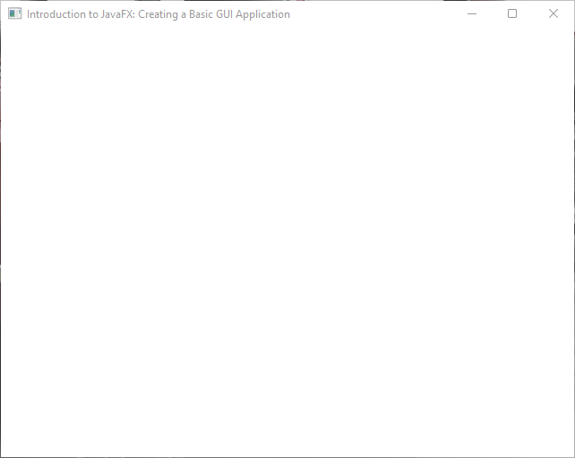

Let's take a look at the minimal code needed to create a JavaFX application.


## Understanding the Stage and Scene

In JavaFX, the terms "stage" and "scene" are key concepts related to creating and managing the Graphical User Interface (GUI) of your Java application. 

They serve different purposes:

### Stage

* A Stage in JavaFX represents a top-level window or container for your application's GUI. It can be thought of as a primary window that contains one or more scenes.
* Typically, an application has one or more stages, such as the main application window, pop-up dialog boxes, or secondary windows.
* A Stage is an instance of the `javafx.stage.Stage` class, and you can create and configure it to suit your needs.

### Scene

* A Scene in JavaFX represents the content of a stage, or in other words, it is the container for the visual elements (nodes) that make up your application's user interface.
* A Scene is an instance of the `javafx.scene.Scene` class, and it can be associated with a Stage to define what's displayed within that stage.
A scene can contain various UI elements like buttons, labels, text fields, and other controls. It can also have its own layout and styling.

## Minimal Code Example

The following code snippet shows how to use the Stage and Scene classes to build a fundamental JavaFX window.

```java
import javafx.application.Application;
import javafx.scene.Scene;
import javafx.scene.layout.BorderPane;
import javafx.stage.Stage;

public class Main extends Application {

    private static final double WIDTH  = 640;
    private static final double HEIGHT = 480;

    @Override
    public void start(Stage stage) {
        // BorderPane is a JavaFX UI element, similar to text, button,...
        BorderPane layoutManager = new BorderPane();
        
        // We initialize the scene, containing the BorderPane
        Scene scene = new Scene(layoutManager, WIDTH, HEIGHT);

        // The stage is provided as a parameter and can be further defined here
        stage.setTitle("Introduction to JavaFX: Creating a Basic GUI Application");
        stage.setScene(scene);
        stage.centerOnScreen();
        stage.show();
    }
}
```

When the above code is executed, it creates a window (= stage) as shown in the image down below:


