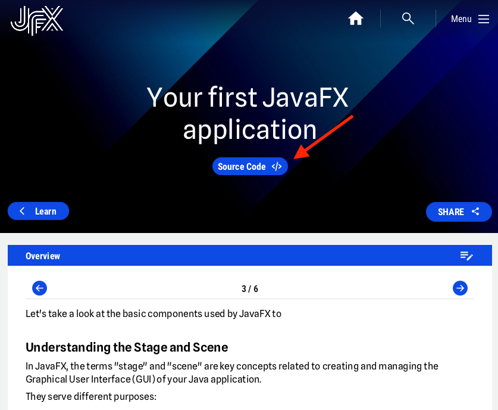

Modern software apps require Graphic User Interfaces (GUIs), and JavaFX is a well-liked framework for creating them. With JavaFX, programmers can easily build GUIs that are both highly interactive and aesthetically pleasing.

## Learn How to Make a JavaFX Desktop Application

In the following sections, you will learn how to use JavaFX to build such a user interface. You can follow each of the steps to gain more knowledge about the use of JavaFX, or just skip to the items of your interest.

## Source Code

Where applicable, a button is available that will bring you to a code repository with the full example code as a Maven or Gradle project that you can clone and execute in your IDE.

## Thanks To...

A lot of the tutorials in this section are provided by [Edward Nyirenda Jr](https://www.jfx-central.com/people/e.nyirenda), and we would really like to thank him for the great content he has written for his personal blog, that we may reuse here on JFX Central.