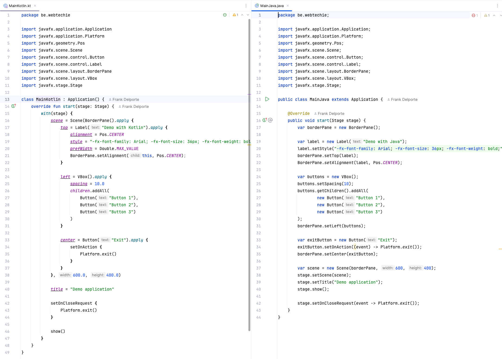

Kotlin also runs on the Java Virtual Machine (JVM) and is a very close sister of Java. In this tutorial, you'll learn the difference in code style when combining it with JavaFX.



## About Kotlin

Kotlin is a programming language, providing a modern, concise, and expressive syntax. It's designed to eliminate many common pitfalls of Java like null pointer exceptions (with nullable types and the ? operator). It's fully interoperable with Java, allowing you to use existing Java libraries and frameworks. You can call Java code from Kotlin and vice versa and mix both in one project. Kotlin was developed in 2010 by JetBrains (maker of IntelliJ IDEA). It quickly gained significant popularity, especially in Android development.

## Example Project

You can use this small [GitHub project](https://github.com/FDelporte/javafx-with-java-versus-kotlin) to see the code differences. It can also be used as a template if you want to get started with Kotlin and JavaFX. It contains the code both in Java and Kotlin to show the same basic user interface with a BorderPane, Buttons, etc. to be able to compare the code structure in Java versus Kotlin. The project also contains a GitHub Action workflow to build the app.



As you can see in the screenshot, the Kotlin code is not smaller, but because you can "nest" the methods of a new object in the `apply{}`-block, it becomes a lot more obvious what code elements belong together.

This is Java code to create a `VBox` with three `Button`s:

```java
var borderPane = new BorderPane();

var buttons = new VBox();
buttons.setSpacing(10);
buttons.getChildren().addAll(
        new Button("Button 1"),
        new Button("Button 2"),
        new Button("Button 3")
);
borderPane.setLeft(buttons);
```

That can be written in Kotlin like this:

```Kotlin
var borderPane = BorderPane().apply {
    left = VBox().apply {
        spacing = 10.0
        children.addAll(
            Button("Button 1"),
            Button("Button 2"),
            Button("Button 3")
        )
    }
}
```

The result is exactly the same, but from reading-point-of-view, the Kotlin approach is easier to read.

## Conclusion

We don't want to push you in the direction of Java or Kotlin! Each language has its strengths, and the choice depends on the requirements of your project, combined with personal and team preferences. But it's definitely worth trying out and the sources of this tutorial can help you to get started easily.