This document serves as a development guide for beginners in Java and JavaFX using Visual Studio Code (VSCode).

There are still relatively few guides available for JavaFX development using VSCode because it previously lacked a well-established development environment for JavaFX. In 2025, extensions for JavaFX were added and organized, making it one of the most accessible IDEs for beginners to start with JavaFX. 

This document contains the following content:

1. How to set up a VSCode environment for JavaFX
2. How to create your first JavaFX project

# Setting up the VSCode environment for JavaFX

This guide will install the following software:

- OpenJDK 21
- Maven 3
- Visual Studio Code and the necessary extensions
- Scene Builder

Installation methods differ depending on the operating system.

## Setting up VSCode for JavaFX on Windows

[Back to main page](readme.md)

### Step 1. Check your Java version

First, check if Java is installed on your system.
Search your Windows OS for the **Terminal** app.
You can do this by clicking the Start menu and typing “Terminal” in the search bar.

Open the "Terminal" (Windows PowerShell) and enter the following command:
```
java -version
```
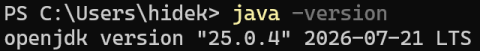

If an error is displayed, Java is not installed on your PC.
Otherwise, the installed version of Java will be displayed.
In the example in the photo above, openjdk version "21.0.6" is shown.

If the version is less than 21, please uninstall Java.
The minor version numbers (the x.x part of 21.x.x) can be anything.
If Java 21 or higher is already installed, no installation is necessary; proceed to **Step 4**.

### Step 2. Install Scoop

If you are unfamiliar with setting up development environments, we recommend using **Scoop**. [Scoop](https://scoop.sh) is a package manager for Windows that automatically installs the necessary software for development and configures it for use.

To install Scoop, copy the two lines below, paste them into Terminal (PowerShell), and press the Enter key to execute them.

```
Set-ExecutionPolicy -ExecutionPolicy RemoteSigned -Scope CurrentUser
Invoke-RestMethod -Uri https://get.scoop.sh | Invoke-Expression
```

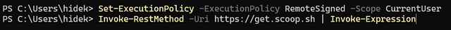

### Step 3. Install Java (OpenJDK 21)

For those just starting to learn Java, OpenJDK is recommended as it is a free Java Development Kit (JDK).

There are many distributions of OpenJDK. Any distribution will work, but this guide uses Microsoft's distribution.

Installing Java involves running the following three commands in your Terminal.

```
scoop install git
scoop bucket add java
scoop install microsoft21-jdk
```
If you know that **git** is already installed on your PC, you can skip the first `scoop install git` command.

Scoop automatically adds the **JAVA_HOME** value and the **Path** to the Java executables into the "User Environment Variables" of your Windows OS. If you don't use Scoop, you need to add them manually.


### Step 4. Install Maven 3

Next, we will install **Maven**, a build tool for Java.

A build tool manages the libraries needed for development projects and enables automatic building.
In this guide, we will use Maven to set up an environment for developing and running JavaFX in your projects.

If you have already installed Scoop in Step 2, installing Maven is straightforward.
Please run the following two commands in your terminal.
```
scoop install maven
[Environment]::SetEnvironmentVariable("MAVEN_HOME", "$env:USERPROFILE\scoop\apps\maven\current", "User")
```
You don't need to configure anything further.

If you don't use Scoop, you need to download a zip file from the [Maven official site](https://maven.apache.org), extract it somewhere on your PC, and add **MAVEN_HOME** to "User Environment Variables". This process is straightforward for those familiar with development but may be a bit troublesome for beginners.

### Step 5. Install Visual Studio Code

Download and install Visual Studio Code from the official page:

https://code.visualstudio.com

You can also install VS Code using Scoop; however, it is recommended to limit Scoop installations to command-line development tools (such as OpenJDK and Maven) that do not have graphical interfaces. GUI applications like VS Code include built-in automatic update features, which can conflict with Scoop's software update mechanism. For beginners, it is advisable to use standard installers instead of Scoop for applications with graphical interfaces.

### Step 6. Install extensions

Open VSCode and install two extensions for developing Java and JavaFX.

It is recommended not to install any JavaFX plugins that are not included in the packs below, as their functions may overlap.

#### Extension Pack for Java (Microsoft)
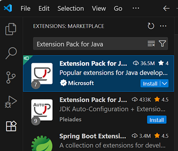

#### JavaFX Essentials Pack
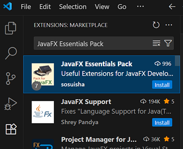

### Step 7. Install Scene Builder

This is a graphical UI editor.

Download and install Scene Builder from the official page:

https://gluonhq.com/products/scene-builder/#download

That's all for the installation.

[Back to main page](readme.md)

## Setting up VSCode for JavaFX on macOS or Linux

### Step 1. Check your Java version

First, check if you have Java installed.

Open a terminal and enter the following command:
```
java -version
```

If an error is displayed, Java is not installed on your PC.
Otherwise, the installed version of Java will be displayed.

If the version is less than 21, please uninstall Java.
The minor version numbers (the x.x part of 21.x.x) can be anything.
If Java 21 or higher is already installed, no installation is necessary; proceed to **Step 4**.

### Step 2. Install SDKMAN!

[SDKMAN!](https://sdkman.io/) is a command-line tool for managing versions of Java-related SDKs and tools.

To install SDKMAN!, copy the line below, paste it into the terminal, and press the Enter key to execute it.

```bash
curl -s "https://get.sdkman.io" | bash
```
After that, close the terminal and open a new one to enable SDKMAN!

### Step 3. Install Java (OpenJDK 21)

For those who are just starting to learn Java, OpenJDK is recommended as it is a free Java Development Kit (JDK).

There are many distributions of OpenJDK. Any distribution will work, but this guide uses the official OpenJDK distribution.

To install Java, type the following command in your terminal:

```bash
sdk install java 21.0.2-open
```

### Step 4. Install Maven 3

Next, we will install **Maven**, a build tool for Java.

A build tool manages the libraries needed for development projects and enables automatic building.
In this guide, we will use Maven to set up an environment for developing and running JavaFX in your projects.

If you have already installed SDKMAN! in Step 2, installing Maven is straightforward.
Type the following command in your terminal:
```bash
sdk install maven
```
You don't need to configure anything further.

If you don't use SDKMAN!, the installation method differs for each OS. If you are a macOS user, you can use Homebrew:
```bash
brew install maven
```
SDKMAN! automatically sets the valid JAVA_HOME and MAVEN_HOME environment variables. If you don't use SDKMAN!, you need to set them yourself.

### Step 5. Install Visual Studio Code

Download and install Visual Studio Code from the official page:

https://code.visualstudio.com

### Step 6. Install extensions

Open VSCode and install two extensions for developing Java and JavaFX.

It is recommended not to install any JavaFX plugins that are not included in the packs below, as their functions may overlap.

#### Extension Pack for Java (Microsoft)


#### JavaFX Essentials Pack


#### Note: VSCode-compatible IDEs (such as VSCodium)

You might need to use a compatible IDE instead of VSCode on your OS. In that case, you will need to install the vscjava extension pack instead of the one from Microsoft.

**Extension Pack for Java (vscjava)**

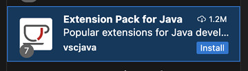

### Step 7. Install Scene Builder

This is a graphical UI editor.

Download and install Scene Builder from the official page:

https://gluonhq.com/products/scene-builder/#download

That's all for the installation.

[Back to main page](readme.md)

## About versions

This guide assumes Java 21 and JavaFX 23. This is a relatively new environment as of spring 2025. 

Java 25 and JavaFX 25 will be released in fall 2025. You can continue to use Java 21 and JavaFX 23 even after fall. If you choose to use Java 25 and JavaFX 25, you will need slightly different procedures from those outlined in this document.

# Create your first JavaFX project

To create a JavaFX project, use a Maven Archetype.

## 1. Start generating

Type the command below in your terminal:
```
mvn archetype:generate
```
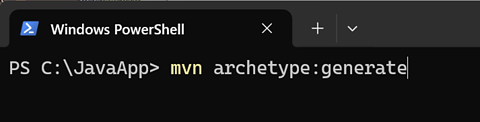

## 2. Select jfx-sss-fxml archetype

Since many options will be shown, type `jfx-sss-fxml` and press the Enter key to narrow the list.

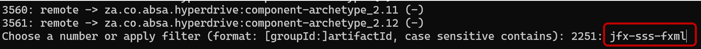

Enter 1 to choose jfx-sss-fxml.

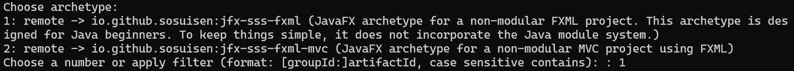

## 3. Select Archetype Version

Press the Enter key to select the latest version.

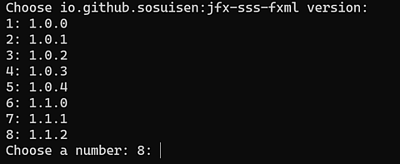

## 4. About your project

The following are the details of your project. 

### 4.1 groupId

groupId is the reverse domain name notation for your organization. For a simple practice app, you can use `com.example` as groupId.

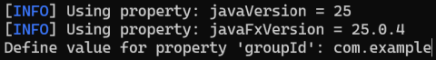

### 4.2 artifactId

The artifactId represents your project's name.

Allowed characters include:

- lowercase letters
- numbers
- hyphens (-)

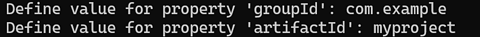

### 4.3 version and package

For the version and package, you can simply press the Enter key to select the default value.

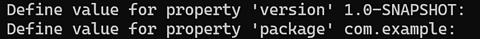

### 4.4 Confirmation

Press the Enter key.

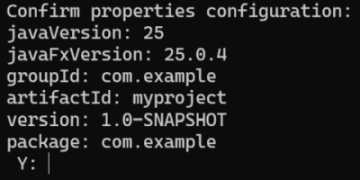

## 5 Project created

A folder with the same name as the artifactId will be created. 

Launch VSCode and open this folder. 

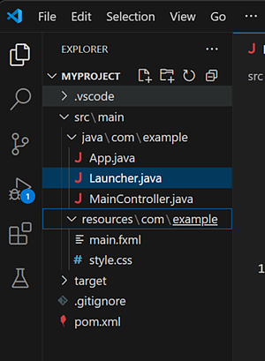

You can also open the folder from your terminal by typing: 
```
code path-to-your-project-folder
```

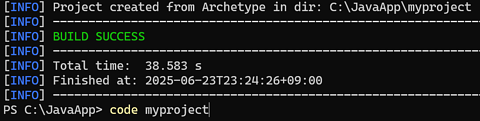

`code` is a terminal command to launch VSCode.

## 6. Launch Scene Builder

Right-click the main.fxml file and select "Open in Scene Builder" to begin developing with Scene Builder.

This is a graphical UI editor.

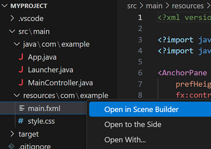

## 7. Launch your app

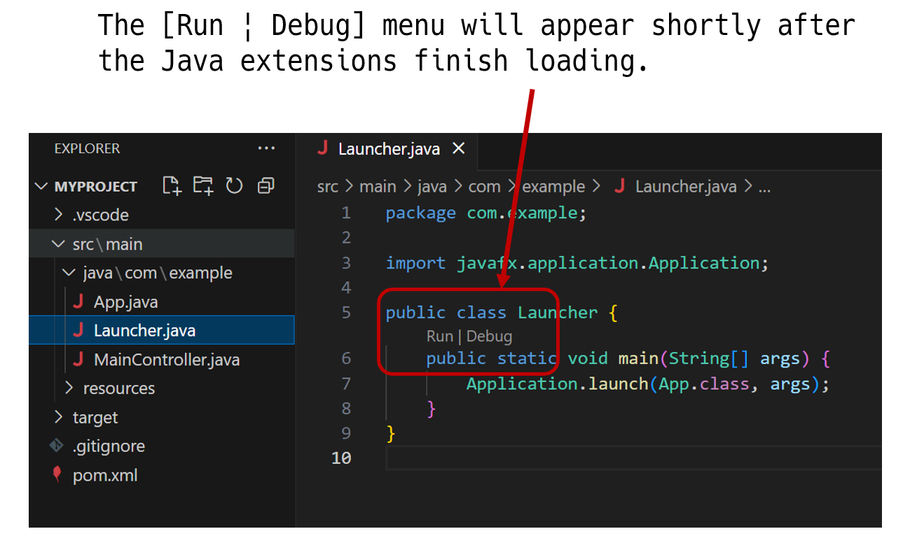

Select `Launcher.java` and click Run or Debug to launch your app.

As a result, a blank window appears.

## 8. Build executable

To create an executable (.exe, .dmg), open a terminal in VSCode and run the following command:

```
mvn clean package
```
The generated executables are located under `target\jpackage\`.


## 9. About archetypes


These archetypes do not utilize Java's module system (JPMS). While many JavaFX samples adopt JPMS, it may be too complex for beginners looking to create desktop applications with JavaFX.

If you want to explore an architecture similar to MVC, the javafx-sss-fxml-mvc archetype will be a helpful reference.

# Conclusion

This is just the starting point. 

If you use libraries for development, you need to search in Maven Central (https://central.sonatype.com) and add the dependency to your pom.xml.

If you want to customize the build, you will need to learn more about Maven.

Enjoy your journey with JavaFX!
