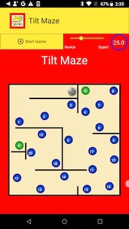
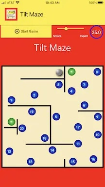
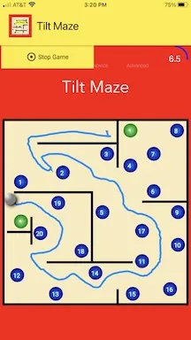

Mobile application offerings for both IOS and Android continue increasing each year.

In this three-part series, I’ll show how to use JavaFX for mobile app development: JavaFX looks great and runs on both mobile platforms.

You use the same JavaFX code targeting Google Play and Apple App stores. Performance is excellent and startup time is fast with native images. You use Java 11+ and the latest JavaFX.

Our game is TiltMaze Labyrinth. Figure 1 shows TiltMaze running on an Android Nexus 5X. Figure 2 shows TiltMaze running on an iPhone 8 Plus.




We’ll discuss TiltMaze in three parts. First, we explore the JavaFX code: the basic structure of an animation-type app and the Gluon Attach API that lets you access hardware-specific features in a device-agnostic way.

In Part 2, we’ll discuss the technologies we use with JavaFX to build the three target applications: “regular” JVM, native iOS image, and native Android image. We’ll include the tools and development requirements needed for each target.

Lastly in Part 3, we’ll discuss how to upload this application to the respective mobile app stores.

This demo application is also explained in this presentation at the Devoxx conference in Belgium (October 2023):


## TiltMaze Labyrinth

Let’s start with the end result first. TiltMaze Labyrinth is a mobile game you can install from both the Apple App Store and Google Play. Download TiltMaze here on your mobile device or tablet to play.

[](https://apps.apple.com/us/app/tiltmaze-labyrinth/id1566464439)
[](https://play.google.com/store/apps/details?id=com.asgteach.accelerometer.TiltMaze)

The game is simple enough: you navigate a rolling ball through a maze within the given time allotment while avoiding strategically placed holes. As you tilt the phone or tablet, the application reads the device’s accelerometer sensor and moves the ball based on the reading.

The Novice-Expert slider controls how fast the ball rolls and the time allotment for completing the maze. As your skill improves, you can challenge your dexterity by making the ball movements more sensitive while simultaneously decreasing the time allotment.

## JavaFX

I am a big proponent of using FXML (FX markup language) to describe your JavaFX views.  To those not familiar with JavaFX, FXML is an XML-based markup language that lets you describe a UI scene.

A free tool, Scene Builder, enables drag-and-drop UI design that produces FXML. FXML helps keep your UI separate from your business logic and application control. You can download Scene Builder from Gluon here. We used FXML to build the TiltMaze UI.

Part of the appeal of this mobile application is its simplicity. TiltMaze is a single-view game. It does not require any cloud data, user sign-ins, complicated menus, or multiple views. The UI is the application and standard JavaFX creates the animations that power the game. You can access the [JavaFX source code for TiltMaze on GitHub](https://github.com/gailasgteach/TiltMaze).

Note that we removed sensitive licensing and credential information from the project!

## Accelerometer

The accelerometer is a sensor that measures velocity changes in three dimensions: horizontally, vertically, and up-down movements (that include the effects of gravity).

We ignore the up-down movements (or the Z-axis) and respond only to changes in the X-axis and Y-axis.

The coordinate system for the accelerometer matches the JavaFX coordinate system for the X-axis, where values increase from left to right. For the Y-axis, however, the accelerometer coordinate system is opposite. In JavaFX, the origin for the Y-axis is at the top and numbers increase as you move towards the bottom of the screen.

The accelerometer is very sensitive; in fact, it’s difficult to hold a phone or tablet in your hand, remaining as motionless as possible, and not see readings change. The good news is that you sample readings in an Animation loop and use these values to update an object in the XY-coordinate space. You multiply the Y-axis reading by -1 so that it conforms to the JavaFX coordinate system.

Gluon’s offerings include the Attach API that lets you access the various hardware features of typical mobile devices and tablets. Both Apple IOS and Android devices have accelerometers. Here’s how to access the accelerometer in your JavaFX mobile application.

```java
try {
    service = AccelerometerService.create().get();
    System.out.println("Got accelerometer service.");
} catch (Exception e) {
    // No accelerometer, using mouse events.
    System.out.println("No accelerometer service.");
}
```

Once you have the AccelerometerService initialized, you can start and stop it, depending on whether the game is in progress.

```java
// start the accelerometer service
service.start();
// stop the accelerometer service
service.stop();
```

The TiltMaze game lets you control a rolling ball by tilting the phone. As you tilt the phone left or right, the game moves the ball along the X-axis by updating the translateX property of the ball.

Similarly, as you tilt the phone vertically, the game moves the ball along the Y-axis by updating its translateY property. Since the accelerometer measures changes in velocity, these readings let you simulate a rolling ball by updating the ball’s position. While the game is playing, we read the accelerometer in an Animation loop, as follows.

```java
acceleration = service.getCurrentAcceleration();
xv = acceleration.getX();
yv = acceleration.getY() * -1;
```

Using these values, we check for possible collisions or falling into holes before updating the ball’s XY position.

```java
ball.setTranslateX(ball.getTranslateX() + xv);
ball.setTranslateY(ball.getTranslateY() + yv);
```

As the ball rolls, we also mark its path by updating a JavaFX Path object, adding a LineTo segment to the path with each update.

```java
path.getElements().add(
new LineTo(ball.getTranslateX(), ball.getTranslateY()));
```

The following figure shows a game in progress. The ball’s path is marked in blue and the countdown timer has 6.5 seconds remaining.  Of course, the game must perform collision detection with the maze barriers, holes, and outside boundaries. We leave this code for you to digest at your leisure!



The Novice/Expert slider is disabled during play, but can be adjusted between games. The Novice setting has the longest game time and the slowest ball roll. The Expert setting corresponds to the shortest game time and the fastest ball roll. And you can experiment with values in between that fit your level.

## Scaling to Device Size

Although mobile devices are generally similar in that they’re portrait-mode rectangles, their sizes can vary quite a bit. We scale the maze so that the aspect ratio is constant and fits within the device’s form factor.

We compute a scale factor, using the resulting scale factor to build the maze’s predefined barriers, boundaries, and holes.

We limit orientation for the game for portrait mode only. If you reorient your device, the application stays in portrait mode.

## Mouse Events

The edit-compile-install-run cycle is relatively long for native targets. Therefore, we simulate the maze program on a desktop to test the JavaFX UI as much as possible before installing it on a mobile device. We use mouse events instead of the accelerometer to guide the ball through the maze.

Although this is really a poor imitation of an accelerometer, it provides a convenient environment for testing the UI: the progress indicator, the Novice/Expert slider, and the Start/Stop game button.

## Performance

We installed the TiltMaze application on an iPhone 8 Plus and an Android Nexus 5X.

The iPhone model is a newer and faster device, but both targets perform the ball roll smoothly with no issues.

The GraalVM-Gluon build creates images that run natively on the target devices.
Next

In Part 2, we show you how to build and install TiltMaze on a locally connected iPhone and Android device.