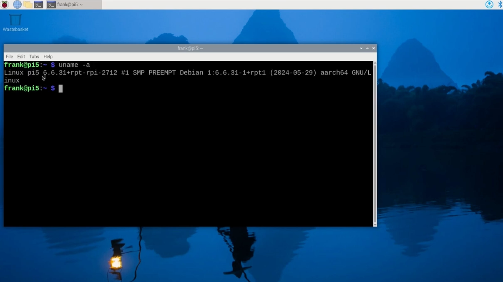

Installing a new version of the Java runtime, or switching between them, is very easy with [SDKMAN](https://sdkman.io/). In this video you can see how it is used, in combination with [J'BANG!](https://www.jbang.dev/) to execute a single-file JavaFX application with different versions of the Azul Zulu runtime.


## Using SDKMAN

The following output shows that a 64-bit Operating System is used on a Raspberry Pi 5. With `sdk list java` we get all the versions that are available for the detected platform `Linux ARM 64bit`. With the single command `sdk install java VERSION`, SDKMAN will download and install it.

```bash
$ uname -a
Linux pi5 6.6.31+rpt-rpi-2712 #1 SMP PREEMPT Debian 1:6.6.31-1+rpt1 (2024-05-29) aarch64 GNU/Linux
 
$ cat /sys/firmware/devicetree/base/model
Raspberry Pi 5 Model B Rev 1.0
 
$ sdk list java
================================================================================
Available Java Versions for Linux ARM 64bit
================================================================================
 Vendor        | Use | Version      | Dist    | Status     | Identifier
--------------------------------------------------------------------------------
...
 Zulu          |     | 22.0.2       | zulu    |            | 22.0.2-zulu
               |     | 22.0.1.crac  | zulu    |            | 22.0.1.crac-zulu
               |     | 22.0.1.fx    | zulu    | installed  | 22.0.1.fx-zulu
...
               |     | 21.0.3.fx    | zulu    |            | 21.0.3.fx-zulu
...
               | >>> | 17.0.11.fx   | zulu    | installed  | 17.0.11.fx-zulu
...
               |     | 11.0.23.fx   | zulu    |            | 11.0.23.fx-zulu
...
               |     | 8.0.412.fx   | zulu    |            | 8.0.412.fx-zulu
...
 
$ sdk install java 22.0.1.fx-zulu
$ java -version
openjdk version "22.0.1" 2024-04-16
OpenJDK Runtime Environment Zulu22.30+13-CA (build 22.0.1+8)
OpenJDK 64-Bit Server VM Zulu22.30+13-CA (build 22.0.1+8, mixed mode, sharing)
 
# If you already installed a version before and want to switch back to it, use:
$ sdk use java 22.0.1.fx-zulu
Using java version 22.0.1.fx-zulu in this shell.
```

## Java Example Project

The example used for this tutorial starts a user interface with labels to show the Java and JavaFX versions and a framerate counter. Additionally, one or more circles are added that bounce around on the screen and change direction when they hit a border of the application. The complete code can be found in [this GitHub Gist](https://gist.github.com/FDelporte/c69a02c57acc892b4c996a9779d4f830).

You can see in the code, by changing the value of `NUMBER_OF_BALLS`, you can quickly test how much animation your system can handle before the framerate drops. All the code is included in one file, and the first three lines enable us to run it with J'BANG! to avoid the need to build a full Maven or Gradle project. 

```java
///usr/bin/env jbang "$0" "$@" ; exit $?

//DEPS org.openjfx:javafx-controls:22.0.2
//DEPS org.openjfx:javafx-graphics:22.0.2:${os.detected.jfxname}

import javafx.animation.AnimationTimer;
...

public class FxDemo extends Application {

    private static int NUMBER_OF_BALLS = 10_000;
    
    ...
    
    @Override
    public void start(Stage stage) {
        var javaVersion = System.getProperty("java.version");
        var javaVendor = System.getProperty("java.vendor");
        var javaVendorVersion = System.getProperty("java.vm.version");
        var javafxVersion = System.getProperty("javafx.version");

        VBox holder = new VBox();
        holder.setFillWidth(true);
        holder.setAlignment(Pos.TOP_CENTER);
        holder.setSpacing(5);
        holder.getChildren().addAll(
            new Label("Java: " + javaVersion + ", " + javaVendor + ", " + javaVendorVersion),
            new Label("JavaFX: " + javafxVersion),
            getFramerateLabel(),
            getBouncingBallPane()
        );

        scene = new Scene(holder, 400, 700);
        stage.setTitle("JavaFX Demo");
        stage.setScene(scene);
        stage.show();
    }

    public static void main(String[] args) {
        launch();
    }

    ...
}
```

## Running the Application

As we already used SDKMAN to install Java, we can also use it to install J'BANG! and check if it installed correctly by running these commands:

```bash
$ sdk install jbang
$ jbang --version
0.117.1
```

Get the code from GitHub and save it as FxDemo.java. You can now start the application without the need to compile any code, J'BANG! will handle this for us:

```bash
$ jbang FxDemo.java
[jbang] Building jar for FxDemo.java...

# If you are connected via SSH, add the display.
# Otherwise you get this error:
# "UnsupportedOperationException: Unable to open DISPLAY"
$ DISPLAY=:0 jbang FxDemo.java
```

