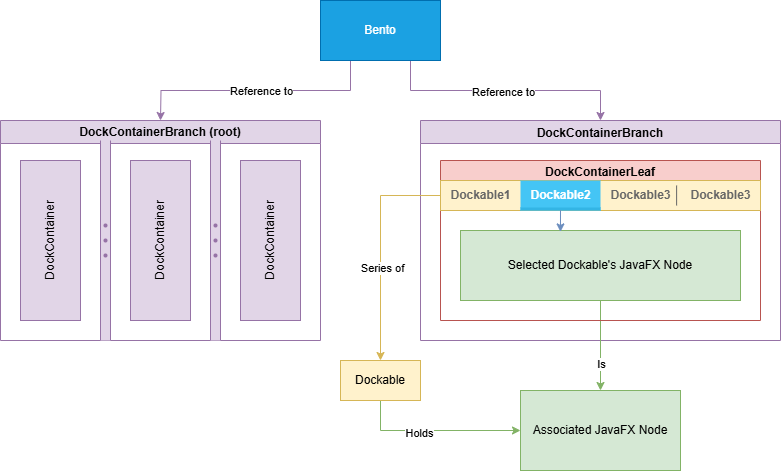
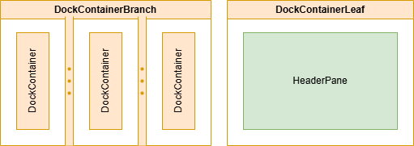
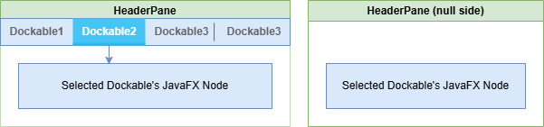
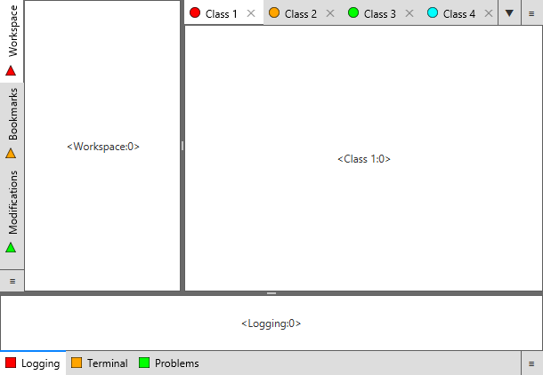

# BentoFX

A docking system for JavaFX.

## Usage

Requirements:

- JavaFX 19+
- Java 21+



In terms of hierarchy, the `Node` structure of Bento goes like:

- `DockContainerRootBranch`
    - `DockContainerBranch` _(Nesting levels depends on which kind of implementation used)_
        - `DockContainerLeaf`
            - `Dockable` _(Zero or more)_

Each level of `*DockContainer` in the given hierarchy and `Dockable` instances can be constructed via a `Bento`
instance's builder offered by `bento.dockBuilding()`.

### Containers



Bento has a very simple model of branches and leaves. Branches hold additional child containers. 
Leaves display `Dockable` items and handle drag-n-drop operations.

| Container type        | Description                                                                                                                                                             |
|-----------------------|-------------------------------------------------------------------------------------------------------------------------------------------------------------------------|
| `DockContainerBranch` | Used to show multiple child `DockContainer` instances in a `SplitPane` display. Orientation and child node scaling are thus specified the same way as with `SplitPane`. |
| `DockContainerLeaf`   | Used to show any number of `Dockable` instance rendered by a `HeaderPane`.                                                                                              |

### Controls



Bento comes with a few custom controls that you will want to create a custom stylesheet for to best fit the intended
look and feel of your application.

An example reference sheet _(which is included in the dependency)_ can be found in `bento.css`.

| Control                     | Description                                                                                                                                       |
|-----------------------------|---------------------------------------------------------------------------------------------------------------------------------------------------|
| `Header`                    | Visual model of a `Dockable`.                                                                                                                     |
| `HeaderPane`                | Control that holds multiple `Header` children, and displays the currently selected `Header`'s associated `Dockable` content.                      |
| `Headers`                   | Child of `HeaderPane` that acts as a `HBox`/`VBox` holding multiple `Headers`.                                                                    |
| `ButtonHBar` / `ButtonVBar` | Child of `HeaderPane` used to show buttons for the `DockContainerLeaf` for things like context menus and selection of overflowing `Header` items. |

### Dockable

The `Dockable` can be thought of as the model behind each of a `HeaderPane`'s `Header` _(Much like a `Tab` of a `TabPane`)_.
It outlines capabilities like whether the `Header` can be draggable, where it can be dropped, what text/graphic to display,
and the associated JavaFX `Node` to display when placed into a `DockContainerLeaf`.

## Example



As an example, this is a very basic skeleton of how an IDE would be laid out.

- Project explorer + associated tools on the right
- Primary editor + tabs of open files in the center
- Console output + associated tools on the bottom

A full runnable version of this example code/snippet can be found in the project's test directory.

```java
Bento bento = new Bento();
bento.placeholderBuilding().setDockablePlaceholderFactory(dockable -> new Label("Empty Dockable"));
bento.placeholderBuilding().setContainerPlaceholderFactory(container -> new Label("Empty Container"));
bento.events().addEventListener(System.out::println);

DockBuilding builder = bento.dockBuilding();
DockContainerBranch branchRoot = builder.root("root");
DockContainerBranch branchWorkspace = builder.branch("workspace");
DockContainerLeaf leafWorkspaceTools = builder.leaf("workspace-tools");
DockContainerLeaf leafWorkspaceHeaders = builder.leaf("workspace-headers");
DockContainerLeaf leafTools = builder.leaf("misc-tools");

// These leaves shouldn't auto-expand. They are intended to be a set size.
DockContainerBranch.setResizableWithParent(leafTools, false);
DockContainerBranch.setResizableWithParent(leafWorkspaceTools, false);

// Root: Workspace on top, tools on bottom
// Workspace: Explorer on left, primary editor tabs on right
branchRoot.setOrientation(Orientation.VERTICAL);
branchWorkspace.setOrientation(Orientation.HORIZONTAL);
branchRoot.addContainers(branchWorkspace, leafTools);
branchWorkspace.addContainers(leafWorkspaceTools, leafWorkspaceHeaders);

// Changing tool header sides to be aligned with application's far edges (to facilitate better collaps
leafWorkspaceTools.setSide(Side.LEFT);
leafTools.setSide(Side.BOTTOM);

// Tools shouldn't allow splitting (mirroring intellij behavior)
leafWorkspaceTools.setCanSplit(false);
leafTools.setCanSplit(false);

// Primary editor space should not prune when empty
leafWorkspaceHeaders.setPruneWhenEmpty(false);

// Set intended sizes for tools (leaf does not need to be a direct child, just some level down in the 
branchRoot.setContainerSizePx(leafTools, 200);
branchRoot.setContainerSizePx(leafWorkspaceTools, 300);

// Make the bottom collapsed by default
branchRoot.setContainerCollapsed(leafTools, true);

// Adding dockables to the leafs
leafWorkspaceTools.addDockables(
		buildDockable(builder, 1, 0, "Workspace"),
		buildDockable(builder, 1, 1, "Bookmarks"),
		buildDockable(builder, 1, 2, "Modifications")
);
leafTools.addDockables(
		buildDockable(builder, 2, 0, "Logging"),
		buildDockable(builder, 2, 1, "Terminal"),
		buildDockable(builder, 2, 2, "Problems")
);
leafWorkspaceHeaders.addDockables(
		buildDockable(builder, 0, 0, "Class 1"),
		buildDockable(builder, 0, 1, "Class 2"),
		buildDockable(builder, 0, 2, "Class 3"),
		buildDockable(builder, 0, 3, "Class 4"),
		buildDockable(builder, 0, 4, "Class 5")
);

// Show it
Scene scene = new Scene(branchRoot);
scene.getStylesheets().add("/bento.css");
stage.setScene(scene);
stage.setOnHidden(e -> System.exit(0));
stage.show();
```