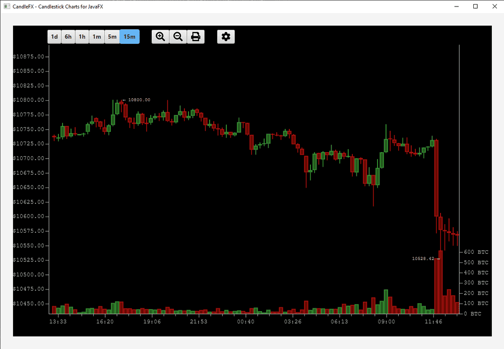

## CandleFX

CandleFX is a JavaFX library that provides a candle-stick chart implementation designed for financial/trading UIs. It supports incremental paging of historical data and live syncing of real-time trading data, with a focus on responsiveness.

Key features:
- Candle-stick chart for trading pairs (e.g. BTC/USD, TSLA/USD)
- Real-time live data via WebSocket
- Paging of historical candle data
- Abstract `Exchange` class — implement your own exchange (Coinbase example included)
- Configurable granularities (1m, 5m, 15m, 1h, 6h, 1d)

