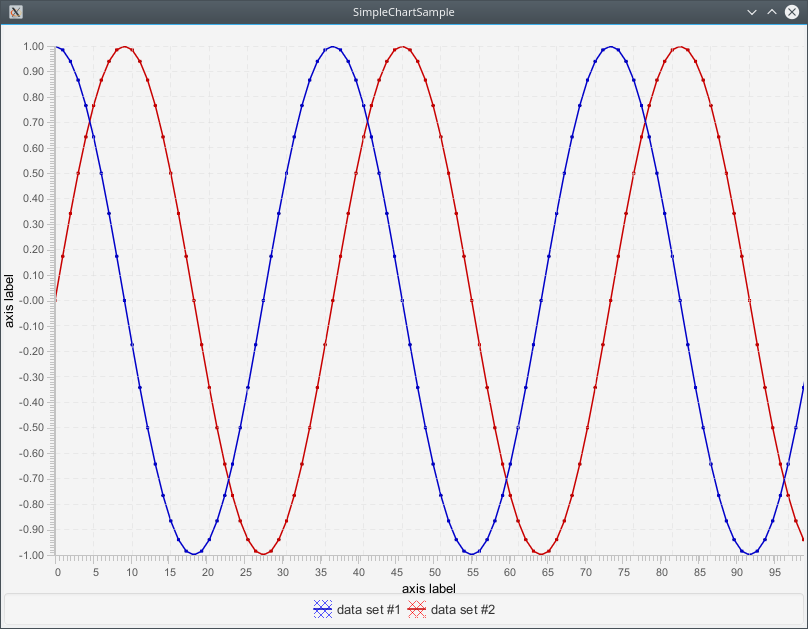

ChartFx is a scientific charting library developed at [GSI](https://www.gsi.de) for [FAIR](https://fair-center.eu/),
optimised for real-time data visualisation at 25 Hz update rates. It handles datasets from tens of thousands to
millions of points, commonly used in digital signal processing applications.

It is a re-engineered version of JavaFX's default [Chart](https://docs.oracle.com/javase/8/javafx/api/javafx/scene/chart/Chart.html),
preserving the extensibility of earlier Swing-based libraries while fixing performance bottlenecks and API issues.
See the [IPAC'19 paper](docs/THPRB028.pdf) / [poster](docs/THPRB028_poster.pdf) and the
[JFX Days talk](https://youtu.be/NK4pgRF9XWk) for background. Full details at the
[project site](https://github.com/fair-acc/chart-fx).

## Minimal Example



```java
final XYChart chart = new XYChart(new DefaultNumericAxis(), new DefaultNumericAxis());

final DoubleDataSet dataSet1 = new DoubleDataSet("data set #1");
final DoubleDataSet dataSet2 = new DoubleDataSet("data set #2");
chart.getDatasets().addAll(dataSet1, dataSet2);

final int N_SAMPLES = 100;
final double[] xValues = new double[N_SAMPLES];
final double[] yValues1 = new double[N_SAMPLES];
final double[] yValues2 = new double[N_SAMPLES];
for (int n = 0; n < N_SAMPLES; n++) {
    xValues[n] = n;
    yValues1[n] = Math.cos(Math.toRadians(10.0 * n));
    yValues2[n] = Math.sin(Math.toRadians(10.0 * n));
}
dataSet1.set(xValues, yValues1);
dataSet2.set(xValues, yValues2);

final Scene scene = new Scene(new StackPane(chart), 800, 600);
```

## Interactive Samples

The `chart-fx` samples submodule contains many examples illustrating the library's capabilities. To try them out:

```bash
gh repo clone fair-acc/chart-fx
cd chart-fx
mvn compile install
mvn exec:java          # main samples
mvn exec:java@math     # math/DSP samples
mvn exec:java@dataset  # dataset samples
mvn exec:java@acc-ui   # accelerator UI samples
```

## Other Recommended JavaFX Charting Libraries

- [Gerrit Grunwald](https://github.com/HanSolo)'s [Charts](https://github.com/HanSolo/charts)
- [JFreeChart-FX](https://github.com/jfree/jfreechart-fx)
- [Michael Ennen](https://github.com/brcolow)'s [CandleFX](https://github.com/brcolow/candlefx) (financial charts)