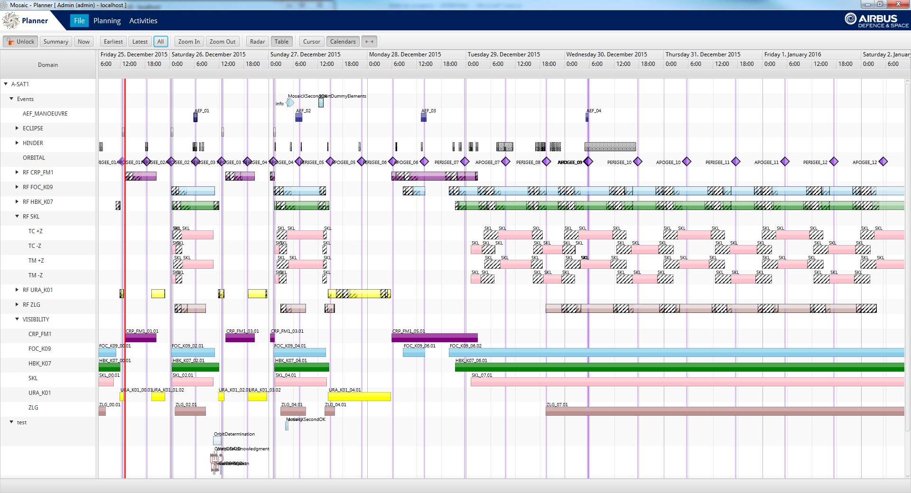

FlexGanttFX is a state-of-the-art Gantt chart custom control for JavaFX.

## Use Cases

| Domain                           | Description                                                  |
| -------------------------------- | ------------------------------------------------------------ |
| ERP                              | Visualize allocation of company resources                    |
| Manufacturing                    | Display MES information with configurable detail levels      |
| Production Planning & Scheduling | Advanced PPS visualization tailored to any scheduling domain |
| Resource Scheduling              | Trains, planes, trucks — anything moving from A to B        |

## Benefits

| Benefit               | Description                                                                                                                                                              |
| --------------------- | ------------------------------------------------------------------------------------------------------------------------------------------------------------------------ |
| **Flexibility** | Pluggable renderer architecture supports anything from one task per row to thousands of non-overlapping activities, rendered exactly as needed via the JavaFX canvas API |
| **Speed**       | Specialized algorithms bypass costly CSS operations; smooth scrolling remains possible with 250,000+ activities                                                          |
| **Elegance**    | Follows JavaFX 8 guidelines; controls use skins to cleanly separate implementation from API                                                                              |

FlexGanttFX is a commercial framework and [has its own homepage](https://www.flexganttfx.com).