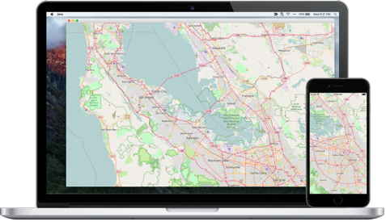

# Gluon Maps

Gluon Maps provides an easy way to integrate [OpenStreetMaps](https://www.openstreetmap.org) into a Java application.
It is blazing fast and offers layer overlays, multiple tile-sets, and much more.

A [sample](https://github.com/gluonhq/maps/tree/master/samples/mobile) is provided in the repository to get started with
the library.

Commercial licences available at: http://gluonhq.com/labs/maps/buy/

