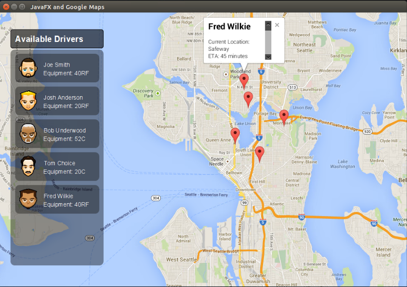

Source code for the sample map above.

A snippet from the FXML file which includes a reference to the GoogleMapView component within an AnchorPane.

`<?xml version="1.0" encoding="UTF-8"?>

<?import java.lang.*?>
<?import javafx.geometry.*?>
<?import javafx.scene.control.*?>
<?import javafx.scene.image.*?>
<?import javafx.scene.layout.*?>
<?import com.lynden.gmapsfx.*?>

<AnchorPane id="AnchorPane" fx:controller="com.lynden.gmapsexampleapp.FXMLController" prefHeight="616.0" prefWidth="737.0" xmlns="http://javafx.com/javafx/8" xmlns:fx="http://javafx.com/fxml/1" >
    <children>        
        <GoogleMapView fx:id="mapView" prefHeight="750.0" prefWidth="761.0" AnchorPane.bottomAnchor="-185.0" AnchorPane.leftAnchor="0.0" AnchorPane.rightAnchor="-441.0" AnchorPane.topAnchor="0.0"/>
        <VBox alignment="TOP_CENTER" fillWidth="false" layoutX="26.0" layoutY="29.0" prefHeight="478.0" prefWidth="221.0" spacing="10.0" styleClass="panel-background" stylesheets="@../styles/Styles.css" AnchorPane.bottomAnchor="50.0" AnchorPane.leftAnchor="26.0" AnchorPane.topAnchor="88.0" BorderPane.alignment="CENTER">
        ...........
`

The FXMLController class which initializes the Map, Markers, and InfoWindow.

`package com.lynden.gmapsexampleapp;

import com.lynden.gmapsfx.GoogleMapView;
import com.lynden.gmapsfx.MapComponentInitializedListener;
import com.lynden.gmapsfx.javascript.object.GoogleMap;
import com.lynden.gmapsfx.javascript.object.LatLong;
import com.lynden.gmapsfx.javascript.object.MapOptions;
import com.lynden.gmapsfx.javascript.object.MapType;
import com.lynden.gmapsfx.javascript.object.Marker;
import com.lynden.gmapsfx.javascript.object.MarkerOptions;
import java.net.URL;
import java.util.ResourceBundle;
import javafx.fxml.FXML;
import javafx.fxml.Initializable;
import javafx.scene.control.Button;

public class FXMLController implements Initializable, MapComponentInitializedListener {

    @FXML
    private Button button;
    
    @FXML
    private GoogleMapView mapView;
    
    private GoogleMap map;
    
    @Override
    public void initialize(URL url, ResourceBundle rb) {
        mapView.addMapInializedListener(this);
    }    

    @Override
    public void mapInitialized() {

        LatLong joeSmithLocation = new LatLong(47.6197, -122.3231);
        LatLong joshAndersonLocation = new LatLong(47.6297, -122.3431);
        LatLong bobUnderwoodLocation = new LatLong(47.6397, -122.3031);
        LatLong tomChoiceLocation = new LatLong(47.6497, -122.3325);
        LatLong fredWilkieLocation = new LatLong(47.6597, -122.3357);
        
        
        //Set the initial properties of the map.
        MapOptions mapOptions = new MapOptions();
        
        mapOptions.center(new LatLong(47.6097, -122.3331))
                .mapType(MapType.ROADMAP)
                .overviewMapControl(false)
                .panControl(false)
                .rotateControl(false)
                .scaleControl(false)
                .streetViewControl(false)
                .zoomControl(false)
                .zoom(12);
                   
        map = mapView.createMap(mapOptions);

        //Add markers to the map
        MarkerOptions markerOptions1 = new MarkerOptions();
        markerOptions1.position(joeSmithLocation);
        
        MarkerOptions markerOptions2 = new MarkerOptions();
        markerOptions2.position(joshAndersonLocation);
        
        MarkerOptions markerOptions3 = new MarkerOptions();
        markerOptions3.position(bobUnderwoodLocation);
        
        MarkerOptions markerOptions4 = new MarkerOptions();
        markerOptions4.position(tomChoiceLocation);
        
        MarkerOptions markerOptions5 = new MarkerOptions();
        markerOptions5.position(fredWilkieLocation);
        
        Marker joeSmithMarker = new Marker(markerOptions1);
        Marker joshAndersonMarker = new Marker(markerOptions2);
        Marker bobUnderwoodMarker = new Marker(markerOptions3);
        Marker tomChoiceMarker= new Marker(markerOptions4);
        Marker fredWilkieMarker = new Marker(markerOptions5);
        
        map.addMarker( joeSmithMarker );
        map.addMarker( joshAndersonMarker );
        map.addMarker( bobUnderwoodMarker );
        map.addMarker( tomChoiceMarker );
        map.addMarker( fredWilkieMarker );
        
        InfoWindowOptions infoWindowOptions = new InfoWindowOptions();
        infoWindowOptions.content("<h2>Fred Wilkie</h2>"
                                + "Current Location: Safeway "
                                + "ETA: 45 minutes" );

        InfoWindow fredWilkeInfoWindow = new InfoWindow(infoWindowOptions);
        fredWilkeInfoWindow.open(map, fredWilkieMarker);
    }   
}`