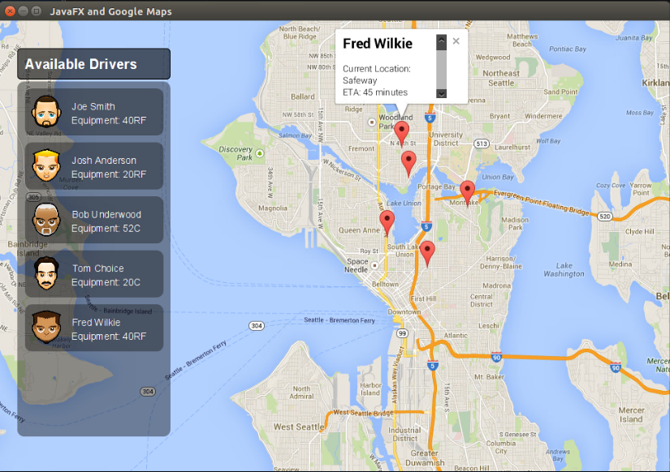

# GMapsFX

A pure JavaFX API for embedding Google Maps without interacting with the underlying JavaScript API directly. Requires Java 11 and JavaFX 17.



## Usage

Add a `GoogleMapView` to your FXML layout, implement `MapComponentInitializedListener`, then configure the map in `mapInitialized()`:

```java
@FXML
private GoogleMapView mapView;
private GoogleMap map;

@Override
public void initialize(URL url, ResourceBundle rb) {
    mapView.addMapInializedListener(this);
}

@Override
public void mapInitialized() {
    MapOptions mapOptions = new MapOptions();
    mapOptions.center(new LatLong(47.6097, -122.3331))
            .mapType(MapType.ROADMAP)
            .panControl(false)
            .streetViewControl(false)
            .zoomControl(false)
            .zoom(12);

    map = mapView.createMap(mapOptions);

    // Add markers
    LatLong location = new LatLong(47.6597, -122.3357);
    Marker marker = new Marker(new MarkerOptions().position(location));
    map.addMarker(marker);

    // Add an info window
    InfoWindowOptions infoOpts = new InfoWindowOptions()
            .content("<h2>Fred Wilkie</h2>Current Location: Safeway<br>ETA: 45 minutes");
    new InfoWindow(infoOpts).open(map, marker);
}
```