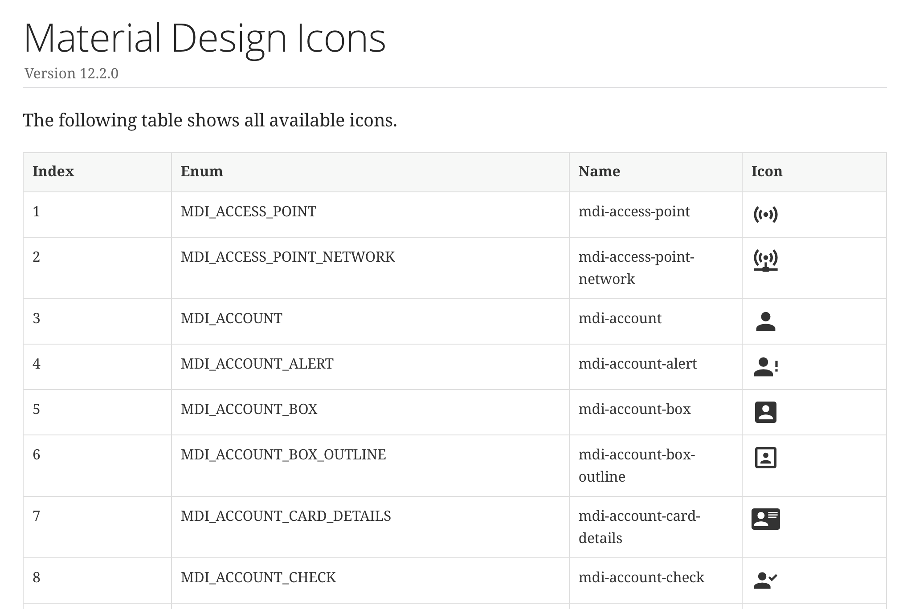

# Ikonli

Ikonli provides icon packs / icon fonts (Material, FontAwesome, WeatherIcons, etc...) that can be used in Java
applications.
Currently over 50 icon fonts are supported. Ikonli makes it trivial to leverage the power of icon fonts in your
JavaFX application. Detailed documentation including a cheat sheet for each
font [are available here](https://kordamp.org/ikonli).

A blog post on how to create your own icon font can
be [found on the Pixel Perfect Blog](https://dlemmermann.wordpress.com/2020/03/11/javafx-tip-32-need-icons-use-ikonli/).
