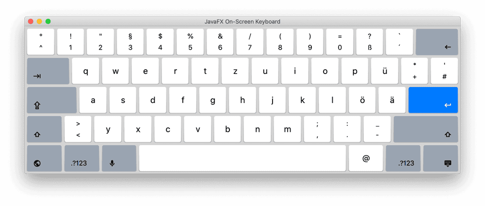

# KeyboardFX

A library for creating on-screen keyboards. Design and behaviour is based on the keyboard found on iPads.



## Usage

```java
KeyboardPane pane = new KeyboardPane();

TextField textField1 = new TextField();
TextField textField2 = new TextField();
textField2.setPromptText("Supports auto-close");
TextArea textArea = new TextArea();

VBox content = new VBox(20, textField1, textField2, textArea);
content.setPadding(new Insets(20));
pane.setContent(content);

// Auto-close keyboard when a specific node loses focus
pane.setAutoCloseStrategy(node -> node == textField2);

stage.setScene(new Scene(pane));
stage.show();
```