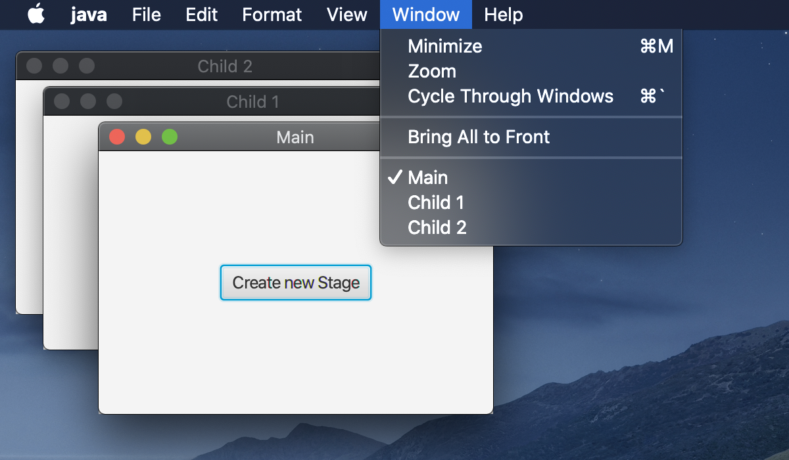
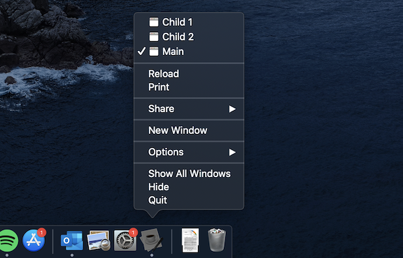
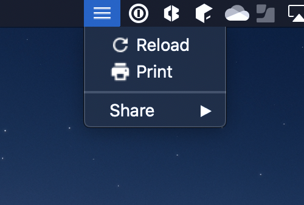
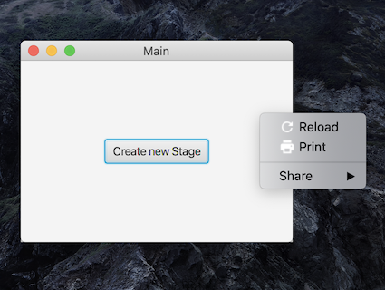
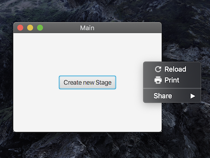

A simple library to customize the macOS menu bar to give your JavaFX app
a more [native look and feel](https://developer.apple.com/library/mac/documentation/UserExperience/Conceptual/OSXHIGuidelines/MenuBarMenus.html). NSMenuFX provides a mapping layer between the JavaFX `Menu` and AppKits `NSMenu` objects. It uses [JNA](https://github.com/java-native-access/jna) to directly set the menus for your application using macOS native API.

### Features

Here are a few examples of what you can do with NSMenuFX.

#### Application menu


Customize the auto-generated application menu of your JavaFX app.

```java
// Create the default Application menu
Menu defaultApplicationMenu = tk.createDefaultApplicationMenu("test");

// Update the existing Application menu
MenuToolkit.toolkit().setApplicationMenu(defaultApplicationMenu);
```

#### Window menu



Create common macOS menus like the Window menu.

```java
// Create the window menu
Menu windowMenu = new Menu("Window");
// ...
// Add your own menu items

// Automatically add windows
MenuToolkit.toolkit().autoAddWindowMenuItems(windowMenu);
```

#### Dock menu



Create a dock icon menu. Note that images for menu items in dock menus are not supported by macOS.

```java
// Create the dock menu
Menu menu = new Menu("Window");
// ...
// Add your own menu items

// Set the dock menu
MenuToolkit.toolkit().setDocIconMenu(menu);
```

#### Tray menu



Add a tray menu. Pass `null` to remove the tray menu again.

```java
// Create the tray menu
Menu menu = new Menu("Window");
// ...
// Add your own menu items

// Set the try menu
MenuToolkit.toolkit().setTrayMenu(menu);
```

#### Context menu




Use the native context menu instead of a JavaFX based context menu.

```java
// Create the context menu
Menu menu = new Menu();
// ...
// Add your own menu items

// Show the context menu when right-clicking the stage
scene.setOnMouseClicked(event -> {
  if (event.getButton() == MouseButton.SECONDARY) {
    MenuToolkit.toolkit().showContextMenu(context, event);
  }
});
```

To adapt the context menu appearence, you can switch between `LIGHT` and `DARK` mode, or use `AUTO` to adapt the appearence of macOS.

```java
// Set appearance automatically (or manually to DARK/LIGHT)
MenuToolkit.toolkit().setAppearanceMode(AppearanceMode.AUTO);
```

#### And more

* Quickly create an "About" menu
* Automatically use the same menu bar for all stages

To find more examples, check out the sample applications [here](https://github.com/0x4a616e/NSMenuFX/tree/master/samples/src/main/java/de/jangassen/nsmenufx/samples).

There is a known issue with OpenJFX that may cause the menu bar to be unresponsive after launch. You can find more
details about this issue in the respective OpenJFX [bug ticket](https://bugs.openjdk.java.net/browse/JDK-8233678). A 
[pull request](https://github.com/openjdk/jfx/pull/361) containing a fix has already been merged and should be available
in OpenJFX 16+.

NSMenuFX no longer supports changing the title of the application menu at
runtime. This has always been a bit "hacky" as it is not really supported
by macOS. As a result, the new name was no longer bold faced when it was
changed with previous versions of NSMenuFX.

To set the title of the application menu to the name of your application,
you need to bundle the application and set `CFBundleName` in `Info.plist`.
