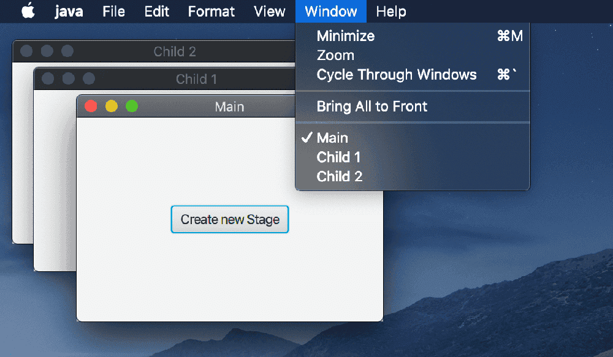
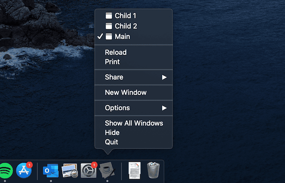
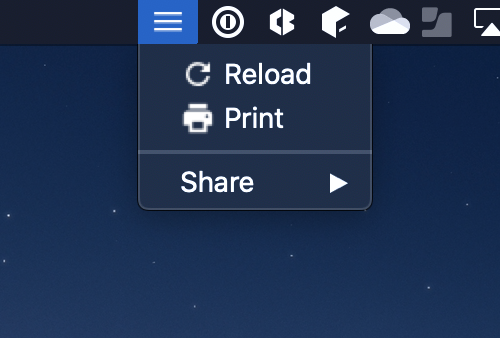
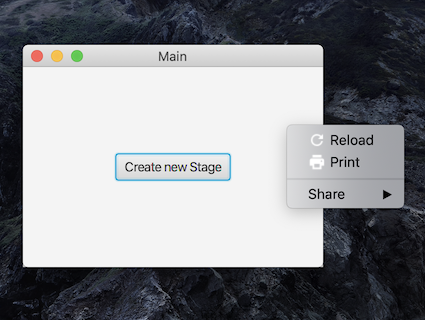
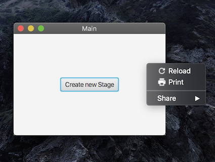

A library to customize the macOS menu bar, giving your JavaFX app a more [native look and feel](https://developer.apple.com/library/mac/documentation/UserExperience/Conceptual/OSXHIGuidelines/MenuBarMenus.html). NSMenuFX maps JavaFX `Menu` objects to AppKit's `NSMenu` using [JNA](https://github.com/java-native-access/jna).

## Menu Types

### Window Menu



```java
Menu windowMenu = new Menu("Window");
// Add your own menu items
MenuToolkit.toolkit().autoAddWindowMenuItems(windowMenu);
```

### Dock Menu



Note: images for menu items in dock menus are not supported by macOS.

```java
Menu menu = new Menu("Window");
MenuToolkit.toolkit().setDocIconMenu(menu);
```

### Tray Menu



Pass `null` to remove the tray menu.

```java
Menu menu = new Menu("Window");
MenuToolkit.toolkit().setTrayMenu(menu);
```

### Context Menu




```java
Menu menu = new Menu();
scene.setOnMouseClicked(event -> {
    if (event.getButton() == MouseButton.SECONDARY) {
        MenuToolkit.toolkit().showContextMenu(context, event);
    }
});

// Appearance: AUTO, LIGHT, or DARK
MenuToolkit.toolkit().setAppearanceMode(AppearanceMode.AUTO);
```

## Other Features

- Quickly create an "About" menu
- Automatically use the same menu bar for all stages

See [sample applications](https://github.com/0x4a616e/NSMenuFX/tree/master/samples/src/main/java/de/jangassen/nsmenufx/samples) for more examples.

## Known Issues

- **Unresponsive menu bar on launch**: A known OpenJFX [bug](https://bugs.openjdk.java.net/browse/JDK-8233678); fixed in OpenJFX 16+ via a merged [pull request](https://github.com/openjdk/jfx/pull/361).
- **Application menu title**: Changing the title at runtime is no longer supported. Set `CFBundleName` in `Info.plist` when bundling the application instead.
