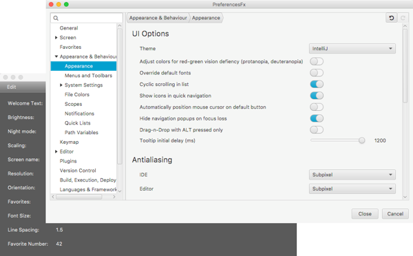
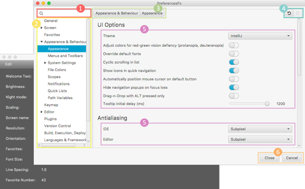

# PreferencesFX

Preference dialogs for business applications made easy. Creating preference dialogs in Java has never been this easy!



## Benefits

- Less error-prone
- Less code needed
- Easy to learn
- Easy to understand
- Easy to use, for developers and users alike

## Main Features

- Simple and understandable API
- The most important features are noted in the picture and the corresponding table below:



 Nr. | Feature                             | Description                                                                                                                                                                       
-----|-------------------------------------|-----------------------------------------------------------------------------------------------------------------------------------------------------------------------------------
 1   | `Search / Filter`                   | Filters all categories for a given String. Enables searching for a Setting, Group or Category by name.                                                                            
 2   | `TreeView`                          | Shows all categories in a hierarchical structure                                                                                                                                  
 3   | `Breadcrumb Bar`                    | Shows the user the previous categories in the hierarchy to the currently displayed category and allows the user to navigate back.                                                 
 4   | `Undo / Redo Buttons`               | Allows the user a stepwise undo and redo possibility of his last changes.                                                                                                         
 5   | `Various pre-defined setting types` | e.g. Integer, Double, Boolean, String, Lists, Objects                                                                                                                             
 6   | `close/cancel buttons`              | The close button just closes the window and leaves the preferences as they are. The cancel button discards all changes which are made during the time the dialog was last opened. 
 -   | `Instant persistance`               | Any changes to the application are saved instantly.                                                                                                                               

## Documentation

This project uses the `asciidoctor` plugin to generate the necessary documentation. Run the following *maven* task:

```Maven
process-resources
```

Afterwards, you will find the documentation in the `target/generated-docs/` subdirectory.

## Structure

A preferences dialog can contain multiple `Categories`.  
Each `Category` contains one to multiple `Groups`  
Each `Group` contains one to multiple `Settings`

For better illustration, the basic concept of writing a preferences dialog is shown below:

```Java
PreferencesFx preferencesFx=
        PreferencesFx.of(SaveClass.class,
        Category.of("Category Title",
        Group.of("Group Title",
        Setting.of("Setting Title",new Property())
        )
        )
        );
```

Notes:

- It is also possible to omit the `Group` and declare all settings in a `Category` directly. However, in this case all
  settings will simply be displayed one after another without grouping. If you want more control, use `Group`.
- A `Group` can also be defined without a title. In this case, the individual groups are displayed with more space in
  between them, to ensure they can be differentiated.
- A `Category` can also take a graphic node to be used as an icon as the second argument,
  e.g. `Category.of("Category Title", new ImageView(new Image("file:icon.png")),`

## Demos

We created several demos to visualize the capabilities of PreferencesFX.  
Simply launch `preferencesfx-demo/src/com/dlsc/preferencesfx/AppStarter.java` and look into the different Tabs.

The following demos are available:

 Import              | Description                                                                                                                   
---------------------|-------------------------------------------------------------------------------------------------------------------------------
 `Standard`          | The standard demo with a few settings and fully working bindings.                                                             
 `Internationalized` | Shows how to define preference dialogs in multiple languages, using internationalization.                                     
 `OneCategory`       | Shows the behavior of the API when only one category is used: The Breadcrumb Bar and TreeView will be omitted from the GUI.   
 `Extended`          | A demo, populated with lots of categories, groups and settings without any bindings. Designed to show usage in a big project. 

## Defining a preferences dialog

Creating a preferences dialog is as simple as calling `PreferencesFx.of()`.

```Java
StringProperty stringProperty=new SimpleStringProperty("String");
        BooleanProperty booleanProperty=new SimpleBooleanProperty(true);
        IntegerProperty integerProperty=new SimpleIntegerProperty(12);
        DoubleProperty doubleProperty=new SimpleDoubleProperty(6.5);

        PreferencesFx preferencesFx=
        PreferencesFx.of(AppStarter.class, // Save class (will be used to reference saved values of Settings to)
        Category.of("Category title 1",
        Setting.of("Setting title 1",stringProperty), // creates a group automatically
        Setting.of("Setting title 2",booleanProperty) // which contains both settings
        ),
        Category.of("Category title 2")
        .expand()                                       // Expand the parent category in the tree-view
        .subCategories( // adds a subcategory to "Category title 2"
        Category.of("Category title 3",
        Group.of("Group title 1",
        Setting.of("Setting title 3",integerProperty)
        ),
        Group.of( // group without title
        Setting.of("Setting title 3",doubleProperty)
        )
        )
        )
        );
```

This code snippet results in the following preferences window, containing three categories:


To create a `Setting`, you only need to define a title and a `Property`. `PreferencesFX` does the rest.  
You can then integrate this `Property` in your application. Changes of values in the preferences dialog will be
persisted instantly, however it's up to you to decide whether you want to persist them instantly in your application as
well.

### Required arguments

You have a lot of options to influence the behavior and layout of the preferences dialog.  
The following parameters are the absolute minimum, needed for the proper functioning of `PreferencesFX`:

 Parameter              | Description                                                                                                                                                                  
------------------------|------------------------------------------------------------------------------------------------------------------------------------------------------------------------------
 `AppStarter.class`     | In the constructor of `PreferencesFx` a `saveClass` is required. This class is saved as a key for the saved setting values. Further information is available in the javadoc. 
 `Category description` | Each `Category` must have a description. This is required to display its description in the `TreeView`.                                                                      
 `Setting description`  | Each `Setting` must have a description. It will be displayed on the left of the control, which is used to manipulate the respective `Setting`.                               

> Note: The value of the each `Setting` is stored using
> the [Java Preferences API](https://docs.oracle.com/javase/8/docs/api/java/util/prefs/Preferences.html) by default.  
> For testing purposes, to clear the saved preferences of the demo, run the method in the class:

```
preferencesfx-demo/src/test/java/PreferencesStorageReset.java
```

### Optional arguments

The following parameters are optionally available to further configure the dialog created by `PreferencesFX`:

 Method                     | Class           | Description                                                                                                                                                                                                                                                                                                               
----------------------------|-----------------|---------------------------------------------------------------------------------------------------------------------------------------------------------------------------------------------------------------------------------------------------------------------------------------------------------------------------
 `.subCategories`           | `Category`      | Subcategories allow a `Category` to have additional subcategories as children. Those are also displayed in the tree.                                                                                                                                                                                                      
 `.expand`                  | `Category`      | Allows to specify if the `Category` should be expanded in the Tree-View by default.                                                                                                                                                                                                                                       
 `.description`             | `Group`         | If you decide not to add the description of a group in the constructor, you can still add it after the creation of the group.                                                                                                                                                                                             
 `.validate`                | `Setting`       | Allows to add a [Validator](http://dlsc.com/wp-content/html/formsfx/apidocs/com/dlsc/formsfx/model/validators/Validator.html) to a setting, to set constraints to the values that can be entered.                                                                                                                         
 `.persistApplicationState` | `PreferencesFx` | Defines if the Preferences API should save the application states. This includes the state persistence of the dialog window, as well as the values of each Setting.                                                                                                                                                       
 `.persistWindowState`      | `PreferencesFx` | Defines whether the state of the dialog window (position, size, last selected Category) should be persisted or not. Defaults to false.                                                                                                                                                                                    
 `.saveSettings`            | `PreferencesFx` | Defines whether the changed settings in the Preferences window should be saved or not. Defaults to true.                                                                                                                                                                                                                  
 `.debugHistoryMode`        | `PreferencesFx` | Makes it possible to enable or disable the keycombination to open a debug view of the list of all actions in the history (undo / redo). Pressing Ctrl + Shift + H (Windows) or CMD + Shift + H (Mac) opens a dialog with the undo / redo history, shown in a table. Defaults to false.                                    
 `.buttonsVisibility`       | `PreferencesFx` | Sets the visibility of the cancel and close buttons in the `PreferencesFxDialog`. Defaults to true.                                                                                                                                                                                                                       
 `.instantPersistent`       | `PreferencesFx` | If set to true, it will instantly apply any changes that are being made in the `PreferencesFxDialog`. If set to false, it will only apply changes when the `Save` / `Apply` / `OK` button is pressed. Due to a limitation in FormsFX, undo / redo cannot be used with instant persistence switched off! Defaults to true. 
 `.i18n`                    | `PreferencesFx` | Sets the translation service of the preferences dialog for internationalization.                                                                                                                                                                                                                                          
 `.dialogTitle`             | `PreferencesFx` | Allows to specify a custom dialog title.                                                                                                                                                                                                                                                                                  
 `.dialogIcon`              | `PreferencesFx` | Allows to specify a custom dialog icon.                                                                                                                                                                                                                                                                                   

## Localisation

All displayed strings can be internationalized. You can
use [resource bundles](https://docs.oracle.com/javase/8/docs/api/java/util/ResourceBundle.html) to define different
locales and use the key instead of the descriptions. Adding i18n support is simply done by calling the method `.i18n()`
at the end when creating the preferences:

```java
private ResourceBundle rbDE=
        ResourceBundle.getBundle("demo.demo-locale",new Locale("de","CH"));

private ResourceBundle rbEN=
        ResourceBundle.getBundle("demo.demo-locale",new Locale("en","UK"));

private ResourceBundleService rbs=new ResourceBundleService(rbEN);

        PreferencesFx.of(…)
        .i18n(rbs);
```

## Validation

It is possible to optionally add
a [Validator](http://dlsc.com/wp-content/html/formsfx/apidocs/com/dlsc/formsfx/model/validators/Validator.html) to
settings. PreferencesFX uses
the [implementation of FormsFX for the validation](http://dlsc.com/wp-content/html/formsfx/apidocs/com/dlsc/formsfx/model/validators/Validator.html).
FormsFX offers a wide range of pre-defined validators, but also includes support for custom validators using
the `CustomValidator.forPredicate()` method. The following table lists the supported validators:

| Validator                  | Description                                                                                                                              |
|----------------------------|------------------------------------------------------------------------------------------------------------------------------------------|
| `CustomValidator`          | Defines a predicate that returns whether the field is valid or not.                                                                      |
| `DoubleRangeValidator`     | Defines a number range which is considered valid. This range can be limited in either one direction or in both directions.               |
| `IntegerRangeValidator`    | Defines a number range which is considered valid. This range can be limited in either one direction or in both directions.               |
| `RegexValidator`           | Valiates text against a regular expression. This validator offers pre-defined expressions for common use cases, such as email addresses. 
| `SelectionLengthValidator` | Defines a length interval which is considered valid. This range can be limited in either one direction or in both directions.            |
| `StringLengthValidator`    | Defines a length interval which is considered valid. This range can be limited in either one direction or in both directions.            |