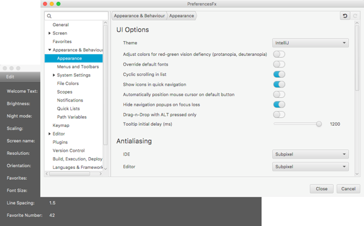
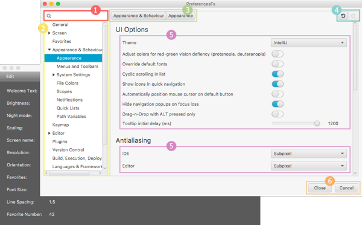
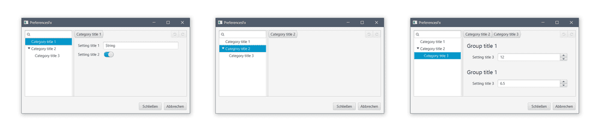

# PreferencesFX

Preference dialogs for business applications made easy.



## Features



| # | Feature | Description |
|---|---------|-------------|
| 1 | Search / Filter | Filters all categories for a given string. |
| 2 | TreeView | Shows all categories in a hierarchical structure. |
| 3 | Breadcrumb Bar | Shows the navigation path and allows navigating back. |
| 4 | Undo / Redo | Stepwise undo and redo of changes. |
| 5 | Setting types | Integer, Double, Boolean, String, Lists, Objects. |
| 6 | Close / Cancel | Close leaves preferences as-is; Cancel discards all changes since the dialog was opened. |
| — | Instant persistence | Changes are saved instantly. |

## Structure

A preferences dialog is composed of `Category` → `Group` → `Setting`:

```java
PreferencesFx.of(SaveClass.class,
    Category.of("Category Title",
        Group.of("Group Title",
            Setting.of("Setting Title", new Property())
        )
    )
);
```

- `Group` can be omitted; settings are then displayed one after another without grouping.
- A `Group` without a title displays groups with extra spacing between them.
- A `Category` can take a graphic node as its second argument to use as an icon.

## Defining a Preferences Dialog

```java
StringProperty stringProperty = new SimpleStringProperty("String");
BooleanProperty booleanProperty = new SimpleBooleanProperty(true);
IntegerProperty integerProperty = new SimpleIntegerProperty(12);
DoubleProperty doubleProperty = new SimpleDoubleProperty(6.5);

PreferencesFx.of(AppStarter.class,
    Category.of("Category title 1",
        Setting.of("Setting title 1", stringProperty),
        Setting.of("Setting title 2", booleanProperty)
    ),
    Category.of("Category title 2")
        .expand()
        .subCategories(
            Category.of("Category title 3",
                Group.of("Group title 1",
                    Setting.of("Setting title 3", integerProperty)
                ),
                Group.of(
                    Setting.of("Setting title 4", doubleProperty)
                )
            )
        )
);
```



### Required Parameters

| Parameter | Description |
|-----------|-------------|
| `AppStarter.class` | Save class used as a key for persisted setting values (see javadoc). |
| Category description | Displayed in the `TreeView`. |
| Setting description | Displayed to the left of the setting's control. |

> Values are stored via the [Java Preferences API](https://docs.oracle.com/javase/8/docs/api/java/util/prefs/Preferences.html) by default.

### Optional Parameters

| Method | Class | Description |
|--------|-------|-------------|
| `.subCategories` | `Category` | Adds child subcategories shown in the tree. |
| `.expand` | `Category` | Expands the category in the Tree-View by default. |
| `.description` | `Group` | Sets the group title after construction. |
| `.validate` | `Setting` | Adds a [Validator](http://dlsc.com/wp-content/html/formsfx/apidocs/com/dlsc/formsfx/model/validators/Validator.html) to the setting. |
| `.persistApplicationState` | `PreferencesFx` | Saves both dialog window state and setting values. |
| `.persistWindowState` | `PreferencesFx` | Persists dialog position, size, and last selected category. Defaults to `false`. |
| `.saveSettings` | `PreferencesFx` | Whether changed settings are saved. Defaults to `true`. |
| `.debugHistoryMode` | `PreferencesFx` | Enables Ctrl/CMD + Shift + H to open the undo/redo history view. Defaults to `false`. |
| `.buttonsVisibility` | `PreferencesFx` | Sets visibility of the cancel and close buttons. Defaults to `true`. |
| `.instantPersistent` | `PreferencesFx` | Applies changes instantly when `true`; requires Save/Apply/OK when `false`. Note: undo/redo is unavailable when set to `false`. Defaults to `true`. |
| `.i18n` | `PreferencesFx` | Sets the translation service for internationalisation. |
| `.dialogTitle` | `PreferencesFx` | Sets a custom dialog title. |
| `.dialogIcon` | `PreferencesFx` | Sets a custom dialog icon. |

## Localisation

Use resource bundles with the `.i18n()` method:

```java
ResourceBundleService rbs = new ResourceBundleService(
    ResourceBundle.getBundle("demo.demo-locale", new Locale("en", "UK")));

PreferencesFx.of(…).i18n(rbs);
```

## Validation

Uses the [FormsFX validator](http://dlsc.com/wp-content/html/formsfx/apidocs/com/dlsc/formsfx/model/validators/Validator.html) implementation. Add validators via `.validate()` on a `Setting`.

| Validator | Description |
|-----------|-------------|
| `CustomValidator` | Predicate-based; returns valid/invalid for a field. |
| `DoubleRangeValidator` | Valid number range for doubles (one or both bounds). |
| `IntegerRangeValidator` | Valid number range for integers (one or both bounds). |
| `RegexValidator` | Validates text against a regex; includes presets (e.g. email). |
| `SelectionLengthValidator` | Valid selection length interval (one or both bounds). |
| `StringLengthValidator` | Valid string length interval (one or both bounds). |
