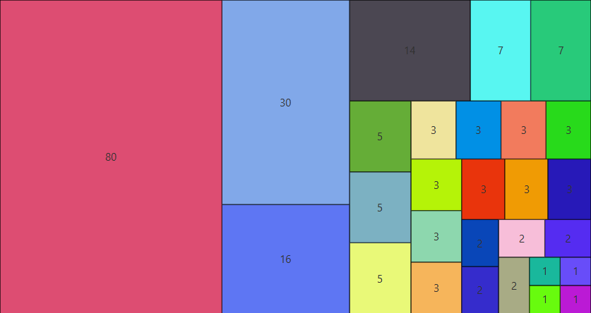

A simple and flexible _"tree map"_ chart control for JavaFX.



## Usage

`TreeMapPane<T>` requires two functions (set in the constructor or via properties) and a value list:

| Property | Purpose |
|----------|---------|
| `sizeFunctionProperty()` — `ToDoubleFunction<T>` | Computes the relative size/weight of each item |
| `nodeFactoryProperty()` — `Function<T, Node>` | Creates the visual `Node` for each item |
| `valueListProperty()` — `ListProperty<T>` | The items to display |

## Basic Example

```java
List<String> values = Stream.of(1, 1, 1, 1, 2, 2, 2, 2, 2, 3,
                3, 3, 3, 3, 3, 3, 3, 3, 3, 5, 5, 5, 7, 7, 14, 16, 30, 80)
        .map(String::valueOf)
        .collect(Collectors.toList());

// size function: larger int = bigger rectangle
// node factory: colored label for each value
TreeMapPane<String> pane = new TreeMapPane<>(Integer::parseInt, text -> {
    Label label = new Label(text);
    label.setStyle("-fx-background-color: " + String.format("#%06x", r.nextInt(0xffffff + 1)) + "; " +
            "-fx-background-radius: 0; -fx-border-width: 0.5; -fx-border-color: black;");
    label.setAlignment(Pos.CENTER);
    return label;
});

pane.valueListProperty().addAll(values);
```

## Hierarchical Example

Use `TreeMapPane.forTreeContent()` with the built-in `TreeContent` interface to display nested data (e.g. directory trees):

```java
// Model the 'src' directory as hierarchical data (directory/file sizes)
Path src = Paths.get("src");
TreeMapPane<TreeContent> pane = TreeMapPane.forTreeContent();
pane.valueListProperty().addAll(hierarchyFromPath(src));

private List<TreeContent> hierarchyFromPath(Path path) {
    try {
        if (Files.isDirectory(path)) {
            ListProperty<TreeContent> children = new SimpleListProperty<>(observableArrayList(
                    Files.list(path).flatMap(p -> hierarchyFromPath(p).stream()).toList()));
            return Collections.singletonList(new SimpleHierarchicalTreeContent(children));
        } else {
            long size = Files.size(path);
            Label label = createLabel(path.getFileName().toString(), path.getParent(), size);
            return Collections.singletonList(new TreeContent() {
                public double getValueWeight() { return size; }
                public Node getNode() { return label; }
            });
        }
    } catch (IOException ex) {
        throw new IllegalStateException(ex);
    }
}
```
