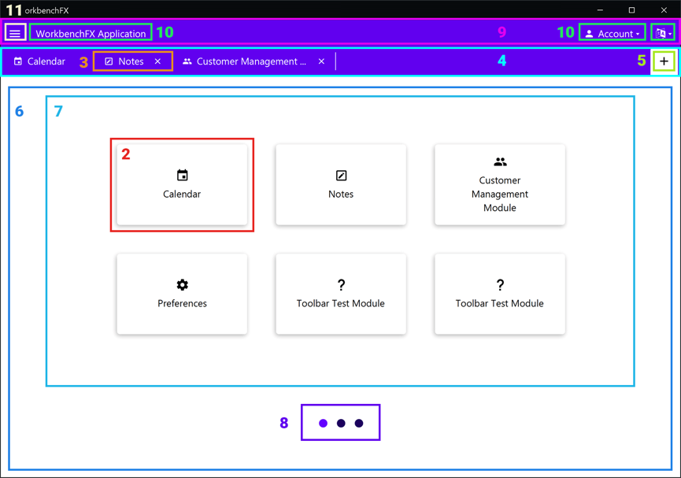
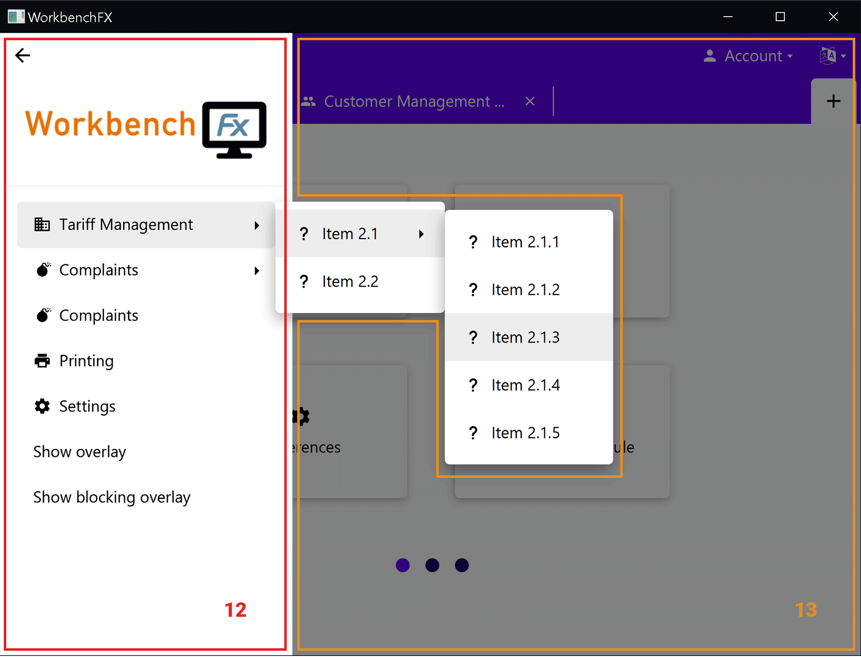
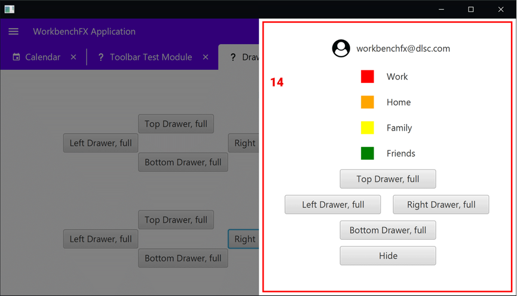
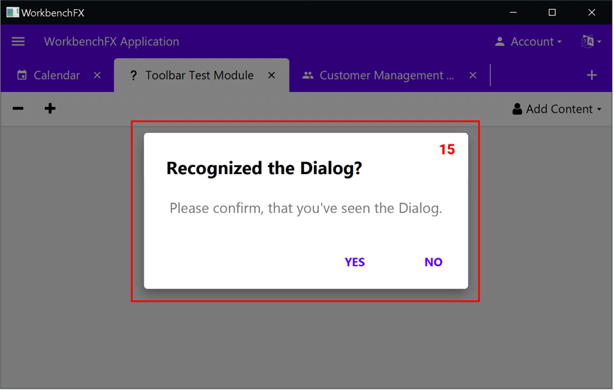
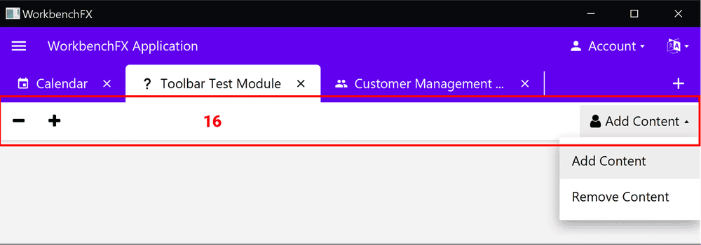

The one and only framework to build large JavaFX Applications!

## Components

    

| Nr. | Component | Description |
|-----|-----------|-------------|
| — | `WorkbenchModule` | Core building block — contains a title, icon, and content view |
| 2 | `Tile` | Clickable tile created for each module; opens the module when clicked |
| 3 | `Tab` | Shown for each open module; pressing *x* closes the module |
| 4 | Tab bar | Upper section displaying tabs for all currently open modules |
| 5 | Add button | Opens the `AddModulePage` to select a module to open |
| 6 | `AddModulePage` | Stores all pages on which module tiles are displayed |
| 7 | `Page` | Created when modules exceed `modulesPerPage()`; tiles overflow onto additional pages |
| 8 | Pagination dots | Visible when multiple pages exist; used for navigation |
| 9 | Toolbar | Contains `ToolbarItem`s; hidden automatically when empty |
| 10 | `ToolbarItem` | Behaves as a `Label`, `Button`, or `MenuButton` depending on configured attributes |
| 11 | Menu button | Opens the `NavigationDrawer`; position depends on toolbar contents; hidden if drawer has no items |
| 12 | `NavigationDrawer` | Displays a logo and `MenuItem`s; hover behavior configurable via `setMenuHoverBehavior()`; closed via `GlassPane` or back button |
| 13 | `GlassPane` | Blocks click events and adds a scrim; clicking it closes non-blocking overlays |
| 14 | `Drawer` | Custom-content drawer shown via `workbench.showDrawer()`; all four window sides supported |
| 15 | `DialogControl` | Predefined types: `showInformationDialog()`, `showErrorDialog()`, etc.; custom dialogs via `workbench.showDialog(WorkbenchDialog)` |
| 16 | Module toolbar | Displays a module's toolbar items; shown/hidden automatically based on content |
