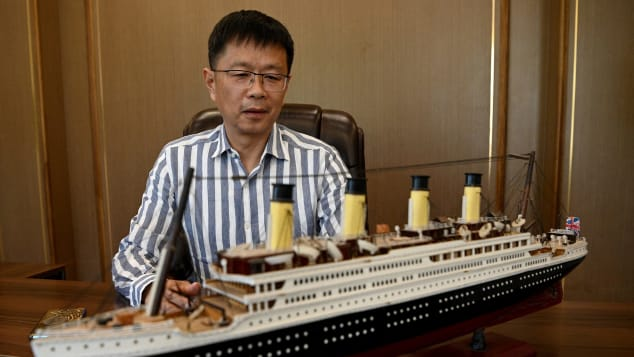
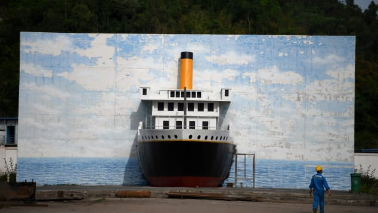
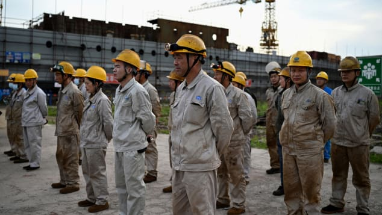

**(CNN)** — For those who have always wondered what it would've been like to be a passenger on the Titanic, a theme park in China is set to offer the closest experience one can get.
A massive replica of the sunken ocean liner is now under construction in Daying County in Sichuan province.
Called the "Unsinkable Titanic," the ship is the exact same size as the original -- 269.06 meters (882 feet) in length and 28.19 meters (92 feet) wide.
The centerpiece of a theme park called Romandisea, it will have the same amenities of its namesake, including banquet halls, theaters, observation decks and a swimming pool. Guests will be able to pay to spend the night aboard the ship, which will be permanently docked in a reservoir in the Qijiang River, about 130 kilometers from the provincial capital Chengdu -- several hundred miles from the sea.
An opening date has not yet been set.
CNN first reported on the project in 2016, when construction workers had just started laying the keel. A recent photo essay by news agency AFP offers a new look at construction progress on the replica. (See below gallery.)

