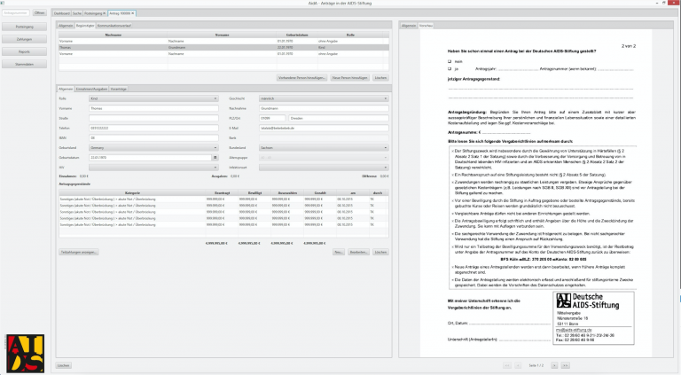
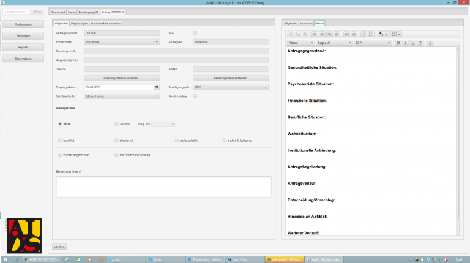

The “Deutsche AIDS Stiftung” (eng. German AIDS Foundation) is helping people that are affected by AIDS or HIV by providing financial support and supporting projects in this field among others. To do this, the foundation needs to handle scanned documents and applications, administrate persons and personal data and manage financial transactions. For this purpose, a new JavaFX application is created as a replacement and enhancement for an old desktop application.

The application is created with the mvvmFX framework. We are using CDI as dependency injection container and JPA for persistence. Interesting tasks were the fast loading and processing of large TIFF documents and the auto-saving of the application state to the database without a specific user interaction.

