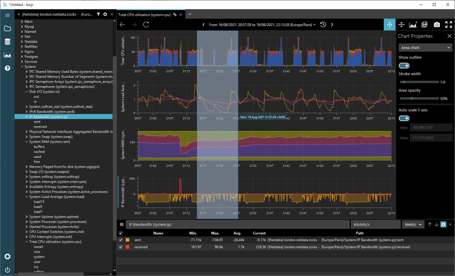
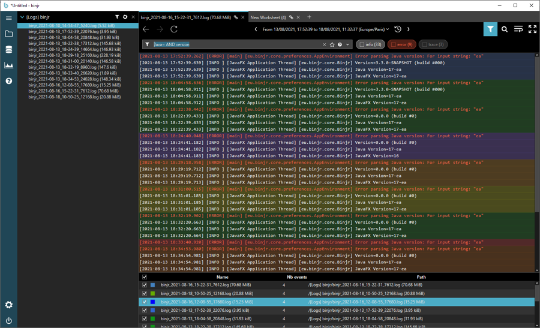

_binjr_ is a time series browser; it renders time series data produced by other applications as 
dynamically editable charts and provides advanced features to navigate the data smoothly and efficiently 
(drag & drop, zoom, history, detachable tabs, advanced time-range picker).
 
It is a standalone client application, that runs independently of the applications that produce the data; there are
no server or server-side components dedicated to _binjr_ that need to be installed on the source.   

The user experience in _binjr_ revolves around enabling users to compose a custom view by using any of the time-series
exposed by the source, simply by dragging and dropping them on the view.  
That view then constantly evolves as users add or remove series from different sources, while navigating through it by changing the time range,
the type of chart visualization and smaller aspects such as the color or transparency for each series.  
Users can then save the current state of their session at any time to a file, in order to reopen it later or to share it with someone else.

_binjr_ also possesses the ability to visualize time series not only as charts of numeric values, but can be customized to 
support visualization for any data type; for instance it features out-of-the-box a source adapter for text based log files.   

Log files, produced by applications to trace their lifecycle at runtime, typically contain timestamps for each event
they contain; so we can think of them as time series, but with data points being textual information instead of numerical 
values.  
In practical terms, this means that a lot of the features built into binjr to compose and navigate time series
visualizations can be applied to log files with great benefits.

Behind the scene, _binjr_ uses Apache Lucene to index data from log files; meaning users can use its powerful query 
language to hack through vast quantities logged events.

It also allows _binjr_ to open log files of any size; unlike most text editors which will fail to load multi
gigabytes-sized files as they try to fit it all in memory, _binjr_ will happily index those and present a paginated view
so that memory usage remains reasonable, while the backing index ensures navigating and searching is lightning fast.

With these abilities, _binjr_ aims to become the missing link between text editors and command line tools
traditionally used to analyse monitoring data locally and full-blown log analytics platforms (e.g. Elastic/Logstash/Kibana
stack) that centralizes logs for entire organizations.
It provides many of the same powerful visualization and search features while still remaining a totally
local solution (the data never needs to be pushed to the cloud - or anywhere else for that matter), and requiring no
setup nor maintenance to speak of.
 
> _binjr_ is developed and released as Free and Open Source Software, under the [Apache License version 2.0](https://github.com/binjr/binjr/blob/master/LICENSE.md). You can find the source code and the issue tracker at [https://github.com/binjr/binjr](https://github.com/binjr/binjr). More information, user guide and download links are available at [https://binjr.eu](https://binjr.eu)
