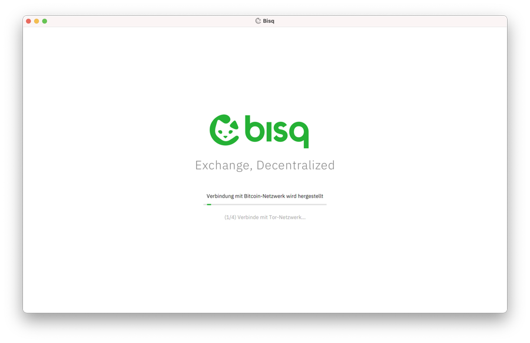
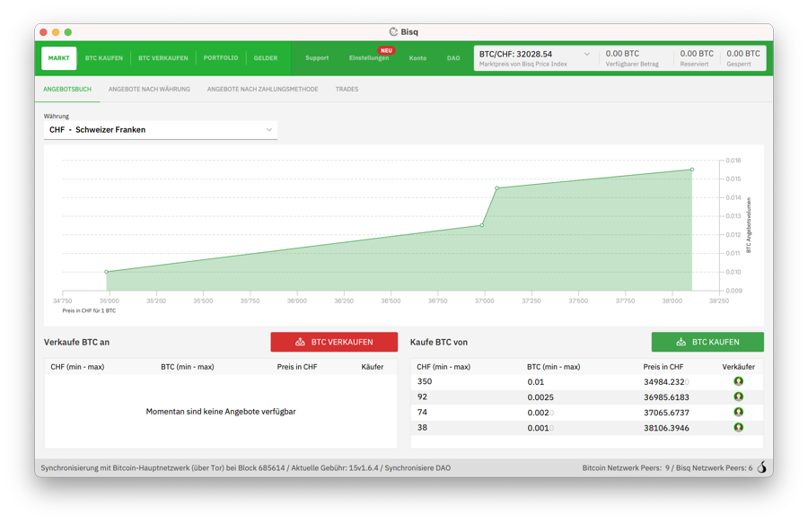
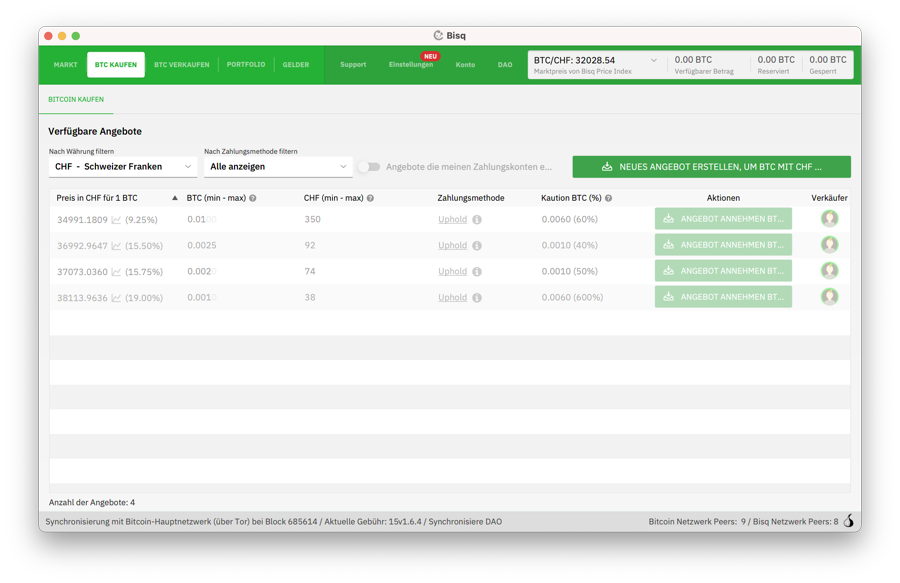
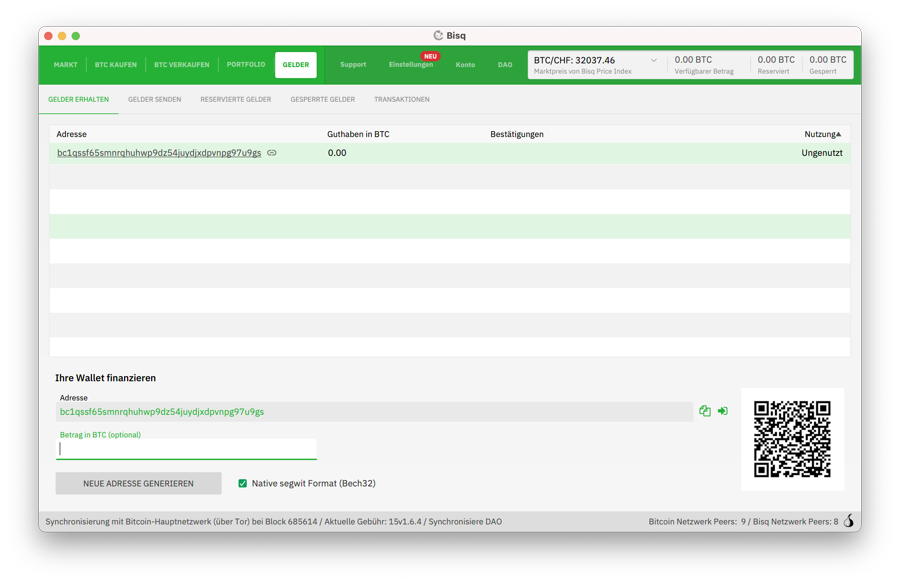
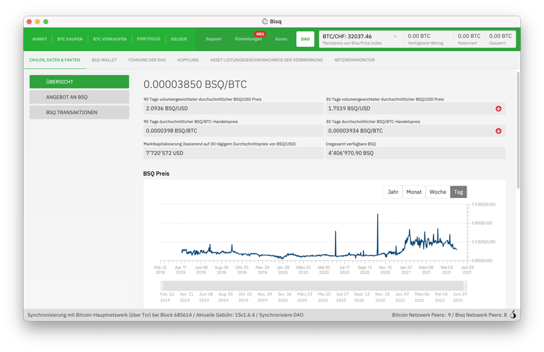

Bisq is a decentralized bitcoin exchange network best understood in terms of its major components:

1. Bisq is a cross-platform desktop application that allows anyone to buy and sell bitcoin in exchange for national currencies and other cryptocurrencies.
2. Bisq is a trading protocol that enables individuals to exchange directly with one another over the internet, eliminating the need for trusted third party exchange services.
3. Bisq is the peer-to-peer network formed by Bisq applications discovering, connecting to, and working with one another to implement the Bisq trading protocol. The Bisq network is fully peer-to-peer in that it requires no centrally-controlled servers and has no single points of failure.

Bisq is not a company—it is free/libre software released under version 3 of the GNU Affero General Public License. Bisq is built by individuals around the world who choose to work together, and Bisq is used by individuals around the world who choose to trade with Bisq over many other exchange alternatives.

The project itself is organized as a [decentralized autonomous organization](https://bisq.wiki/Decentralized_autonomous_organization).

Bisq’s mission is to provide a **secure**, **private** and **censorship-resistant** way of exchanging bitcoin for national currencies and other cryptocurrencies over the internet.

When we say secure, we are referring to the safety of users' funds. Centralized exchanges require users to store their bitcoins—​for at least some amount of time—​on exchange servers. When thousands of users do this, it creates extreme incentives for those servers to be hacked and for those users' bitcoins to be stolen. And time and time again these hacks and thefts are exactly what happen.

When we say private, we are referring to users' ability to control access to their own information. Most centralized exchanges require users to divulge personally identifying information in order to set up an account, which in turn links users' trading activity to their respective identities. This practice creates extreme risks for users: that their personal details and financial information will be stolen, leaked, or otherwise used against their own best interests.

When we say censorship-resistant, we are referring to freedom: users' ability to voluntarily trade with one another without interference from a third party. Centralized bitcoin exchanges are highly susceptible to such interference. By their nature, they must operate within one legal jurisdiction or another, putting them at risk of being fined or shut down if they do not comply with the laws and other rules of that jurisdiction, which may include restrictions on who can trade and what can be traded, and which almost always include requirements to collect personal information as described above.

