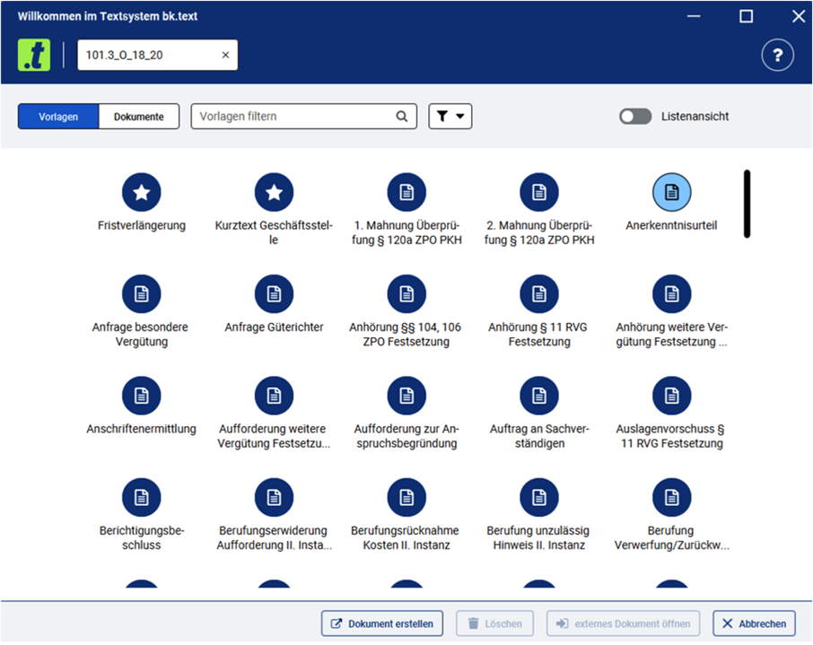
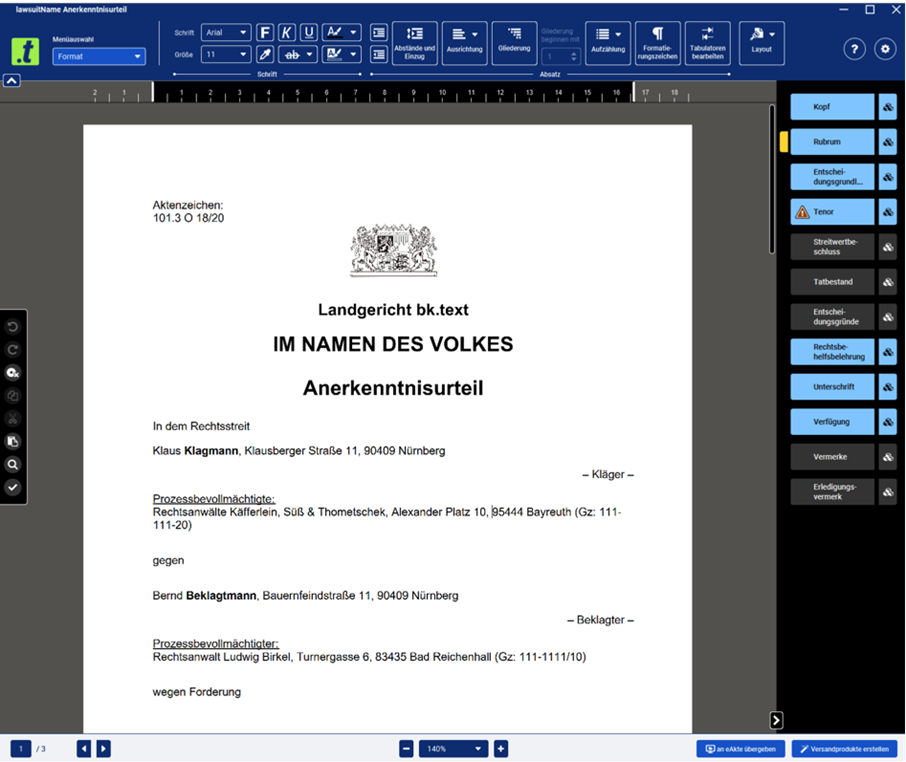
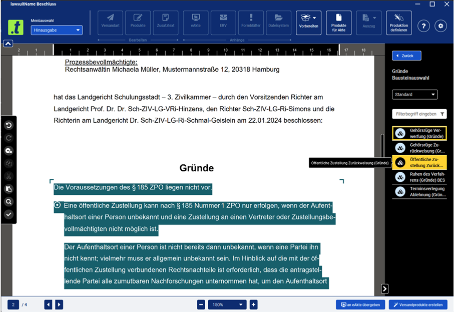
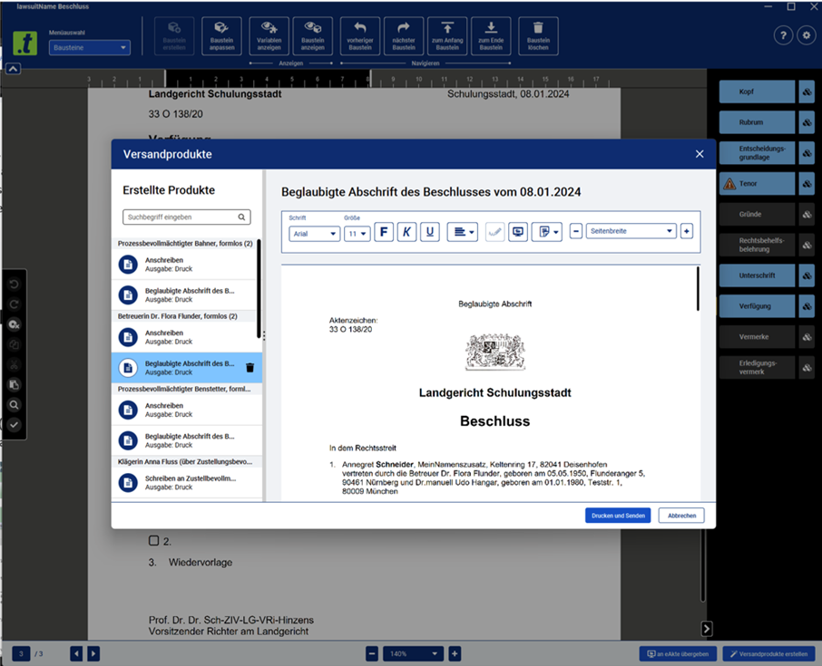
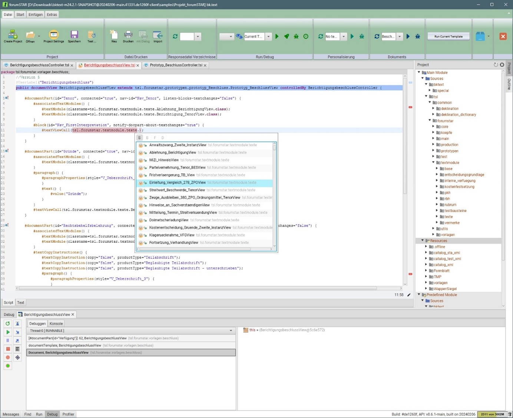

bk.text is an ergonomic and accessible text system for the German justice system, which supports the digital processing of court proceedings.

bk.text is a Java and JavaFX-based text system for the judicial authorities in 11 federal states in Germany, which offers common features for editing and designing texts. Additional features support the digital processing of judicial proceedings and business transactions in courts and public prosecutors' offices. For this purpose, bk.text is embedded in a system landscape consisting of databases with procedural data, electronic file systems and communication systems.

The users of bk.text can define templates and text modules with underlying processing flows for their individual requirements and workflows (e.g. display data from third-party systems and process them in other products). This is made possible with the object-oriented programming language TSL (Text System Language), which was developed specifically for this purpose. It is essentially based on Java and provides additional elements with which the text system can be controlled, the structure defined and documents structured. The source code is developed in the associated JavaFX programming editor (IDE), which supports the template developer with common IDE features such as syntax highlighting, debugging tools, autocomplete and static code analysis. The source code is converted into executable Java code at runtime by an interpreter.

The challenges in interface design with JavaFX are primarily in the area of the WYSIWYG editor and the implementation of accessibility requirements.

**WYSIWYG editor**

In addition to the usual editing and design options of a word editing program, the bk.text editor offers special revision functions (tracking of changes, comments, monitoring of sensitive areas), a spelling and grammar check as well as individual controls, e.g. for data transfers and display of information from third-party systems. The editor is based on the Model View Controller (MVC) principle and is based on a complex XML data model. In a separate thread, line breaks, page layout (pagination) and the display and positioning of all content (paragraph texts, images, tables, etc.) are continuously analyzed and recalculated, if necessary, without affecting the work on the document. The calculations comprise not only the document section currently displayed on the canvas, but also distant document parts that are stored in a cache. This ensures text to be displayed without delay and scrolling through large documents quickly.

**Ergonomics and accessibility**

Software systems used in the judicial environment must meet certain standards and norms regarding ergonomics and accessibility. Use cases include speech output, magnification, color themes (especially high contrast and glare-free), Braille output and keyboard operation. However, the requirements could not be completely implemented with JavaFX because JavaFX does not fully support the accessibility interface of Windows - so-called UIA (UI Automation). For this reason, a replacement for JavaFX's Glass Windowing Toolkit was developed and made available as an open-source solution (link). This makes it possible to use JavaFX to address all UIA interfaces and thus develop tailor-made solutions for ergonomics and accessibility.

