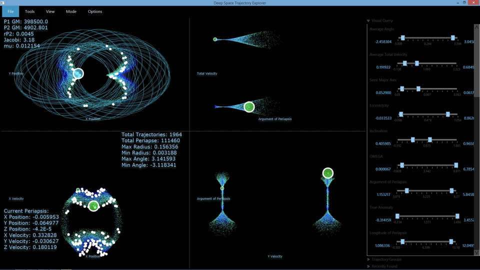
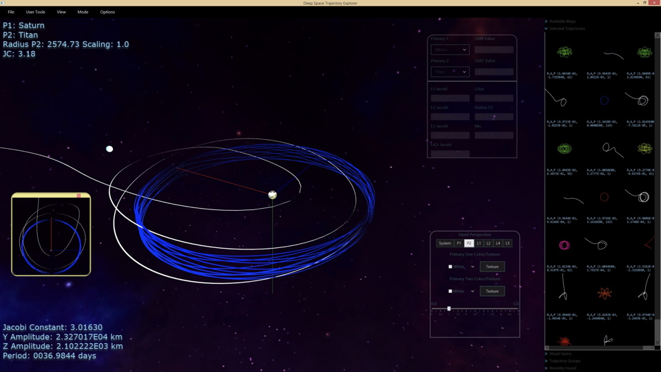
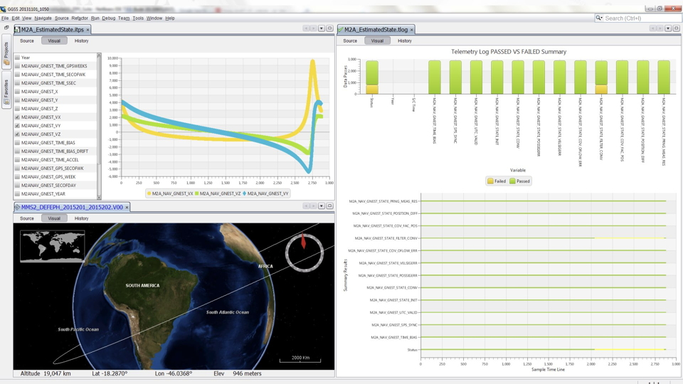
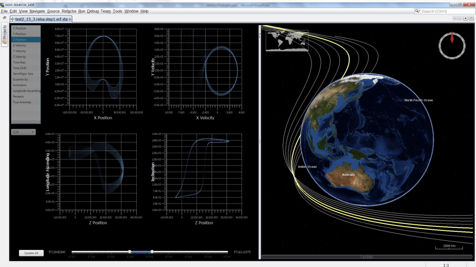

The DSTE is software developed internally by a.i. solutions and leveraged as a design tool at the Johnson 
Space Center for trajectory design for the upcoming manned habitat missions to be located in orbit within 
the Earth-Moon system. The DSTE facilitates rapid trajectory design across a vast potential data space, 
supporting any Planetary and Moon centered ballistic trajectory in the solar system along with their respective 
Lagrange point Halo, Lyapunuv and Manifold families. Custom JavaFX tools have been built that provide high performance, 
interactive analysis for large (1M points) multi-dimensional data sets.

