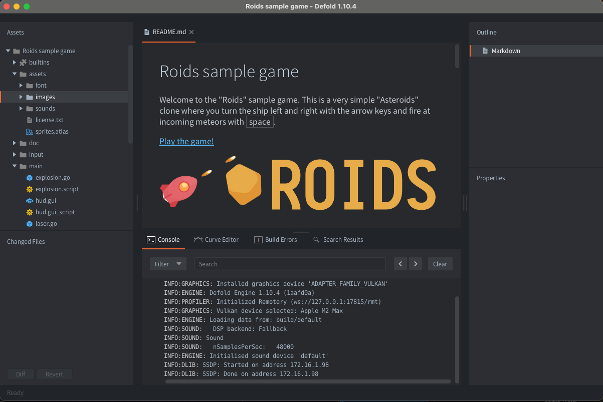
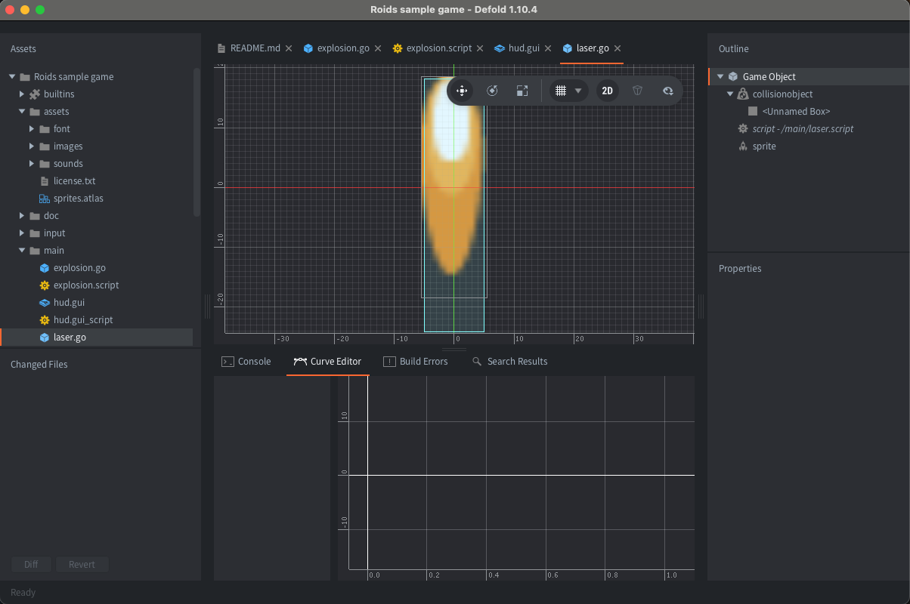
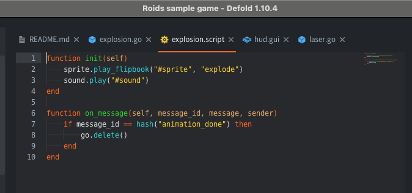
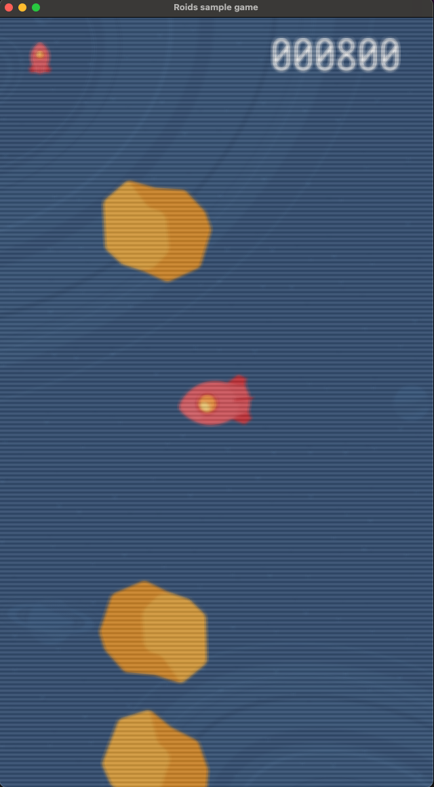
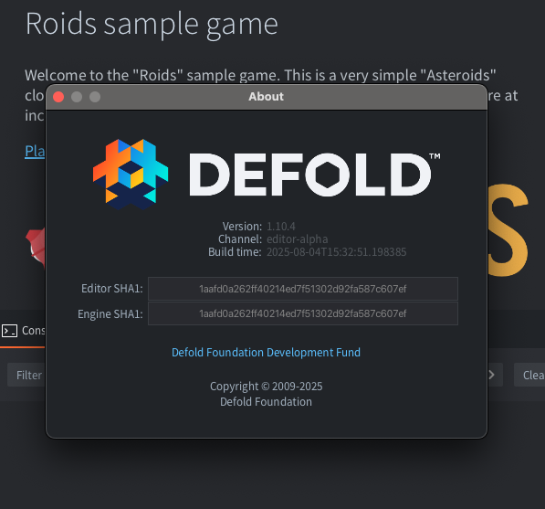

Defold is a completely free to use game engine for development of console, desktop, mobile and web games. There are no up-front costs, no licensing fees and no royalties. The Defold editor runs on Windows, Linux and macOS and includes a code editor, debugger, profiler and advanced scene and UI editors. Game logic is written in Lua with the option to use native code to extend the engine with additional functionality.

The main [project repository on GitHub](https://github.com/defold/defold) contains the game engine (mainly written in C/C++), and the editor (Java/JavaFX/Closure).

## Defold Editor

On the website, you can download the Defold editor for free. This editor is a JavaFX application to build games with the Defold engine. It has a built-in Lua editor and a built-in code editor.

The Defold editor runs on the Java Virtual Machine. We bundle our own JVM with the editor and use a simple launcher executable to boot the JVM with a particular set of command-line arguments. The entry point is in editor/src/java/com/defold/editor/Main.java, which starts up a JavaFx Application subclass. A splash screen is displayed while a custom ClassLoader loads all the classes required to show the Welcome dialog. While it is shown, the custom ClassLoader keeps loading the classes required by the editor on all available background threads while the user ponders which project to open. Once that happens we await loading of all the remaining classes, then proceed to loading the project from disk.

We load the entire set of editable project data into memory, but non-editable resources such as images can be loaded on demand. From this, we create the project graph, which represents the complete state of all editable resources in the project.

Check this [README on GitHub](https://github.com/defold/defold/blob/dev/editor/README.md) as the starting point for more information about the editor and its source code.

