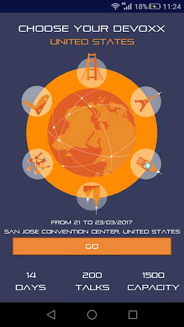
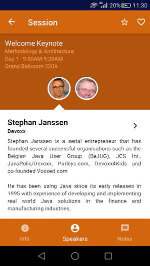
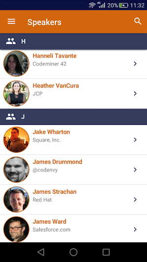

This application is used by the Devoxx conference (originally created for JavaOne 2016 in San Francisco) to show its attendees information about their talks, speakers and locations. The application is based on Gluon Mobile. It is available for Android and iOS devices. 

Its Source code is released as a sample of a professional Gluon Mobile application and was developed by the Gluon team, therefore makes use of best practices. Check the source code [here](https://github.com/devoxx/MyDevoxxGluon).

