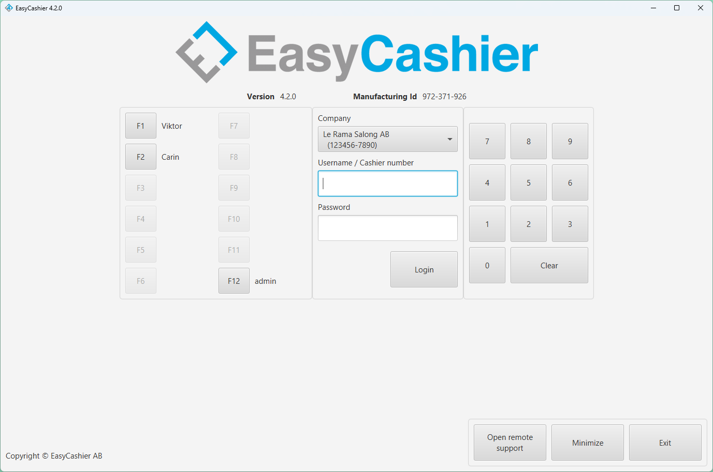
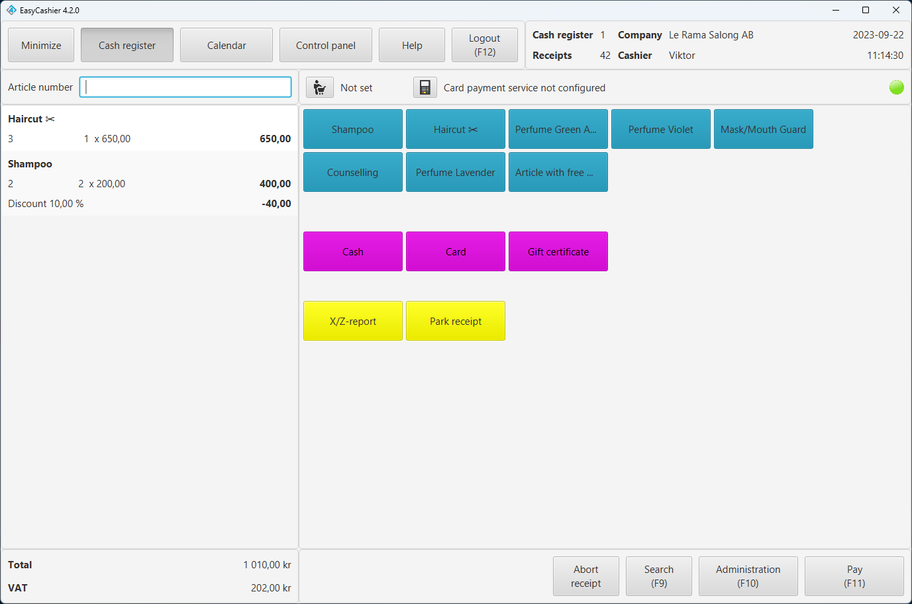
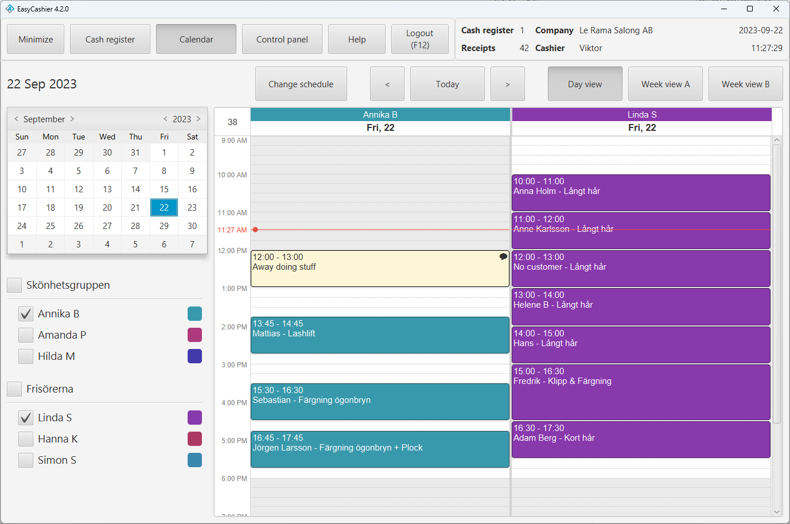
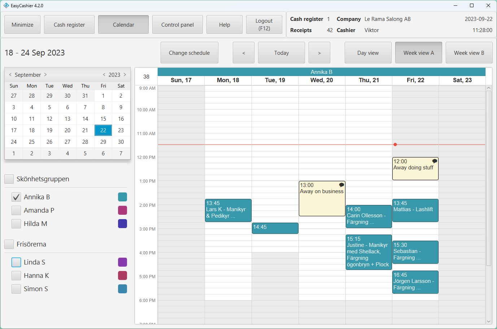

EasyCashier is a point of sale (POS) system targeting a variety of businesses in 
Sweden. These businesses are ranging from retail stores or beauty parlors to gas 
stations. It uses [CalendarFX](https://libraries/calendarfx) for its integrated 
scheduling calendar. EasyCashier is a very popular choice for any business with 
the need of accepting appointments and performing sales. The software is a standalone 
Java application connected to a cloud-based service and has the ability to work 
offline as well.

