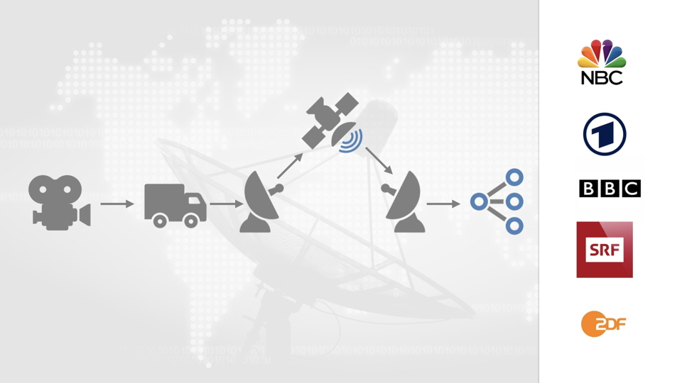
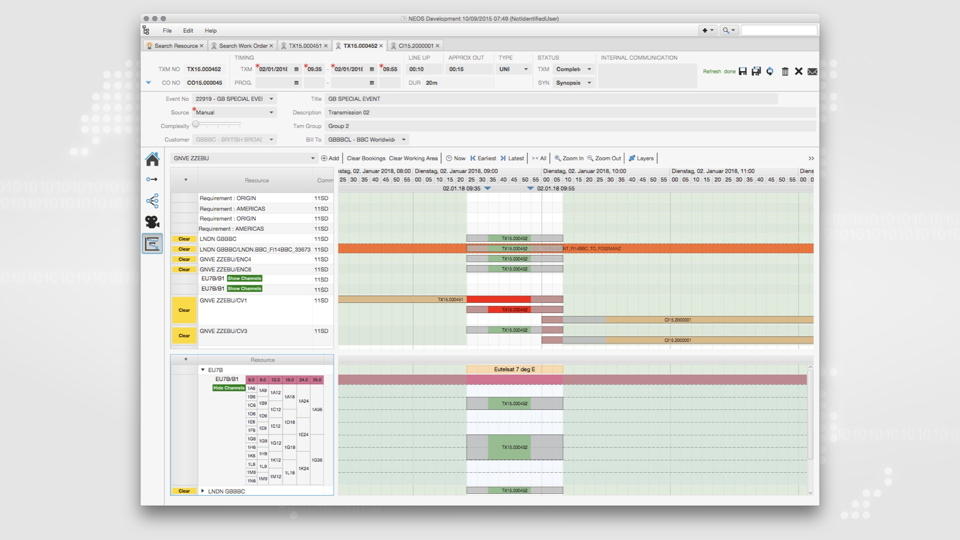
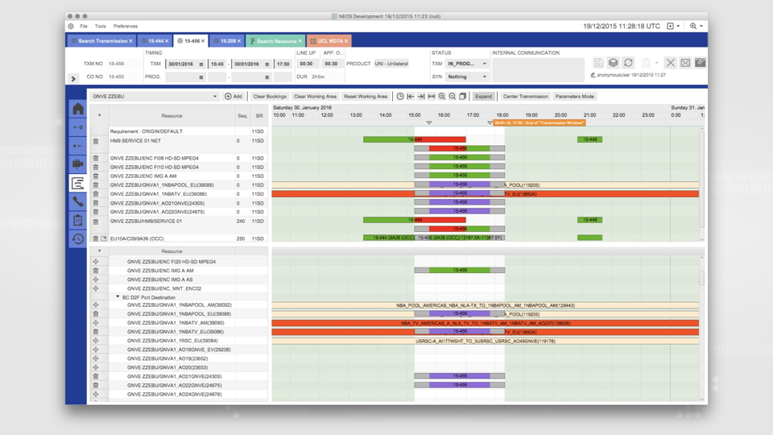

NEOS is being used by EBU to ensure TV and radio transmissions travel from one location to another. 
„Ensuring“ means that all required resources for the transmission will actually be available at the
time of the transmission. Resources include satellites, satellite dishes, fiber optic networks, 
multiplexers, and so on. The application has 150 concurrent users and is implemented as a client / server 
solution. The JavaFX client communicates via REST service calls with the server and its database.

