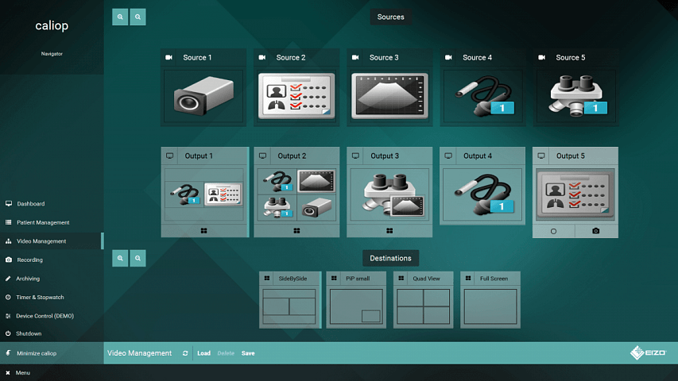
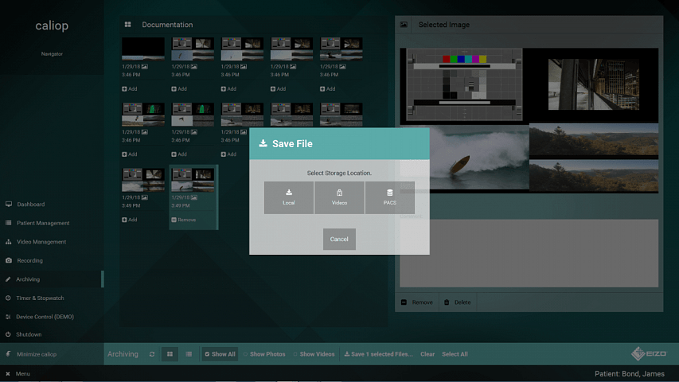
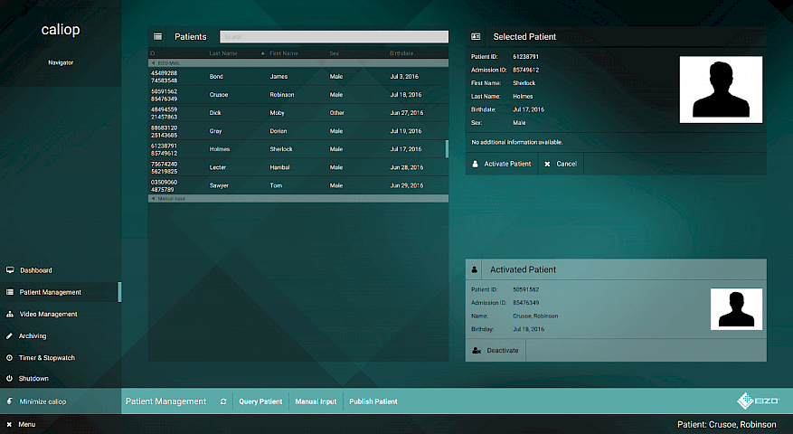

CuratorOR Caliop, developed by EIZO GmbH in Germany, is an application that will be installed in 
hospital operating rooms. It is being installed in wall-mounted consoles equipped with a Windows PC 
running Java. The consoles also include additional hardware for routing video input signals to 
various monitors / displays and hardware for recording video signals (video and screenshots). The 
operating room personnel uses Caliop to look up patient data, to document the surgery, and to store 
the produced documents in the central hospital database.

