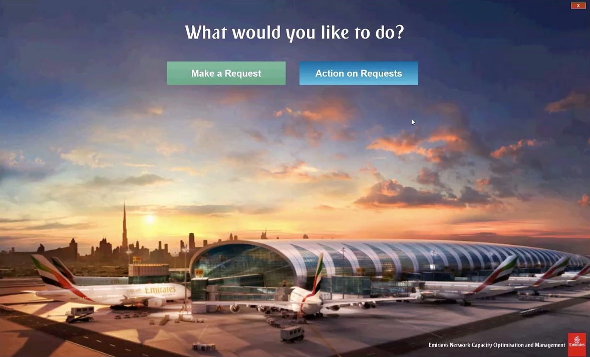
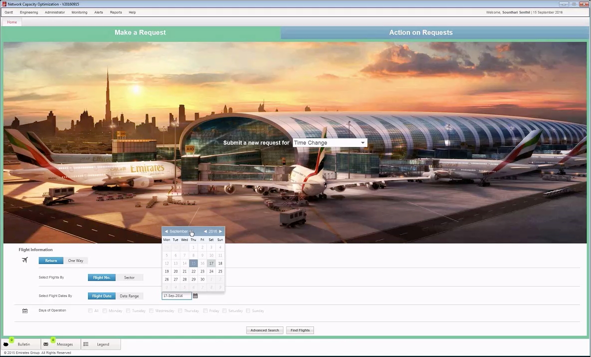
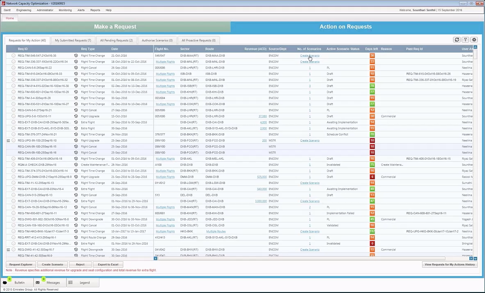
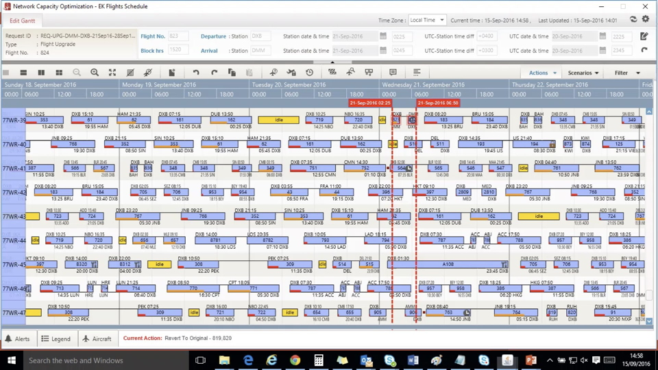

Emirates Airline is one of the biggest airlines in the world and they selected JavaFX as the client technology 
for their new application „Network Capacity Optimization“. This software allows the Network Planning Department
to integrate various requests into the existing flight schedule. Possible requests are: new flight, cancelled 
flight, modified flight, etc. Several scenarios can be created and then compared with each other to find the best 
solution for the request. The application had complex requirements for the schedule visualization which could be 
satisfied by utilizing the commercial FlexGanttFX framework. 

