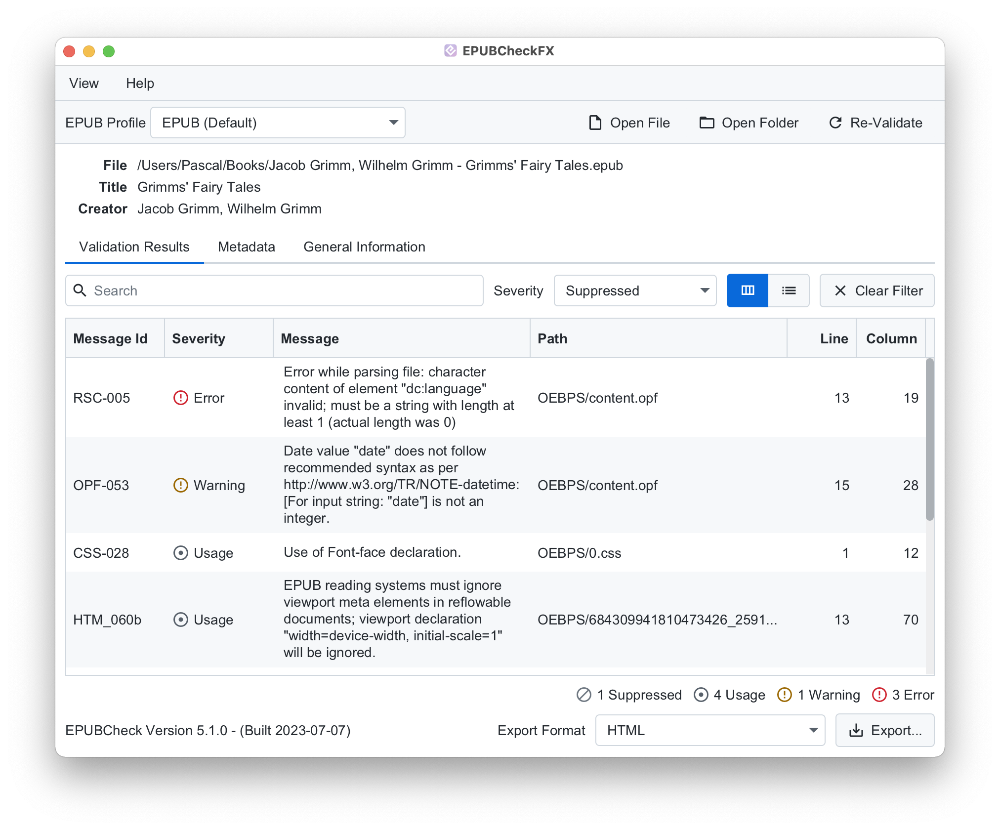
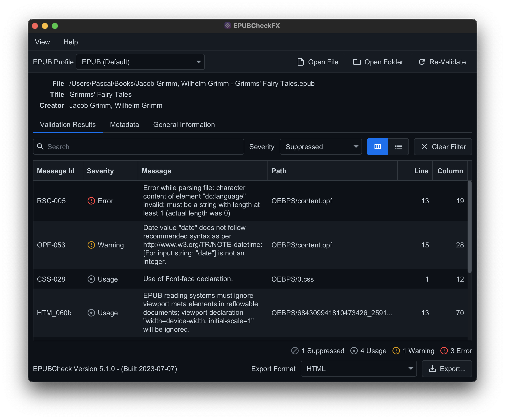

A graphical interface for the official *W3C EPUBCheck* conformance checker. It can validate EPUB files and folders and display metadata in an easy-to-use and modern interface. Validation results are displayed as a table or list, and a summary provides a quick overview of the number of errors and warnings that occurred.

## Features

### Validation

- Validate EPUB 2 and EPUB 3 files and folders
- Choose the EPUB profile for validation e.g. EPUB Indexes, EPUB for Education or the default EPUB profile

### User Interface

- Localized interface in English and German
- Automatic light and dark mode support
- Use drag and drop for validation of files and folders
- Change the application theme to one of the four available ones

### Validation Results

- Search and filter validation results
- Display results as a table or list
- Provide a short summary of errors and warnings

### Export Options

- Export validation results in various formats e.g. HTML, Markdown, AsciiDoc, reStructuredText, Textile, Plaintext, CSV, TSV

### Metadata Display

- View Dublin Core metadata e.g. title, creator, date, contributor, publisher, description and subject
- View additional data e.g. the contained files, their compressed size, declared mime type and SHA-256 checksum
