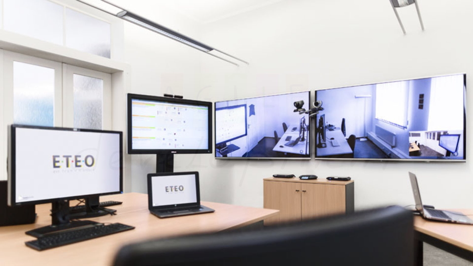

**eteoBoard** is a digital Scrum Board which synchronizes the connected clients in real time. 
Therefore, we’ve written an synchronization engine called SynchronizeFX which synchronizes 
JavaFX properties between multiple clients. We use eteoBoard in our own software development 
projects to help our distributed teams optimize their workflow. 

