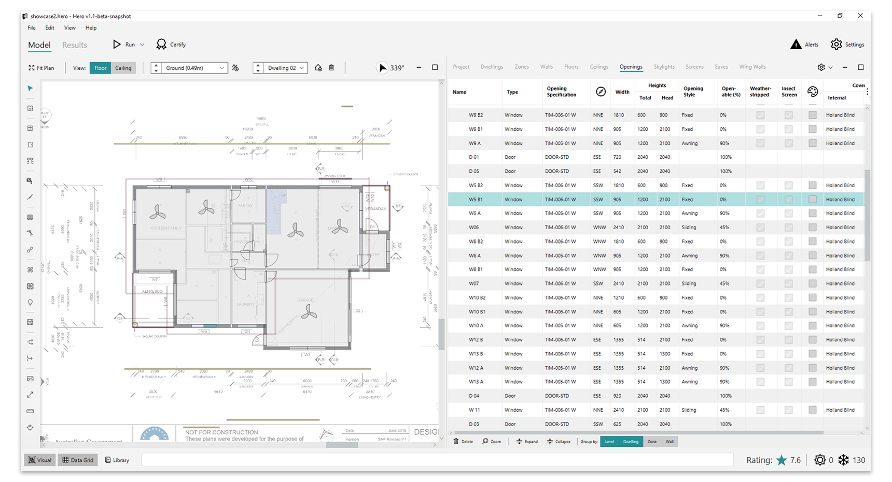
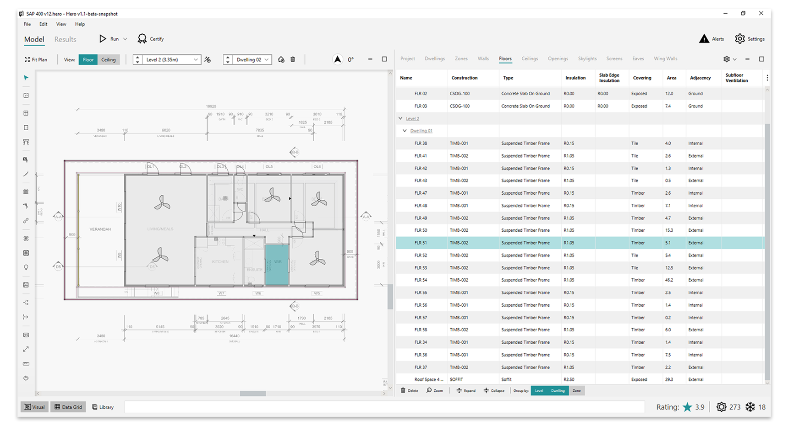

HERO (Home Energy Rating and Optimisation) is a CAD application for calculating the energy efficiency of dwellings (or multiple dwellings).It can be seen as an application similar to Autocad (which is used in civil engineering, architecture, etc) but with the specific purpose to do energy efficiency assessments. It's a quite complex application that was built in a record time (around 12 to 18 months) and with a much smaller 
budget than competing projects.  

The main view window was built leveraging just the JavaFX scene graph (retained mode graphics). It has thousands of nodes,
yet it still renders fast and works smoothly. This is the type of application that would be practically impossible to do using technologies that leverage the web stack as it is an application that is very memory and performance intensive.  

You can read more about this application here: [https://pixelduke.com/2020/07/27/creating-a-cad-application-in-java-javafx](https://pixelduke.com/2020/07/27/creating-a-cad-application-in-java-javafx/)

