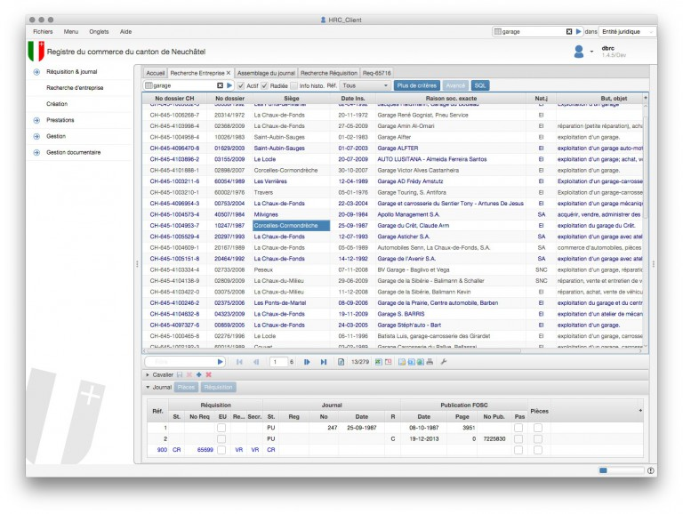
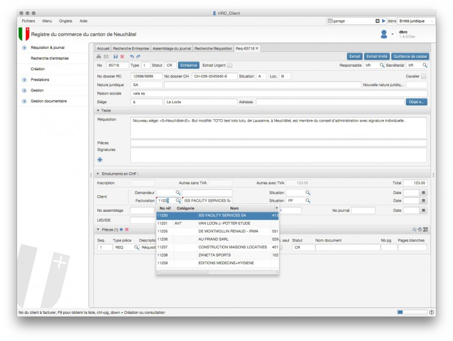
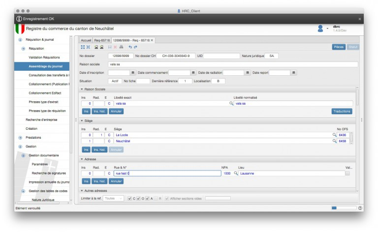
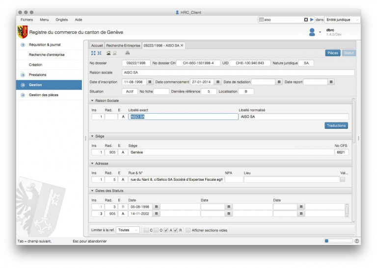

HRC-Matic is being used by registries in Switzerland to register new businesses and to administrate the master 
data of existing businesses. It is a pure database application with a strong focus on keyboard navigation. The 
users have to be able to quickly enter a lot of data about businesses. This is still a weak point in JavaFX but 
AISO was able to find a solution.

