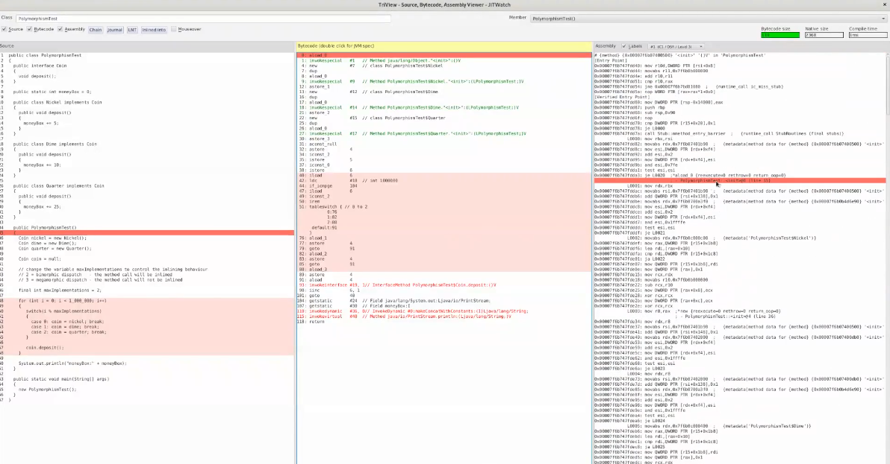
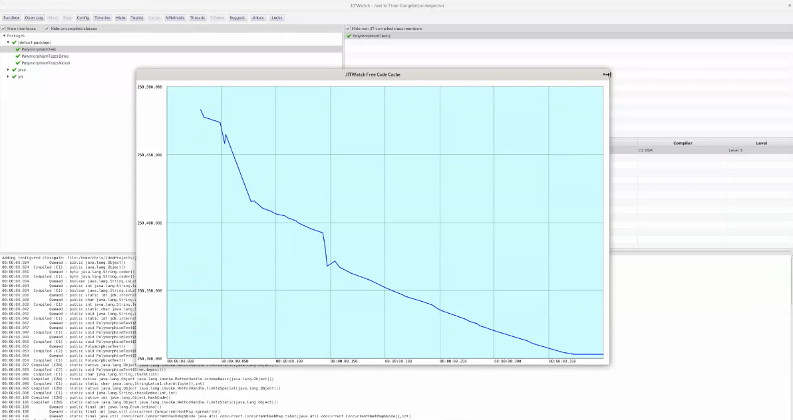
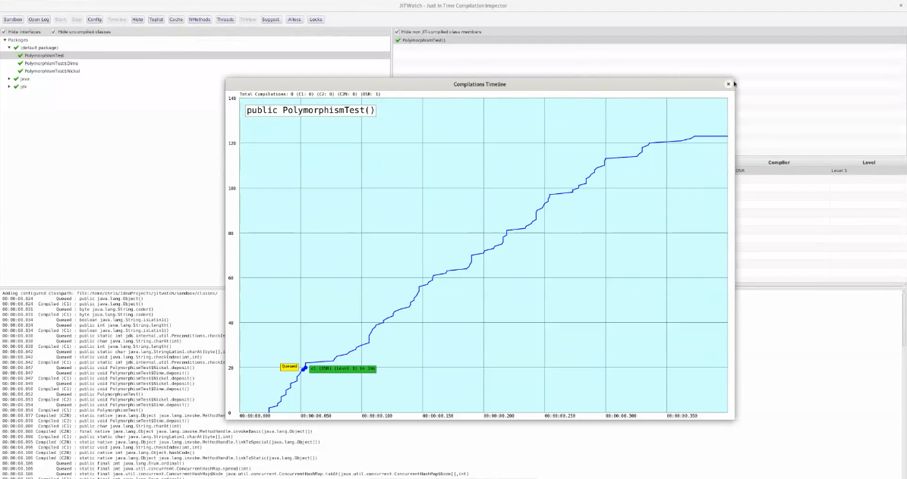

# JITWatch

Log analyser and visualiser for the HotSpot JIT compiler.

* Video introduction to JITWatch [video](https://www.youtube.com/watch?v=p7ipmAa9_9E)
* Slides from my LJC lightning talk on JITWatch  [slides](https://chriswhocodes.com/LJC2022.pdf)

For instructions and screenshots see the [wiki](https://github.com/AdoptOpenJDK/jitwatch/wiki).

The JITWatch user interface is built using JavaFX which is downloaded as a maven dependency for JDK11+.

For pre-JDK11 you will need to use a Java runtime that includes JavaFX.







## Maven

```shell
mvn clean package && java -jar ui/target/jitwatch-ui-shaded.jar
```

## Build an example HotSpot log

```shell
# Build the code and then run
cd scripts && ./makeDemoLogFile.sh
```
