_JPAD Modeller_ is a knowledge-based shape modelling tool developed to support aircraft design workflows. The software is a desktop application that provides an efficient 3D geometry pre-processor for several third-party computational environments, which are typically used for aircraft conceptual and preliminary design studies. _JPAD Modeller_ features a UI made with JavaFX and leverages the computational library named _JPAD_ (Java API for Aircraft Design). The internal CAD engine of _JPAD_ is based on [Open CASCADE Technology (OCCT)](https://www.opencascade.com/open-cascade-technology).

**Business model**

The business model of _JPAD Modeller_ is represented by a full-blown parametric model of an entire aircraft defined within _JPAD_, the underlying API. The aircraft model features several modules that define all the possible components found in transport aircraft (fuselage, wing, empennages, engines, etc). 

The main aircraft data structure collects the high-level parameters (such as the aircraft type, the reference set of regulations, or limit load factor values), keeps a list of all components (such as the fuselage, the wing, tails, etc), specifies the components positions and rotations in a Body Reference Frame (BRF), and points to a number of predefined component definition files. 
The aircraft model and the parametric definition of all the components are reflected by the _JPAD Modeller_ UI. By changing, adding or removing components the user can customize the aircraft according to his/her needs.

The same _JPAD Modeller_ aircraft parametric model is used to build up the aircraft CAD model. This is _automatically generated_ starting from a selected set of components and their defining parameters. Also the CAD model data structure is modular. The user can decide to generate only one or more of the components that compose the aircraft according to his/her needs.

A parametric aircraft model created with _JPAD Modeller_ may result in a fairly complex CAD artifact. The following CAD entities can be defined: 
- Fuselages with streamlined nose and tail cones.
- Lifting surface layouts with multiple panels.
- Lifting surface tips (flat cut-off, rounded tips).
- Wing tip winglets.
- Wing-fuselage fairings.
- Canard-fuselage fairings.
- Engine Pylons for under-wing-mounted engines, upper-wing-mounted engines and fuselage-mounted engines.
- Propeller disks with spinners.
- Nacelles (different Levels of Detail available).

**User experience**

_JPAD Modeller_ provides a simple and efficient user experience. Starting from the setup of the working directories, up to the export of the final aircraft geometry, the software is designed to minimize the user actions necessary to complete a work session. In addition, the user experience is enhanced by automatic aircraft geometry checks combined with a smart management of the possible runtime errors and exceptions. 

An aircraft in _JPAD Modeller_ is defined by hundreds of parameters, the UI provides several info buttons and prompt messages whenever needed, allowing the user to stay focused on his own project and complete successfully an entire work session. 

The workflow of a typical _JPAD Modeller_ session is the following:
1. Definition of the initial aircraft model,
    - with a dedicated knowledge-based pre-design module, or
    - by importing a pre-defined aircraft model, or
    - by creating of a design from scratch.
2. Management of the aircraft model and its components (add/remove components, parameters modifications, airfoils and engine deck customizations). 
3. Management of the aircraft CAD model (selecting aircraft components for which CAD generation is required, or enabling advanced CAD features). 
4. Update the aircraft CAD model. 
5. Export the aircraft or its CAD model.

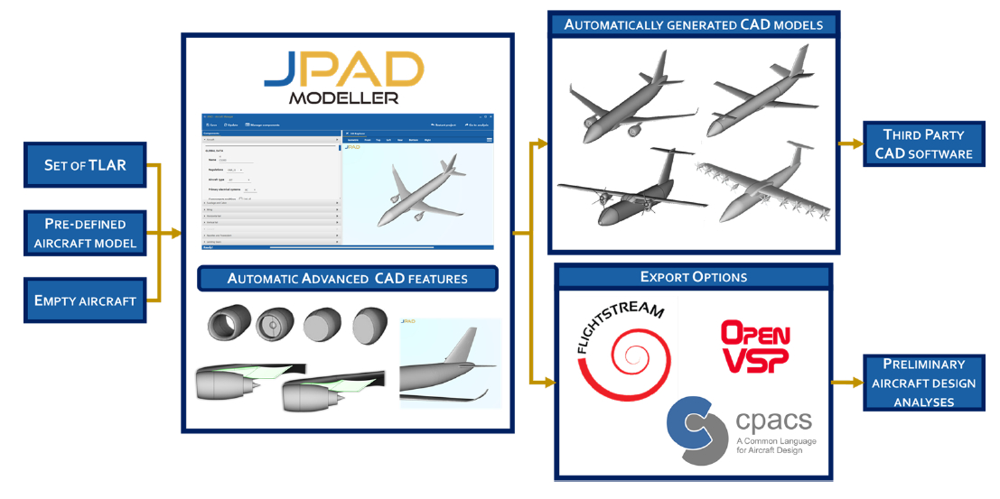

The possibility to import pre-defined components enhances the user experience allowing to easily build up an aircraft model by simply combining different parts. Those parts can be imported either by default aircraft model components or by user-defined components exported during previous work sessions. 

**Setup the working environment**

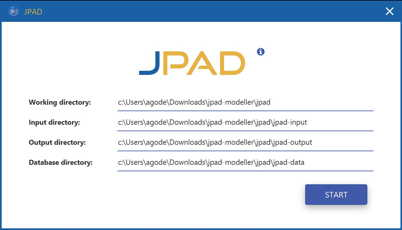

**Choose the Pre-design mode to initialize the aircraft model**

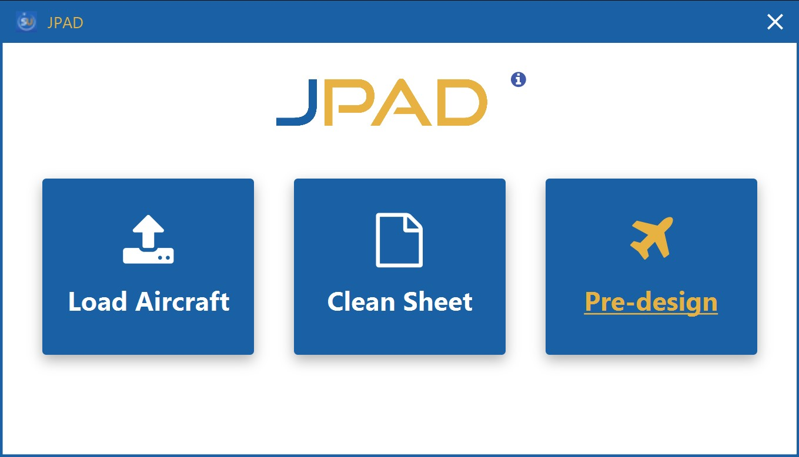

**Load a pre-set of Top Level Aircraft Requirements (TLAR)**

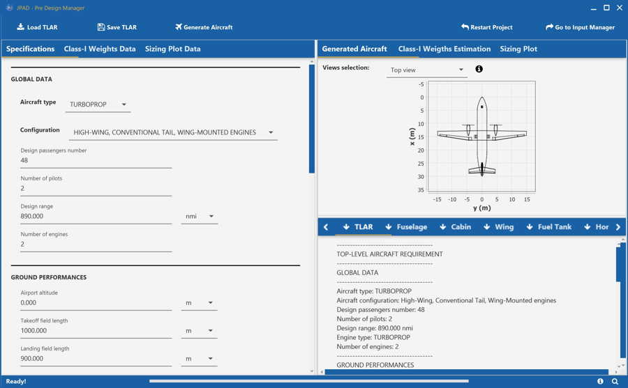

**Two-pane paradigm plus message logs in the RHS-pane**

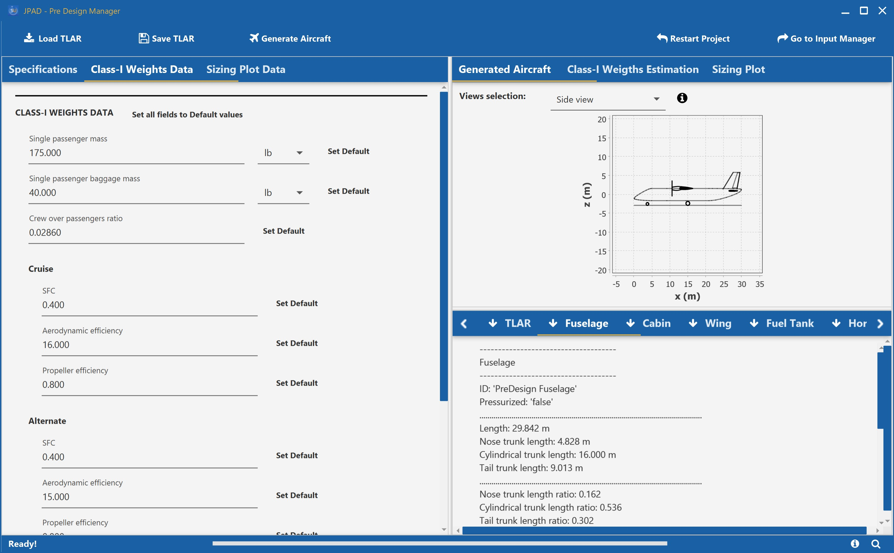

**Class-I weight estimation as an example of knowledge-based design initialization**

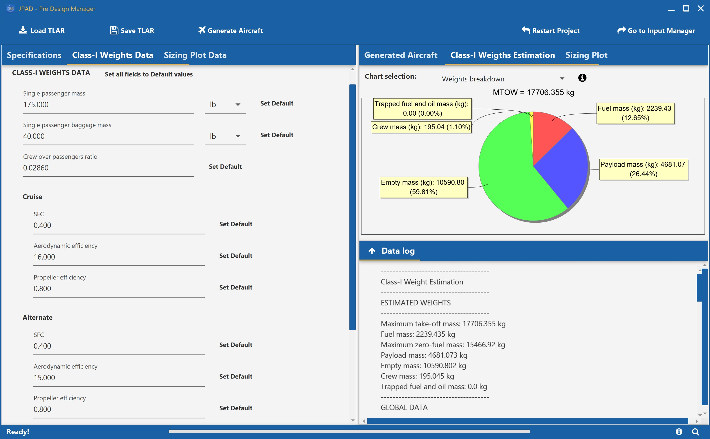

**Choose to load a pre-defined design**

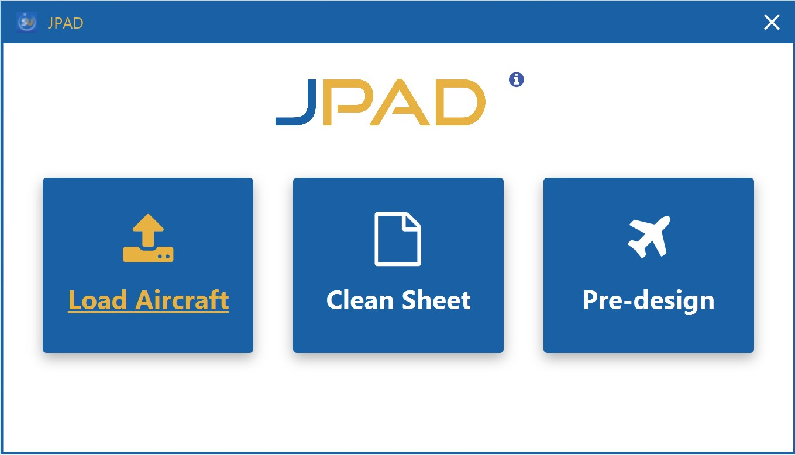

**Two-pane paradigm - LHS: components definition - RHS: 3D and 2D inspection windows**

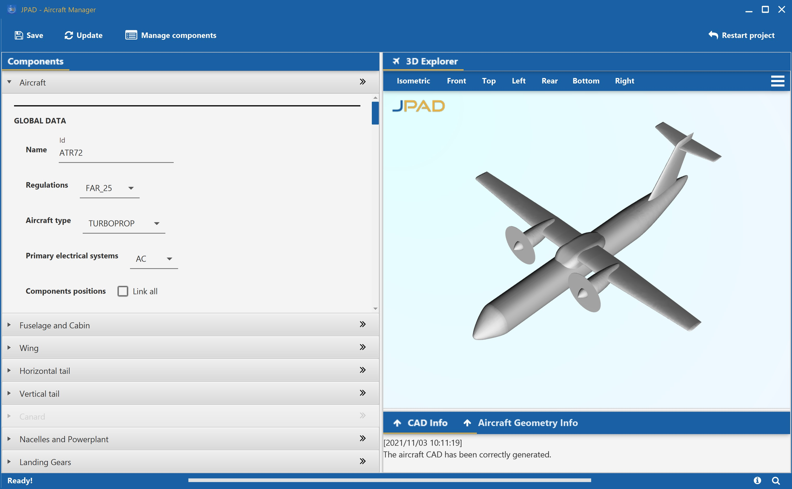

**CAD manager configuration**

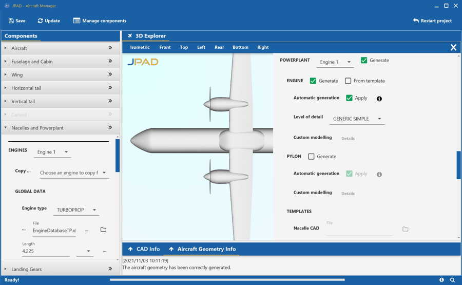

**Component inspection windows (2D) - Wing**

**Component inspection windows (2D) - Fuselage and cabin**

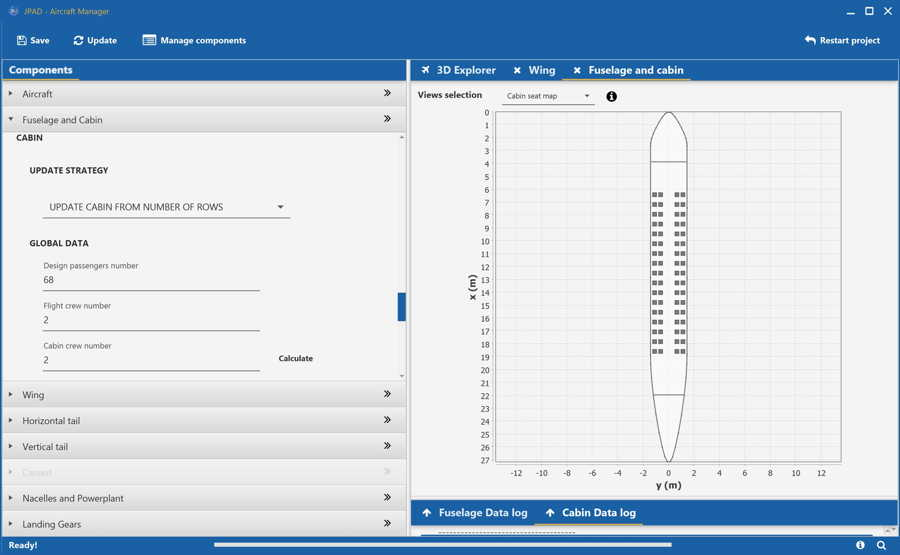

**Component inspection windows (2D) - Landing gears**

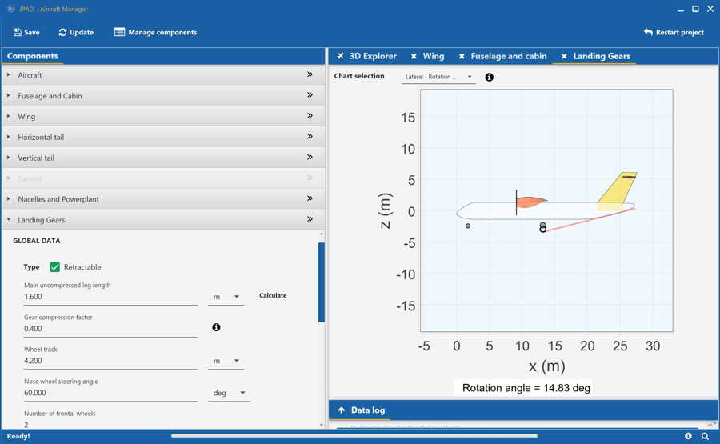

**Component inspection windows (2D) - Landing gears**

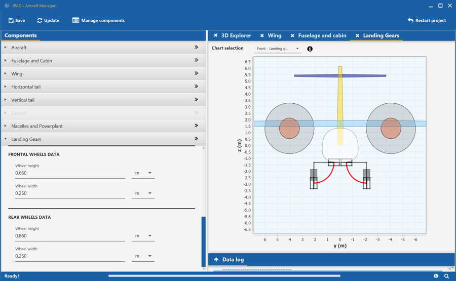

**Airfoil shape management window**

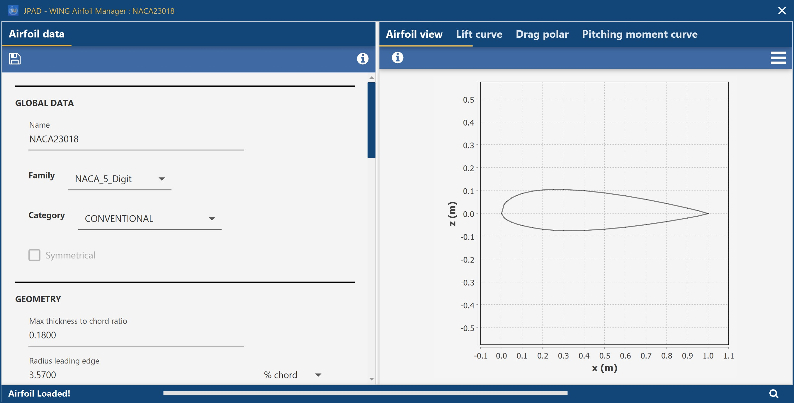

**Airfoil shape management window**

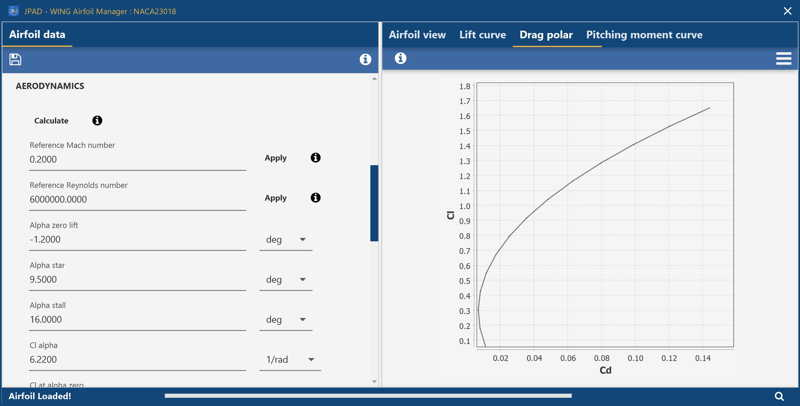

**Aircraft management window and component update strategy**

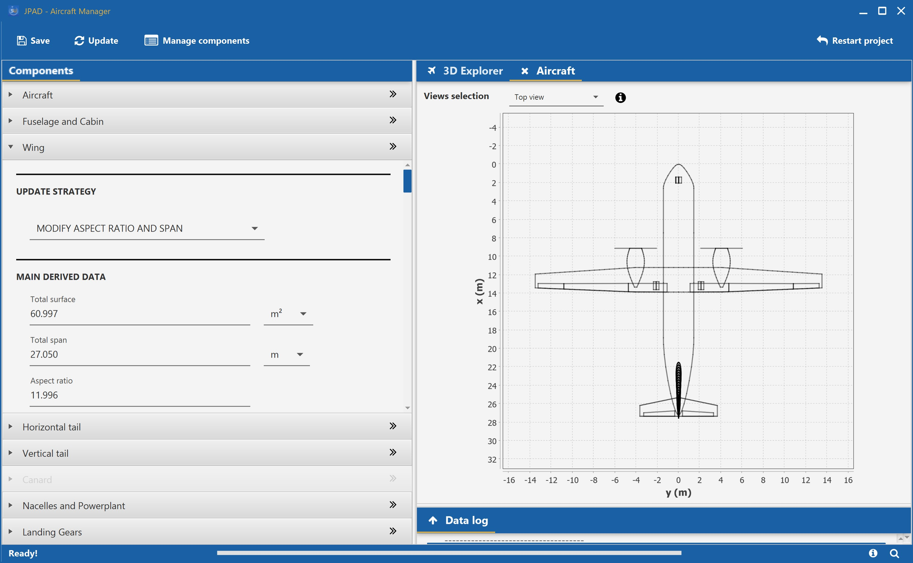

> _JPAD Modeller_ is developed and released as a Commercial Software by [SmartUp Engineering srl](https://www.smartup-engineering.com). More information and a trial request form are available at [https://www.smartup-engineering.com/jpad-modeller](https://www.smartup-engineering.com/jpad-modeller)

