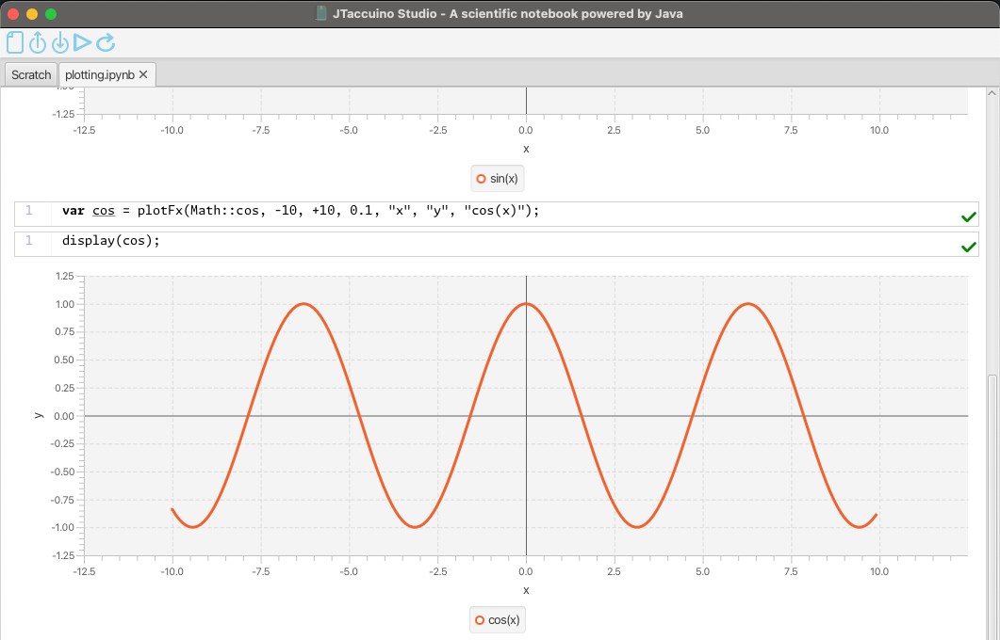
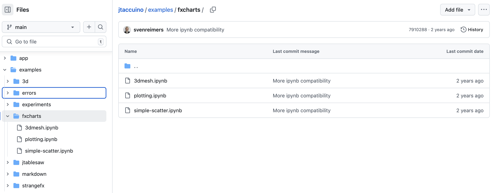
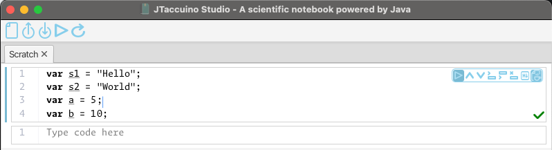
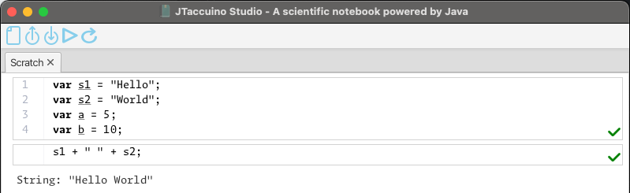
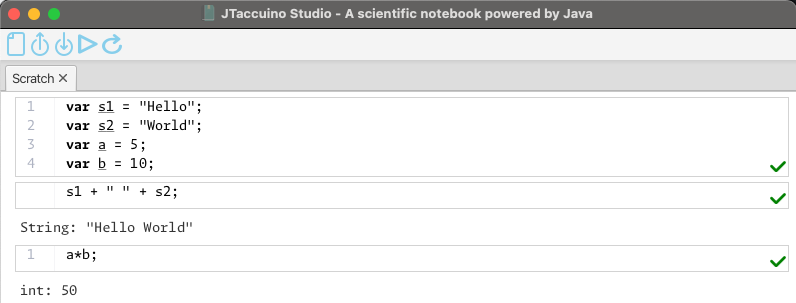
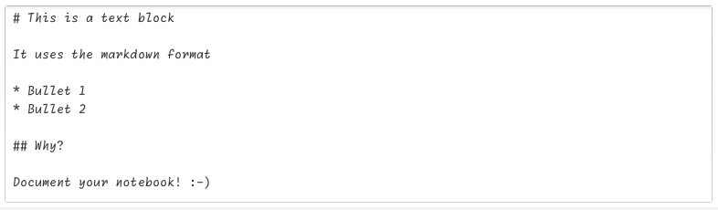
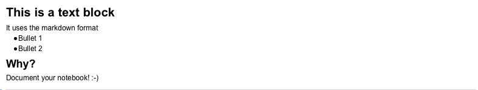

JTaccuino is a JavaFX based notebook application for Java developers.

It is built for usages in education, interactive experimentation with algorithms, and more advanced use cases.

Java code execution is provided by JShell, the awesome Java REPL.

## Download the Application

Builds for Windows, Linux, and macOS are available on the [releases page of the GitHub project](https://github.com/jtaccuino/jtaccuino/releases).

### Examples

You can find [many examples in the GitHub repository](https://github.com/jtaccuino/jtaccuino/tree/main/examples).

## Download the Sources

In case you want to learn how the application works, file a bug, propose an improvement, please check the [GitHub repository](https://github.com/jtaccuino/jtaccuino)

## Usage Instructions

### Getting Started

* [Download](/download/) the application or sources and run it.
* Add some Java code to the empty block and click on the "play" button.

* A new empty block appears, add some code here to use the code from the first block.

* Repeat these steps...

### Adding Descriptions

By using MarkDown-formatted content, you can add more information about your notebook.

When you hit the play button of the block, the text gets visualized.

### Loading Examples

Check the [examples](https://github.com/jtaccuino/jtaccuino/tree/main/examples) for more advanced use. You can execute a complete notebook at once, by clicking the play button in the top menu bar.

