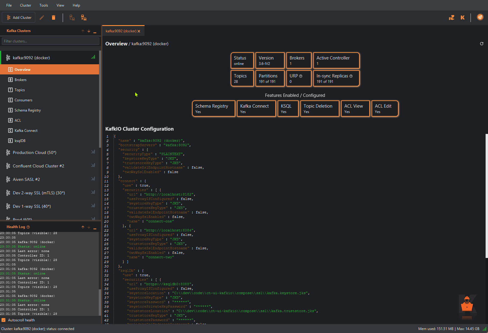
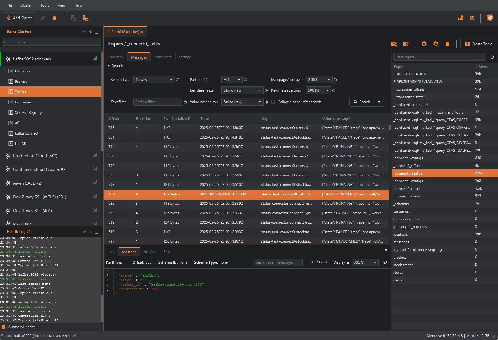
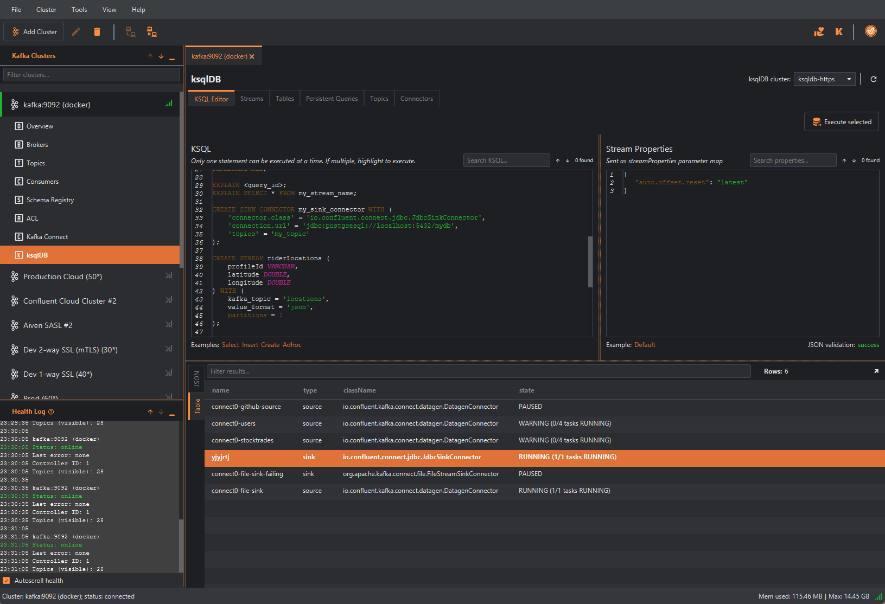
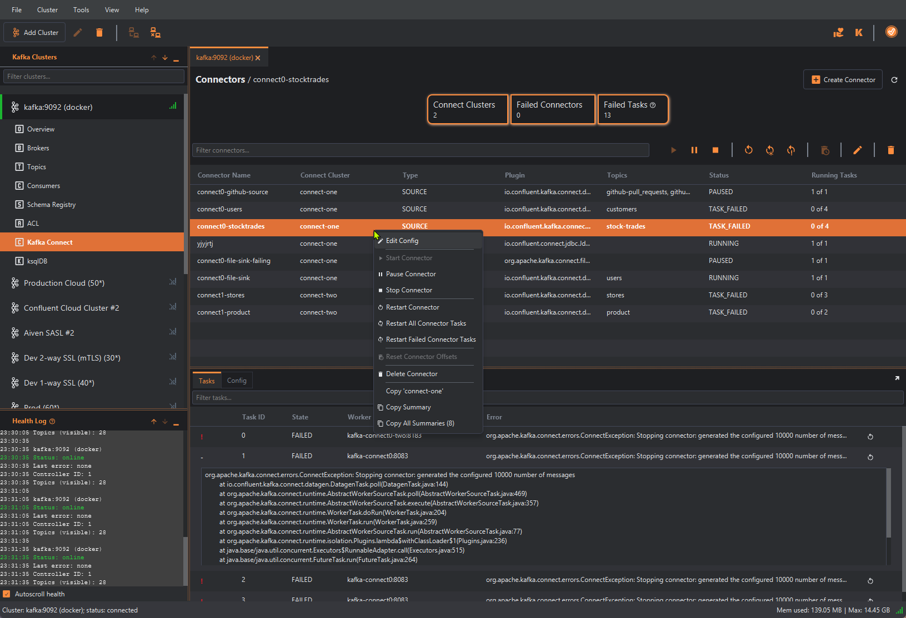
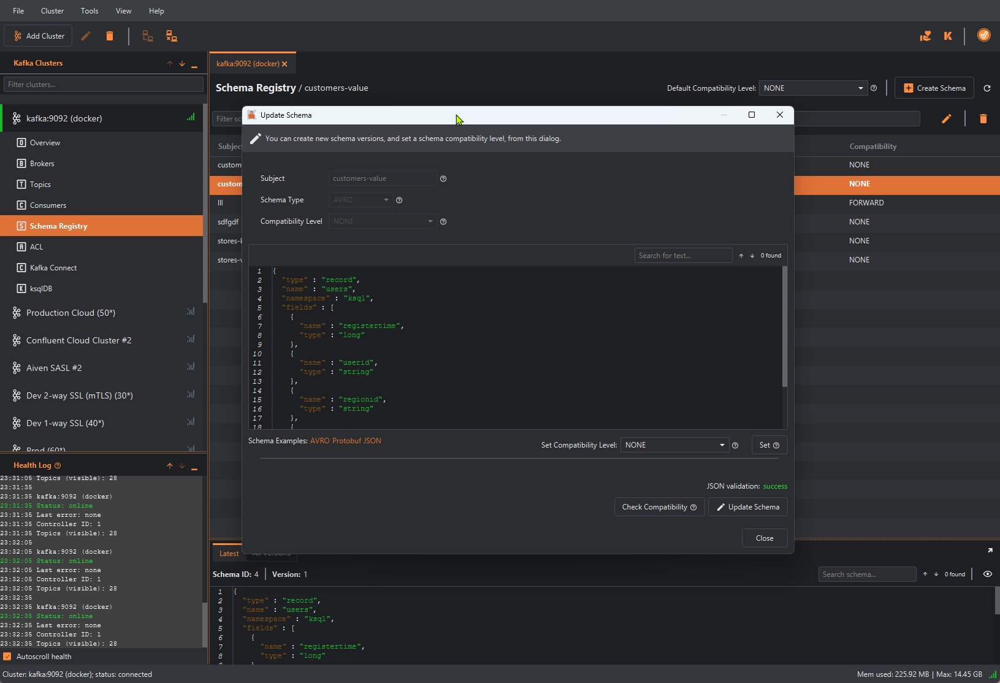

**The Fast, Intuitive Apache Kafka™ GUI, for Engineers and Administrators for macOS, Windows and Linux.**

KafkIO is designed for easy, fast, enjoyable use. It only takes a few clicks before you're exploring your Kafka clusters. No web servers, configuration files, clunky installation, Docker, or funky licensing!

## Easy & Powerful

- Seamlessly create/edit/delete/dump/clear topics, produce messages, advanced search and streaming with text, offset, and date range criteria, tweak offsets, delete consumers, browse/create/update schemas. 
- Easily manage access control lists (ACLs). View your data a variety of ways. Manage Kafka Connect connectors, and ksqlDB (with a flexible KSQL editor).
- Troubleshoot issues with a clear view into broker, topic, ksqlDB, connector and consumer configuration, with live statistics such as partition skew, out-of-sync replicas, consumer lag, etc.

## Native for Your System

- KafkIO is built for macOS, Windows and Linux. It loads fast, it responds quickly, and it is convenient.
- KafkIO on macOS is a native and familiar experience. With a sleek and simple interface, KafkIO meets Apple UI standards, all while using native macOS features. KafkIO is compatible with ARM (Apple Silicon) or x86 Apple machines!
- The KafkIO Windows UI is fully Windows 7/10/11 ready, but will work on older versions of Windows too.
- On Linux, KafkIO has been carefully crafted to follow the GNOME Human Interface Guidelines and features.

## Configuration & Security

- KafkIO is fully compatible with cloud platforms like Confluent Cloud, Aiven, Azure Event Hubs & Amazon MSK, etc., as well Kubernetes with Strimzi.
- Behind a proxy? Don't want to see help info pop-ups? Prefer light theme? Need to import custom certs? 
- Want to export your configuration? KafkIO is configurable without getting in your way.
- Easily configure and test connections to complex cluster configurations, with mTLS and SASL, etc.
- For SSL-secured clusters, KafkIO supports all common key types, for your convenience: JKS (Java Keystore), X.509 (i.e., CRT / PEM), or P12 (i.e., PFX, PKCS12).
- Out-of-the-box, KafkIO handles Confluent Schema Registry and the Protobuf, JSON Schema, and Avro formats and all compression types. Manage all of your schemas with ease.
- KafkIO helps you view, define and manage ACLs for consumers, producers, and Kafka Streams applications.

## Download Link

| Platform | Link                                               |
|----------|----------------------------------------------------|
| Windows, Mac, Linux  | [KafkIO Download](https://www.kafkio.com/download) |

## Overview

## Topics

## ksqlDB

## Kafka Connect

## Edit Schema

