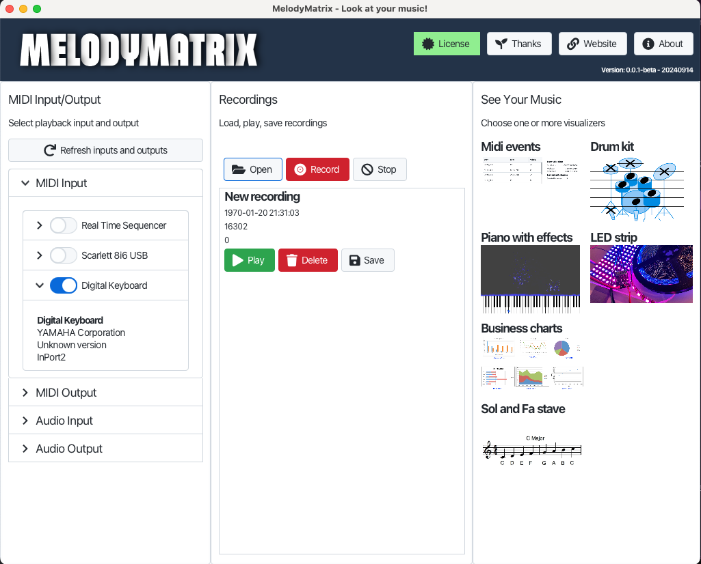
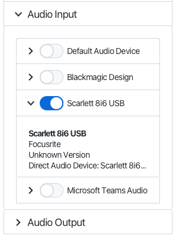
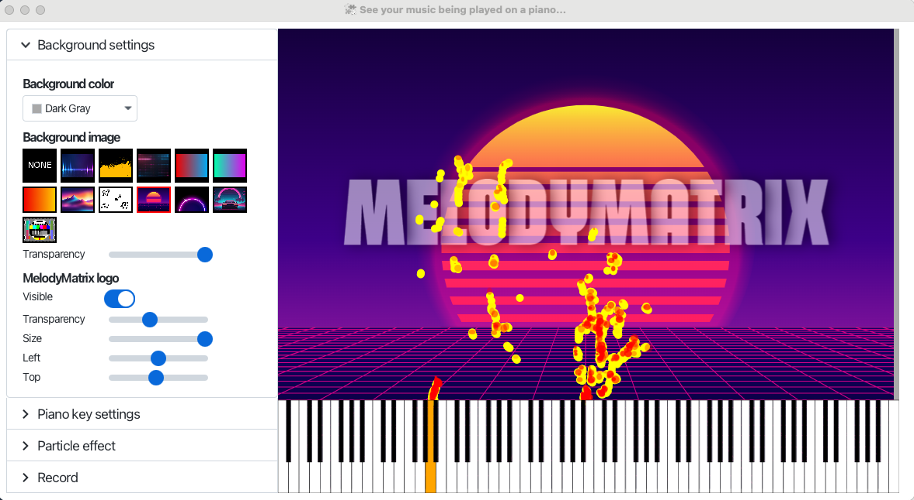
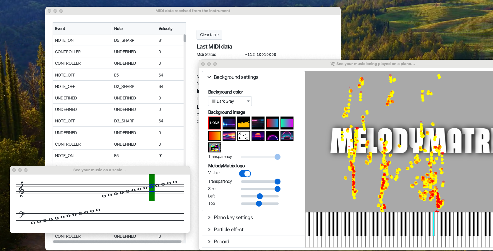

MelodyMatrix is an app created by Vik and Frank Delporte to visualize music being played on MIDI instruments. Vik is a young musician (14y) who wants to share his passion for music in other ways. Frank is a Java developer trying to learn more about JavaFX and how it can be used in different ways.

MelodyMatrix connects via USB to any MIDI instrument to receive and send MIDI and audio, save it to recordings, and visualize it different views like piano, chart dashboard, MIDI events, staves,... These viewers are shared as an [open-source project on GitHub](https://github.com/codewriterbv/melodymatrix-app-views) so others can contribute or use them as a learning path of what can be done with JavaFX.

The app is available as a free and licensed version for Mac, Windows, and Linux thanks to JDeploy. All the used libraries and tools are listed [on this page](https://melodymatrix.rocks/thanks).

